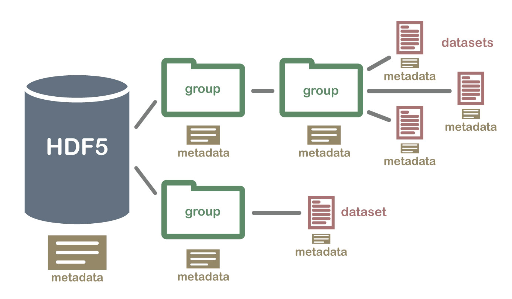

# Scientific File Formats {#sec-specialformats}

``` {python}
# Preparation: reload modules from the previous chapter
import pandas as pd
```
Scientific datasets can be extremely large. For example, in November 2018, CERN recorded 15.8 petabytes of data ([Key Facts and Figures - CERN Data Centre](https://information-technology.web.cern.ch/sites/default/files/CERNDataCentre_KeyInformation_July2022_V3.pdf)). To exchange large amounts of data, formats such as Hierarchical Data Format (HDF) and Network Common Data Format (netCDF) were developed. These allow, among other things, datasets to be read directly from the computer's mass storage, avoiding potential limitations of RAM.

Below, the basic functions for working with HDF5 and netCDF4 files are briefly introduced. More detailed information can be found in the respective documentation.

## HDF5
HDF5 stands for Hierarchical Data Format Version 5. HDF organizes data in a folder structure, comparable to a computer's directory tree, and includes descriptive metadata, which makes HDF self-describing. The HDF directory structure is described using specific terms:

  - `groups` denote directories (subfolders) within the HDF file. `groups` can contain additional groups or `datasets`.

  - `datasets` correspond to individual files.

::: {.border}
{width="80%" fig-alt="Representation of the HDF5 directory structure. The root directory, with associated metadata, contains groups that may contain further groups or datasets. Each object has associated metadata."}

An illustration of an HDF...and associated metadata by U.S. National Science Foundation's National Ecological Observatory Network (NEON) is available at <https://www.neonscience.org/resources/learning-hub/tutorials/about-hdf5>.
::: 

&nbsp;

In Python, the packages [PyTables](https://www.pytables.org/), used by Pandas, and h5py can handle HDF5. Reading HDF5 files works similarly to reading standard files in Python: Accessing the file is done through a file object, which provides methods for reading and writing. The file object is then closed after use.

The integration of PyTables into Pandas is designed for the use of Pandas objects. A specific file structure is expected. HDF5 files structured differently cannot be read directly. Therefore, the package is only briefly introduced here. ([Discussion on StackOverflow](https://stackoverflow.com/questions/71388502/read-hdf5-file-created-with-h5py-using-pandas), [Answer by Kevin S under CC-BY-SA 3.0](https://stackoverflow.com/a/33644128))

::: {#wrn-hdfdata .callout-warning appearance="simple"}
## Dataset
In this section, a part of the dataset IceBridge ATM L1B Elevation and Return Strength, Version 2 is used ([free NASA Earth registration required](https://nsidc.org/data/ilatm1b/versions/2#anchor-data-access-tools)). The [user guide is available here](https://nsidc.org/sites/default/files/ilatm1b-v002-userguide_2.pdf). The dataset contains airborne laser measurements for ice sheet elevation in the Arctic and Antarctic using the NASA Airborne Topographic Mapper (ATM). ATM has a sampling rate of 3 to 5 kHz. Each file contains data from a few minutes of flight. The geographic reference system is the World Geodetic System 1984 (WGS 84).

The files are named according to the pattern ILATM1B_YYYYMMDD_HHMMSS.ATM4BT4.h5:

  - Dataset ID_
  
  - Year, month, day of measurement_
  
  - Time at the start of measurement in hours, minutes, seconds_

  - Instrument ID (five digits) and measurement angle (T2 = 15 degrees, T3 = 23 degrees, T4 = 30 degrees)

  - xxx File type (.h5 = HDF5, h5.xml = additional metadata file) 

:::: {.border}
Studinger, M. 2013, updated 2020. IceBridge ATM L1B Elevation and Return Strength, Version 2.
[Indicate subset used]. Boulder, Colorado USA. NASA National Snow and Ice Data Center Distributed
Active Archive Center. https://doi.org/10.5067/19SIM5TXKPGT. [05.12.2024]
::::
:::

### PyTables
The PyTables package is installed with the command `pip install tables`. Its functions are integrated into Pandas. Access to HDF files in Pandas is provided via an [HDFStore object](https://pandas.pydata.org/docs/user_guide/io.html#hdf5-pytables). Through this object, HDF files can be read and written. The HDFStore object corresponds to the root directory of the structured file. The function `pd.HDFStore(path, mode)` takes the file path `path` and access mode `mode` as arguments.

| Access Mode | Description |
|---|----------------------|
| 'a' | Default append mode: opens the file for reading and writing. If the file does not exist, it is created. |
| 'w' | Write access, creates a new file, overwrites an existing file with the same name |
| 'r' | Read-only access |
| 'r+' | Read and write access like 'a', but file must exist |

&nbsp;

Through the HDFStore object, the contents of the file can be read, provided the format is compatible.

  - The method `hdf.info()` provides information about the file object.
  
  - The method `hdf.keys(include='pandas')` returns by default the keys of Pandas objects in the root directory. With the argument `hdf.keys(include='native')`, native HDF5 objects should also be returned if the HDF5 file is compatible.
  
  - Access to selected keys is done via `hdf.get('key')` or `hdf['key']`.
  
  - The method `hdf.close()` closes the HDFStore object.

::: {#nte-HDFStore .callout-note collapse="true"}
## Incompatible HDF5 File

```{python}
# Open file
file_path = "01-daten/ILATM1B_20191120_041200.ATM6AT6.h5"
hdf = pd.HDFStore(file_path, mode='r')

print(hdf.info(), "\n")

# parameter include: str, default ‘pandas’.  When ‘pandas’ return pandas objects. When ‘native’ return native HDF5 Table objects.
print(hdf.keys(include='native'), "\n") 
print(hdf.keys(include='pandas'), "\n") 

print(hdf.groups(), "\n")

# Test hdf.get()
try:
  elevation = hdf.get('elevation')
  print(type(elevation))
except TypeError as error:
  print("This input results in the error message:\n", error)
else:
  elevation = hdf.get('elevation')
  print(type(elevation))

# Test pd.read_hdf()
try:
  elevation = pd.read_hdf(path_or_buf=hdf, key='elevation')
  print(type(elevation))
except TypeError as error:
  print("This input results in the error message:\n", error)
else:
  elevation = pd.read_hdf(path_or_buf=hdf, key='elevation')
  print(type(elevation))

# Close HDFStore object
hdf.close()
```

:::

To demonstrate the functions, an HDF5 file is created. For this, an HDFStore object is opened in `append` mode, and a DataFrame is stored using the method `hdf.put(key, value, format)`.

```{python}
# Create HDF5 file
df = pd.DataFrame({'Column1': [1, 2, 3], 'Column2': [4, 5, 6]})
hdf = pd.HDFStore("01-daten/hdf_file_demo.h5", mode='a')
hdf.put('data', df, format='table')

hdf.close()

# Read HDF5 file
hdf2 = pd.HDFStore("01-daten/hdf_file_demo.h5", mode='r')
print(hdf2.info(), "\n")
print(hdf2.keys(), "\n")

df2 = hdf2.get(key="/data")
print(df2)

hdf2.close()
```

A list of available functions can be found [in the documentation](https://pandas.pydata.org/docs/reference/io.html#hdfstore-pytables-hdf5).  
([Numpy Ninja](https://www.numpyninja.com/post/hdf5-file-format-with-pandas))

### h5py
The package h5py is installed with the command `pip install h5py`. The h5py module works similarly to PyTables. Access to an HDF5 file is through a file object created using the function `h5py.File(file_path, access_mode)` ([see h5py documentation](https://docs.h5py.org/en/latest/high/file.html#file)).

| Access Mode | Description |
|---|----------------------|
| r | Read-only mode, file must exist (default) |
| r+ | Read/write mode, file must exist |
| w | Create file, truncate existing file |
| w- or x | Create file, abort if file already exists |
| a | Read/write if the file exists, otherwise create it |

&nbsp;

Through the file object, groups and datasets can be accessed. Groups are structured like dictionaries, so access is via key-value pairs. Keys are the names of elements in a group, and values are the elements themselves (groups or datasets).

::: {.border}

"The most fundamental thing to remember when using h5py is:

  **Groups work like dictionaries, and datasets work like NumPy arrays**" ([h5py documentation](https://docs.h5py.org/en/latest/quick.html), emphasis in original)

:::

&nbsp;

Group names can be retrieved using the method `file_object.keys()`.

```{python}
import h5py
file_path = "01-daten/ILATM1B_20191120_041200.ATM6AT6.h5"
hdf = h5py.File(file_path, mode='r')

print(hdf, "\n")
print(list(hdf.keys()))
```

Using the keys, the function `isinstance(item, type)` can be used to check whether an element is a group `h5py.Group` or a dataset `h5py.Dataset`. Datasets, like NumPy arrays, have the attributes `dtype`, `shape`, `size`, `ndim` (and `nbytes`).

```{python}
for key in list(hdf.keys()):
  
  obj = hdf[key]
  print(f"Key:\t{key} is a {type(obj)}")
  
  if isinstance(hdf[key], h5py.Dataset):
    
    print(f"\tData type: {obj.dtype}\n"
          f"\tStructure: {obj.shape}\t Dimensions: {obj.ndim}\tNumber of elements: {obj.size}\n")
  
  elif isinstance(hdf[key], h5py.Group):
    print(f"\tThe group {key} contains the objects:\n\t {hdf[key].keys()}\n")
```

The objects `elevation`, `latitude`, and `longitude` are datasets. The objects `ancillary_data` and `instrument_parameters` are groups. Access within groups works like entering a file path: `file_object['Group/key']`.

To work with datasets, a copy must be created, for example by slicing.

```{python}
try:
  print(hdf['elevation'] - 1000)
except TypeError as error:
  print("Direct access results in the error message:\n", error)

# Working with a copy is possible
print("\nUsing a copy works:")
print(hdf['elevation'][:] - 1000)

# Using index ranges also works
print("\nAlso with selected index ranges:")
print(hdf['elevation'][0:10])
```

Finally, the file object is closed.
```{python}
hdf.close()
```

### Exercise: Accessing H5P Datasets
**Calculate the actual measurement time from the relative time `hdf['instrument_parameters/rel_time']` in 'hhmmss' format and the start time contained in the filename.** The file path is: '01-daten/ILATM1B_20191120_041200.ATM6AT6.h5'.  
*Note: The relative time is in milliseconds. Due to the high sampling rate of ATM, times typically appear multiple times.*

::: {#tip-measurement-time .callout-tip collapse="true"}
## Example Solution: Calculating Absolute Time

```{python}
# Open HDF file
file_path = "01-daten/ILATM1B_20191120_041200.ATM6AT6.h5"
hdf = h5py.File(file_path, mode='r')

timestamp = int(str(hdf)[29:35])
print(f"Start of measurements: {timestamp}\n")

rel_time = hdf['instrument_parameters/rel_time'][:]
abs_time = rel_time + timestamp

print(f"rel_time[-5:]:\n{rel_time[-5:]}\n\nabs_time[-5:]:\n{abs_time[-5:]}")

# Close HDF file
hdf.close()
```

:::

#### Writing HDF5 Files
To write objects to an HDF5 file, it must be opened in write mode.

```{python}
hdf_new = h5py.File('01-daten/hdf_neu.h5', mode='w')
hdf_new['abs_time'] = abs_time
hdf_new.close()

# Check
hdf_new = h5py.File('01-daten/hdf_neu.h5', mode='r')
print(hdf_new.keys())
hdf_new.close()
```

([h5py Documentation](https://docs.h5py.org/en/latest/quick.html))


## netCDF4
The package netCDF4 (Network Common Data Format Version 4) is installed with `pip install netCDF4`. netCDF4 is based on HDF5 but uses its own terminology. Access to a netCDF4 file is via the Dataset object, which corresponds to the root group. A netCDF file or the Dataset object consists of:

  - Groups: Groups are subdirectories of the Dataset object and can contain variables, dimensions, attributes, and further groups.
  
  - Variables: Variables correspond to datasets or NumPy arrays.

  - Dimensions: Dimensions describe properties of variables such as name, size, and group membership.

  - Attributes: Attributes describe either the entire dataset (global attributes) or individual variables. Attributes store metadata.

    - `Dataset.description = 'Description of the dataset'`

    - `Dataset.history = 'Creation timestamp'`

    - `Dataset.source = 'Source'`

    - `Dataset.units = 'Description of measurement unit'`

    - `Dataset.calendar = 'Gregorian calendar'`
    
These elements are structured as dictionaries and allow access via key-value pairs.

::: {#wrn-netcdfdata .callout-wrn appearance="simple"}
## Dataset
In this section, a NASA dataset on lightning density (number of flashes per square kilometer) is used [free registration at NASA Earth required](https://www.earthdata.nasa.gov/data/catalog/ghrc-daac-lohrfc-2.3.2015). The netCDF4 file contains various datasets (variables) obtained with satellite-based instruments. Flashes within +/- 38 degrees of the equator were measured with the Lightning Imaging Sensor (LIS) on the Tropical Rainfall Measuring Mission (TRMM) satellite. At higher and lower latitudes, flashes were measured with the Optical Transient Detector (OTD) on Orbview-1. The data have a resolution of 0.5 degrees. ([Dataset documentation](https://www.earthdata.nasa.gov/data/catalog/ghrc-daac-lolrac-2.3.2015), [Poetzsch 2021](https://refubium.fu-berlin.de/handle/fub188/43384): 182-183)

The datasets follow the naming scheme HRFC_COM_FR

  - HRFC = High Resolution Full Climatology
  
  - COM = Combination of both instruments [LIS, OTD]
  
  - FR = Flash Rates [RF = Raw Flash Rates, SF = Scaled Flash Rates]

:::: {.border}
LIS/OTD 0.5 Degree High Resolution Full Climatology (HRFC) V2.3.2015 by Global Hydrometeorology Resource Center DAAC (GHRC DAAC)

DOI https://doi.org/10.5067/LIS/LIS-OTD/DATA302

::::
:::

&nbsp;

A Dataset object is opened with the function `nc.Dataset(filename, mode)`. The argument `filename` specifies the file path, and the argument `mode` specifies the access mode.

| Access Mode | Description |
|---|----------------------|
| r | Read-only mode, file must exist (default) |
| r+ | Update mode, file may be created and can be read and written |
| w | Write mode, create file, overwrite existing file |
| x | Create file, abort if file already exists |
| a | Append: file may be created, new content is added at the end of the file without deleting existing content |

&nbsp;

netCDF files can have different versions (NETCDF3_CLASSIC, NETCDF3_64BIT_OFFSET, NETCDF3_64BIT_DATA, NETCDF4_CLASSIC, NETCDF4). The version can be retrieved via the attribute `cdf.data_model`.

```{python}
import netCDF4 as nc

file_path = "01-daten/LISOTD_HRFC_V2.3.2015.nc"
cdf = nc.Dataset(filename=file_path, mode='r')
print(f"File version: {cdf.data_model}\n")
```

The essential information can be displayed using the print function `print(cdf)`. However, the output can be confusing for more complex files.

The groups of the file can be displayed using the attribute `print(cdf.groups)`.

```{python}
print(cdf.groups)
```

The output is a dictionary, which in this case is empty. The file therefore has no subdirectories (groups).

The variables (datasets) can be displayed using the attribute `print(cdf.variables)`, which is also a dictionary. The complete output can be seen in the following example.

```{python}
variables = cdf.variables
for key, value in variables.items():
    print(key)
    print(value, "\n")
    break # Stop after the first key-value pair
```

::: {#nte-cdf .callout-note collapse="true"}
## Complete output of cdf.variables
```{python}
variables = cdf.variables
for key, value in variables.items():
    print(key)
    print(value, "\n")
```

:::

Similarly, the dimensions (`cdf.dimensions`) and the global attributes of the dataset (`cdf.__dict__` or as a list with `cdf.ncattrs()`) can be displayed. Attributes of a variable can also be displayed. Variables are accessed directly via the key `variable = cdf['key']` or using `variable = cdf.variables['key']`.

::: {.panel-tabset}
## Dimensions

```{python}
dimensions = cdf.dimensions

for key, value in dimensions.items():
    print(key)
    print(value, "\n")
```


## global attributes
```{python}
print(cdf.ncattrs(), "\n")
global_attributes = cdf.__dict__

for key, value in global_attributes.items():
    print(key)
    print(value, "\n")
```

## attributes of a variable
```{python}
variable = cdf['HRFC_OTD_FR']
# Alternatively:
# variable = cdf.variables['HRFC_OTD_FR']

print("\nAttributes of a variable")
print(f"As a list with variable.ncattrs():\n{variable.ncattrs()}\n")

print(f"As a dictionary with variable.__dict__:\n{variable.__dict__}\n")
```

:::

### Writing data to netCDF4 files
To write data to a netCDF4 file, it must be opened in one of the write modes: `Dataset = nc.Dataset('path', mode = 'a')`. To create a new variable, a corresponding dimension must be defined first. If the variable should be stored in a path that does not yet exist, the corresponding groups must also be created.

  - Groups in the root directory are created with the function `Dataset.createGroup("group_name")`. Subdirectories are created in the same way as a path: `Dataset.createGroup("/group_name/subdirectory")` (note the leading '/').

  - Dimensions describe the size of a variable and must be created before the variable itself (a scalar, i.e., a single value, has no dimension): `Dataset.createDimension('dimension_name', dimension_size_as_integer)`. Passing `None` or `0` as the size creates an unlimited dimension (netCDF4 variables behave like NumPy arrays but have no fixed size, meaning additional data can be appended).  
    For example, to create a two-dimensional data structure with 10 rows and 5 columns, both dimensions must be declared separately:  
    `Dataset.createDimension('Dimension1', 10)`, `Dataset.createDimension('Dimension2', 5)`.

  - Variables are created with the function `Dataset.createVariable('name_or_path', 'data_type_code', ('dimension_name', ))`. The arguments `'name_or_path'` and `'data_type_code'` are required.  
    The dimensions of the variable were previously defined using `cdf_new.createDimension('dimension_name', dimension_size_as_integer)` and are passed as a tuple.  
    A single value (scalar) is created by omitting the dimension argument.  
    A two-dimensional data structure can be created like this:  
    `Dataset.createVariable('name_or_path_of_variable', 'data_type_code', ('Dimension1', 'Dimension2', ))`  
    [see documentation](https://unidata.github.io/netcdf4-python/#variables-in-a-netcdf-file).

| Data type code | Data type |
|:---:|:---:|
| 'f4' | 32-bit floating point |
| 'f8' | 64-bit floating point |
| 'i4' | 32-bit signed integer |
| 'i2' | 16-bit signed integer |
| 'i8' | 64-bit signed integer |
| 'i1' | 8-bit signed integer |
| 'u1' | 8-bit unsigned integer |
| 'u2' | 16-bit unsigned integer |
| 'u4' | 32-bit unsigned integer |
| 'u8' | 64-bit unsigned integer |
| 'S1' | single-character string |

&nbsp;

In the following code, the object `abs_time` from the previous section is saved in a netCDF4 file.  
The attributes `variablename.description`, `variablename.source`, and `variablename.units` store metadata about the variable (here: milliseconds).  
The statement for creating the variable is assigned to an object `variablename`.

```{python}
# Open new dataset in write mode
cdf_new = nc.Dataset('01-daten/cdf_neu.nc', mode = 'w')

# Create group 'Data'
cdf_new.createGroup("Data")

# Create dimension
cdf_new.createDimension('abs_time', abs_time.shape[0])

# Create variable as 'f4' 32-bit float and assign it to an object
variablename = cdf_new.createVariable('/Data/abs_time', 'f4', ('abs_time', ))

## Create attributes
variablename.description = 'very important time information'
variablename.source = 'calculated from IceBridge ATM L1B Elevation and Return Strength, Version 2'
variablename.units = 'milliseconds'

# Close dataset
cdf_new.close()

# Verification
cdf_new = nc.Dataset('01-daten/cdf_neu.nc', mode = 'r')
print(cdf_new.groups, "\n")

variables = cdf_new['/Data'].variables
for key, value in variables.items():
    print(key)
    print(value, "\n")

cdf_new.close()
```

#### Operations with variables
As with HDF5 files, operations with variables cannot be performed directly.
```{python}
try:
  print(cdf['HRFC_OTD_FR'] - 1)
except TypeError as error:
  print("Direct access results in the following error message:\n", error)

# Operations can be performed with a copy
print("\nIt works with a copy:")
print(cdf['HRFC_OTD_FR'][:, :])

# It also works with selected index ranges
print("\nAlso with selected index ranges:")
print(cdf['HRFC_OTD_FR'][30:40, 30:40])
```

At the end, the netCDF4 file is closed.
``` {python}
cdf.close()
```

### Exercise: Accessing netCDF Datasets
**Access the variable `HRFC_LIS_RF` from the file located at the path `'01-daten/LISOTD_HRFC_V2.3.2015.nc'`.**

  - Display the attributes of the variable.
  
  - Determine the minimum, maximum, and average number of lightning flashes.

  - Center the data (value - mean) and append a new variable `'HRFC_LIS_RF_centered'` to the dataset.


::: {#tip-netCDF .callout-tip collapse="true"}

Since running the code modifies the file according to the task description, the code is included as *raw* rather than executable Python code.

``` {.raw}
# Read the file in append mode
filepath = "01-daten/LISOTD_HRFC_V2.3.2015.nc"
cdf = nc.Dataset(filename = filepath, mode = 'a')
print(cdf.data_model, "\n")

# Read the variable
lis_rf =  cdf['HRFC_LIS_RF']

# Print the variable's attributes
print("Attributes of variable 'HRFC_LIS_RF':", lis_rf.ncattrs(), "\n")

# Read the data from the variable
lis_rf_data =  cdf['HRFC_LIS_RF'][: , :]
print(f"min: {lis_rf_data.min()}\tmax: {lis_rf_data.max()}\tmean: {lis_rf_data.mean()}\n")

# Center the data
# rounding due to internal floating-point representation - optional
lis_rf_data_centered = lis_rf_data - lis_rf_data.mean()
print(f"min: {lis_rf_data_centered.min()}\tmax: {lis_rf_data_centered.max()}\tmean: {lis_rf_data_centered.mean()}\trounded mean: {round(lis_rf_data_centered.mean())}\n")

# Append the data to the netCDF4 file

## Create dimensions
## latitude and longitude are the dimensions of the 2D array
## Code can only be executed once; using try or "not in" to check if dimension already exists

dimensions = cdf.dimensions

### latitude
DIMENSION = 'latitude'
if DIMENSION not in dimensions:
  print(f"The dimension {DIMENSION} does not exist and will be created.")
  cdf.createDimension(DIMENSION, lis_rf_data_centered.shape[0])
else:
  print(f"The dimension {DIMENSION} already exists.")

### longitude
DIMENSION = 'longitude'
if DIMENSION not in dimensions:
  print(f"The dimension {DIMENSION} does not exist and will be created.")
  cdf.createDimension(DIMENSION, lis_rf_data_centered.shape[1])
else:
  print(f"The dimension {DIMENSION} already exists.")

## Create variable 'lis_rf_data_centered' as 32-bit float ('f4') and assign it to the object variablename.
## latitude and longitude are the dimensions of the 2D array
## Code can only be executed once; using try or "not in" to check if variable already exists
variables = cdf.variables

VARIABLE = 'lis_rf_data_centered'

if VARIABLE not in variables:
  print(f"The variable {VARIABLE} does not exist and will be created.\n")
  variablename = cdf.createVariable('lis_rf_data_centered', 'f4', ('latitude', 'longitude', ))

  ### Insert data
  variablename[ :, :] = lis_rf_data_centered

  ### Add attributes
  variablename.description = 'centered lightning flash count'
  variablename.units = 'absolute deviation from mean value'
else:
  print(f"The variable {VARIABLE} already exists.\n")

# Close the dataset
cdf.close()

# Verification
filepath = "01-daten/LISOTD_HRFC_V2.3.2015.nc"
cdf = nc.Dataset(filename = filepath, mode = 'r')

variables = cdf.variables
for key, value in variables.items():
  print(key)
  # print(value, "\n")

check =  cdf['lis_rf_data_centered'][: , :]

print(f"\nData structure type of lis_rf_data_centered: {type(check)}\nNumber of elements: {check.size}\tNumber of values: {check.mask.sum()}\tMean of values: {check.mean()}")
```

::: 

