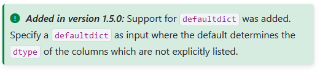
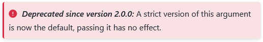
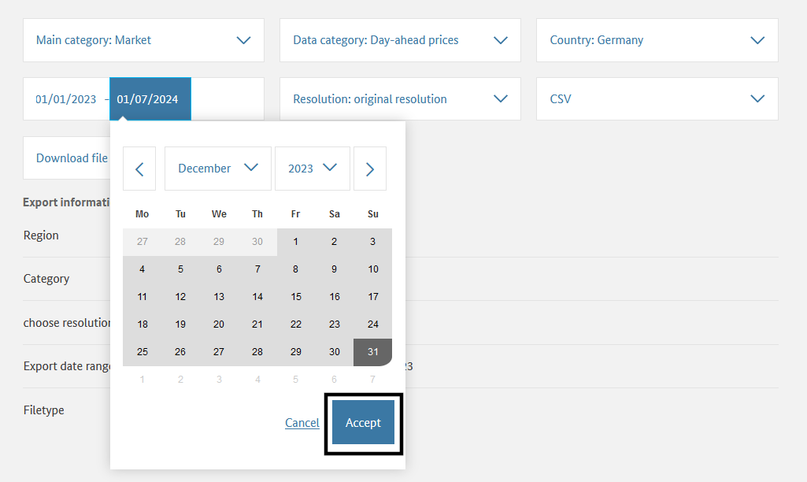
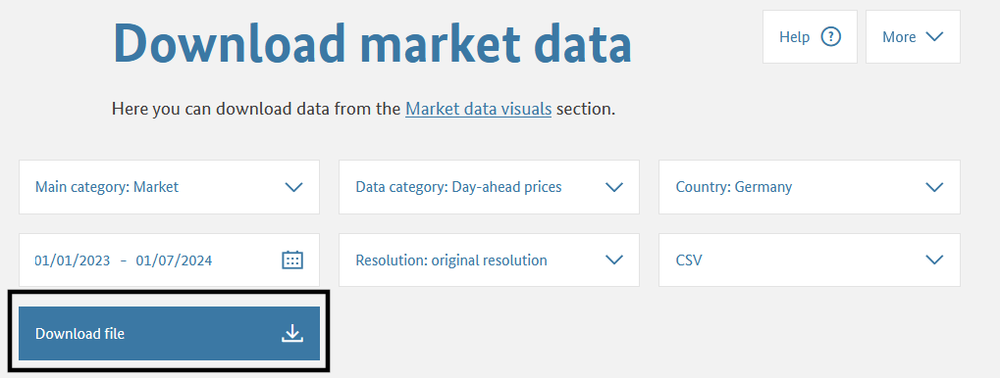

# Introduction

In 2016, a study found that one-fifth of all scientific articles in the field of genetics were based on data distorted by the spreadsheet software Excel [@Ziemann-2016]. Gene names such as "MARCH1" were mistakenly converted into date formats. In 2021, this estimate of affected papers was even raised to 30 percent. ([heise online](https://www.heise.de/news/Excel-wandelt-Genbezeichnungen-in-Datumsangaben-um-Problem-groesser-als-gedacht-6165902.html))

At the beginning of computer-based data analysis lies the task of reading data from files. In practice, reading data is anything but trivial. Data are stored in a variety of file formats. Therefore, in data analysis, it is essential to handle different file types: from small text files just a few kilobytes in size, to open and proprietary formats from common office applications, to files several hundred megabytes large in formats specifically developed for scientific data exchange. Programming languages such as Python and R provide various tools for reading, processing, and saving different file formats. Specialized packages further extend this toolbox.

However, the practical challenges of data analysis are not limited to technical aspects. Often, the internal structure of datasets poses the greatest difficulties. An important part of reading structured datasets involves searching for and, if necessary, cleaning errors in the dataset. Dasu and Johnson write:

::: {.border layout="[5, 90, 5]"}

&nbsp;

"Unfortunately, the data set is usually dirty, composed of many tables, and has unknown properties. Before any results can be produced, the data must be cleaned and explored—often a long and
difficult task. [...] In our experience, the tasks of exploratory data mining and data cleaning constitute 80% of the effort that determines 80% of the value of the ultimate data
mining results." (@Dasu-Johnson-2003, p. ix)

&nbsp;

:::

&nbsp;

Reading structured datasets therefore includes the entire process of technical file access, organization, error detection and correction, and storing the data in a form suitable for further processing.

In practical data analysis, two simple tips can help when reading structured datasets:

::: {#tip-editor .callout-tip collapse="false"}
**Look at your data before reading it into Python!** A simple text editor or a spreadsheet application is sufficient (be mindful of automatic detection and conversion of date formats). A quick glance helps you identify the delimiters, thousands separators, date formats, missing value encodings, and Unicode encoding (such as UTF-8) used in your data.
:::

However, this is not always possible—for example, if your dataset contains hundreds of columns and tens of thousands of rows. This module therefore provides the tools to read datasets using only the means available in Python.

It is not necessary to memorize all the details of the packages and functions presented here. The topic is too complex, and the behavior of functions often changes as the programming language evolves. The special features of the functions presented here serve as mental anchors to help you troubleshoot issues in practice.

::: {#tip-dokumentation .callout-tip collapse="false"}
**Use the documentation!** This way, you get a complete overview of default and optional parameters. You can also spot changes in program behavior and avoid unexpected errors.

:::: {layout="[1, 1]"}

{fig-alt="Hint about a new feature in Python"}

{fig-alt="Hint about a deprecated feature in Python"}

::::

:::

# Fundamentals: Characteristics of Datasets
Before diving into the practical challenges of reading structured datasets, we will first look at some key characteristics of datasets to build a basic understanding of terminology and learn how to handle Python’s built-in tools. At the end of this chapter, we introduce *tidy data*—a fundamental concept for organizing datasets.

::: {#imp-Datensatz .callout-important}
## Dataset

A dataset is a collection of related data. Datasets contain values associated with one or more variables. Every dataset has a technical format, a structure, at least one variable, and at least one value.

:::

## Technical Format
The technical format of a dataset determines how data can be read, processed, and stored. Some examples include:

  - Printed material, e.g., phone book: data like names and phone numbers must be read manually, edited irreversibly with a pen
  
  - Punch card, e.g., parking ticket: a reader recognizes the holes and grants one free hour; edited irreversibly with a punch tool
  
  - Text file, e.g., population by federal states: can be read, processed, and stored with various computer programs such as text editors, spreadsheets, or programming environments
  
  - Hierarchical Data Format (HDF5), e.g., spatial lightning density data: requires specialized software or packages

## Structure
Datasets store data in a defined n-dimensional structure.

::: {.border}
{fig-alt="Shown from left to right are one-, two-, and three-dimensional block structures representing datasets. These subfigures are reused and described in more detail in later sections."}

*slicing* by Marc Fehr is licensed under [CC-BY-4.0](https://github.com/bausteine-der-datenanalyse/w-python-numpy-grundlagen#CC-BY-4.0-1-ov-file) and available on [GitHub](https://github.com/bausteine-der-datenanalyse/w-python-numpy-grundlagen). 2024
:::

### One-Dimensional Datasets
The simplest form of dataset assigns values to a single variable. One-dimensional datasets containing values of the same type (e.g., numbers) are called **vectors**. One-dimensional datasets that can contain different data types are called **lists**. One-dimensional datasets have only one axis: the index, which can be used to access elements.

::: {.border}

{width="50%" fig-alt="A strip divided into five blocks represents a one-dimensional dataset. The blocks are labeled from 0 to 4 along axis 0 from left to right. A blue arrow goes from block zero to block three, which is highlighted in blue."}

*slicing* by Marc Fehr is licensed under [CC-BY-4.0](https://github.com/bausteine-der-datenanalyse/w-python-numpy-grundlagen#CC-BY-4.0-1-ov-file) and available on [GitHub](https://github.com/bausteine-der-datenanalyse/w-python-numpy-grundlagen). The graphic was cropped to show only the relevant part and the top label removed. 2024
:::

&nbsp;

Examples of one-dimensional datasets include a shopping list or the raw list of dice roll results. Using the index, you can, for example, output the dice result at index position 2.

``` {python}
print( *( eyes := [6, 2, 1, 2] ) )

print(f"The dice result at index position 2 is: {eyes[2]}")
```

### Reading One-Dimensional Data with Python
At this point, let’s briefly revisit content from the [Python Fundamentals module](https://bausteine-der-datenanalyse.github.io/w-python/output/book/):  
Python’s base accesses files via *file objects*. You have already learned about these functions and methods in the Python module. Accessing files through Python’s base functionality is a reliable fallback option and also useful for determining a file’s encoding.

::: {#tip-openundco .callout-tip collapse="false"}
## Quick Review: Core Python Functions and Methods

- The function `os.getcwd()` from the `os` module returns the current working directory. You can change it with `os.cwd(path)`.
- The function `open(filepath, mode = 'r')` opens a file in read mode and returns a file object.
- Information about the file object can be retrieved using various attributes: `file_object.name`, `os.path.basename(file_object.name)`, `file_object.closed`, `file_object.mode`, `file_object.encoding`
- The file object can be read using methods such as `file_object.read()`, `file_object.readline()`, `file_object.readlines()`, or the function `list(file_object)`.
- The method `file_object.close()` closes the file and releases it for use by other programs.

:::

**Read the file "python.txt" located in the path "skript/01-daten/".**

 - Determine the file’s encoding.

 - Remove the first line from the text and output the remaining text using Python.

 - How can the text be displayed correctly?

::: {#tip-pythonbasis .callout-tip collapse="true"}
## Example Solution for python.txt
```{python}
filepath = "01-daten/" + "python.txt"
file_object = open(filepath, mode = 'r')

# Determine the file encoding
print(f"The file encoding is: {file_object.encoding}")

# Output text
text_as_list = list(file_object)

for i in range(1, len(text_as_list)):
  print(text_as_list[i])

# Close the file
file_object.close()
```

Select UTF-8 encoding.
```{python}

# Choose UTF-8 encoding to support European special characters
file_object = open(filepath, mode = 'r', encoding = 'utf-8')

# Output text
text_as_list = list(file_object)

for i in range(1, len(text_as_list)):
  print(text_as_list[i])

# Close the file
file_object.close()
```

:::

### Two-Dimensional Datasets
Two-dimensional datasets organize values in a **matrix** or a **data frame** consisting of rows and columns. A matrix contains only one data type (e.g., numbers), while a data frame can contain different data types (e.g., numbers and boolean values). In Python, the Pandas module provides the DataFrame structure (see [Pandas Fundamentals module](https://bausteine-der-datenanalyse.github.io/w-pandas/output/book/)).

::: {.border}
{width="45%" fig-alt="A two-dimensional block represents a two-dimensional dataset. Arrows indicate the two axes. Axis 0 corresponds to the dataset’s length (top to bottom), and axis 1 corresponds to its width."}

*slicing* by Marc Fehr is licensed under [CC-BY-4.0](https://github.com/bausteine-der-datenanalyse/w-python-numpy-grundlagen#CC-BY-4.0-1-ov-file) and available on [GitHub](https://github.com/bausteine-der-datenanalyse/w-python-numpy-grundlagen). The graphic was cropped to show only the relevant part and the top label removed. 2024
:::

&nbsp;

Typically, in two-dimensional datasets, each column represents a **variable** and each row represents an **observation**. Variables store all values of a feature, for example, dice results. Observations store all measured values for one observation unit, e.g., a person. [@Wickham-2014, p. 3]

``` {python}
import pandas as pd

measurement1 = pd.DataFrame({
    'Name': ['Hans', 'Elke', 'Jean', 'Maya'],
    'Birthday': ['26.02.', '14.03.', '30.12.', '07.09.'],
    'Dice Color': ['pink', 'pink', 'blue', 'yellow'],
    'Sum of Eyes': [17, 12, 8, 23]
})

measurement1
```

&nbsp;

By specifying the indices along axis 0 (rows) and axis 1 (columns), you can output the sum of dice eyes for a person.

``` {python}

print(f"Jean rolled {measurement1.iloc[2, 3]} eyes")
```

It is also possible to first select a column and then access the value at a specific index, as with a one-dimensional dataset. This is called **chained indexing**.

``` {python}

print(f"Jean rolled {measurement1['Sum of Eyes'][2]} eyes")
```

::: {#wrn-chainedassignment .callout-warning appearance="simple"}
## Chained Indexing

Chained indexing in Pandas may either create a copy of the object or access the object’s memory directly, depending on the context. With Pandas 3.0, chained indexing will no longer be supported, and creating a copy will become the default. More information can be found at the linked reference.

:::: {.border layout="[5, 90, 5]"}

&nbsp;

"Whether a copy or a reference is returned for a setting operation may depend on the context. This is sometimes called `chained assignment` and should be avoided. See [Returning a View versus Copy](https://pandas.pydata.org/docs/user_guide/indexing.html#indexing-view-versus-copy)."

&nbsp;

::::

([Pandas Documentation](https://pandas.pydata.org/docs/user_guide/indexing.html))
:::

### Long and Wide Format
Two-dimensional datasets are usually represented as a matrix of rows and columns. Values for the variables organized in columns are assigned to the observations entered row-wise. This way of representing data is called the **wide format**: each additional measured variable makes the dataset wider.

Another way to organize and think about data is the **long format**. Some programs and packages require or at least benefit from data in long format, for example when creating plots. Let’s first look at the dataset `measurement1` again in wide format. What are the observation units? Which variables were recorded?

``` {python}
#| echo: false

measurement1
```

&nbsp;

You might assume that the observation units are Hans, Elke, Jean, and Maya, and that the variables are Birthday, Dice Color, and Sum of Eyes. However, it is also possible that the observation unit is Person, encoded as 0, 1, 2, and 3 (the row index of the dataset), and that the column Name is one of the recorded variables. Similarly, there could be only two variables, Dice Color and Sum of Eyes, while the columns Name and Birthday encode the observed individuals. Imagine there is a second person named Hans. In that case, the dice results for individuals named Hans can only be correctly assigned using the Birthday, e.g., 26.02. or 11.11.

``` {python}
measurement1 = pd.DataFrame({
    'Name': ['Hans', 'Elke', 'Jean', 'Maya', 'Hans'],
    'Birthday': ['26.02.', '14.03.', '30.12.', '07.09.', '11.11.'],
    'Dice Color': ['pink', 'pink', 'blue', 'yellow', 'pink'],
    'Sum of Eyes': [12, 17, 8, 23, 7]
})

measurement1
```

&nbsp;

The long format makes these considerations explicit by distinguishing between **identification variables** (id variables) and **measured variables** (measure variables or value vars). Transforming a dataset from wide format to long format is called **melting**. The Pandas module provides the function `pd.melt(frame, id_vars=None)`. It expects a DataFrame, and the optional argument `id_vars` specifies which columns are the identification variables.

``` {python}

measurement1_long = pd.melt(measurement1, id_vars = ['Name', 'Birthday'])

measurement1_long
```

&nbsp;

In long format, the measured variables are listed in the column `variable`, and their values are stored in the column `value`. Each additional measured variable makes the dataset longer.

If you think through the distinction between identification and measured variables, the variable name itself can be considered an identification variable for the value in the `value` column. A dataset can be understood as a structure that has exactly one measured variable, `value`, and a number of identification variables. This can be represented in long format as follows:

``` {python}
#| output: false

measurement1_all_id = pd.melt(measurement1, id_vars = ['Name', 'Birthday', 'Dice Color'])

measurement1_all_id
```

In this representation, for example, the first value `12` is identified by `Name = Hans`, `Birthday = 26.02.`, `Dice Color = pink`, and `variable = Sum of Eyes`.

::: {layout="[70, 30]"}
``` {python}
#| echo: false

measurement1_all_id = pd.melt(measurement1, id_vars = ['Name', 'Birthday', 'Dice Color'])

measurement1_all_id
```

{width="90%" fig-alt="Decorative image of a surprised dog"} 

<!-- wow will be removed again ;-) -->

::: 

::: {.border}
Much wow. Such architecture. by Dmitry Kudryavtsev is available at <https://yieldcode.blog/post/bloat-in-software-engineering/>. **The image will likely be removed again.**
:::

**What happens if the variable `Sum of Eyes` is also passed to the `id_vars` argument?**

::: {#tip-Antwort-all-id .callout-tip collapse="true"}
## Answer

The command `measurement1_all_id = pd.melt(measurement1, id_vars = ['Name', 'Birthday', 'Dice Color', 'Sum of Eyes'])` produces an empty DataFrame because no measured values remain.
:::

The reverse case is also possible: if no `id_vars` are specified during melting, all columns are treated as measured variables.

``` {python}

measurement1_no_id = pd.melt(measurement1)

measurement1_no_id
```

&nbsp;

The reverse operation of melting is called **casting** or **pivoting**. Here, a dataset in long format is converted back to wide format. The Pandas function `pd.pivot(data, columns, index)` takes a melted DataFrame and converts it using the unique values in `columns` (the column names of the wide-format DataFrame) and the unique values in `index` (the row index of the wide-format DataFrame). If no column is provided for `index`, the existing index of the melted DataFrame is used (which, with 20 rows, is of course too long). Since the object `measurement1_no_id` does not have a suitable index column, one must be created before casting. This can be done with the method `measurement1_no_id.groupby('variable').cumcount()`, which counts the occurrence of each value in the specified column starting at 0. (Directly replacing the index is not possible in this way, because the index passed to `pd.pivot(data, columns, index)` must not contain duplicates.)

``` {python}
# pd.pivot() requires an index or uses the existing index of the melted_df, which is too long
# Therefore, insert an additional column in measurement1_no_id
## simple: measurement1_no_id['new_index'] = list(range(0, 5)) * 4 
## general: measurement1_no_id['new_index'] = measurement1_no_id.groupby('variable').cumcount()

# Insert new_index column
measurement1_no_id['new_index'] = measurement1_no_id.groupby('variable').cumcount()
print(f"The long-format dataset with additional column new_index:\n{measurement1_no_id}")

# casting
measurement1_cast = pd.pivot(measurement1_no_id, index='new_index', columns='variable', values='value')
print(f"\nThe dataset in wide format:\n{measurement1_cast}")
```

The result still does not match the original wide-format dataset. To restore the original format, the columns must be reordered, and the index and its label must be reset.

```{python}

# Reorder columns and reset index
measurement1_cast = measurement1_cast[['Name', 'Birthday', 'Dice Color', 'Sum of Eyes']]
measurement1_cast.reset_index(drop=True, inplace=True)
measurement1_cast.rename_axis(None, axis=1, inplace=True)

print(f"\nThe dataset in wide format with reset index:\n\n{measurement1_cast}")
```

::: {#tip-idvars .callout-tip collapse="false"}
## Identification and Measured Variables

Even when working with wide-format datasets, distinguishing between identification and measured variables is useful for organizing data. [see @sec-tidydata]

:::

### Exercise: Two-Dimensional Datasets
Above, the object `measurement1_long` was created using the command `measurement1_long = pd.melt(measurement1, id_vars = ['Name', 'Birthday'])`.  
**Use the function** `pd.DataFrame.pivot()` **to transform the dataset `measurement1` back into wide format.**

``` {python}
#| echo: false

measurement1_long
```

::: {#tip-pivoting .callout-tip collapse="true"}
## Example Solution: Two-Dimensional Datasets

``` {python}

# Insert new_index column
measurement1_long['new_index'] = measurement1_long.groupby('variable').cumcount()

# casting
measurement1_long_cast = pd.pivot(measurement1_long, index='new_index', columns='variable', values='value')

# Reorder columns and reset index
measurement1_long_cast = measurement1_cast[['Name', 'Birthday', 'Dice Color', 'Sum of Eyes']]
measurement1_long_cast.reset_index(drop=True, inplace=True)
measurement1_long_cast.rename_axis(None, axis=1, inplace=True)

measurement1_long_cast
```

:::

### Three- and Higher-Dimensional Datasets
Three- or higher-dimensional datasets organize complex data structures in **arrays**. Arrays are n-dimensional data structures and therefore a general concept. For example, a list is a one-dimensional array, a matrix is a two-dimensional array, and an Excel file with multiple sheets for annually collected survey data is a three-dimensional array (sheets, rows, columns). Depending on the module used, arrays may contain one or multiple data types.

<!-- optionally add: xarray module <https://docs.xarray.dev/en/stable/user-guide/pandas.html> -->

::: {.border}
{width="50%" fig-alt="A three-dimensional block representing a three-dimensional dataset. Arrows indicate the three axes. Axis 0 corresponds to depth, axis 1 to length (top to bottom), and axis 2 to width of the dataset."}

*slicing* by Marc Fehr is licensed under [CC-BY-4.0](https://github.com/bausteine-der-datenanalyse/w-python-numpy-grundlagen#CC-BY-4.0-1-ov-file) and available on [GitHub](https://github.com/bausteine-der-datenanalyse/w-python-numpy-grundlagen). The graphic was cropped to show only the relevant part and the top label removed. 2024

:::

&nbsp;

For three- and higher-dimensional data structures, specialized data formats are often used, as discussed in section @sec-specialformats. This is partly because it makes it easier to process different data types and document them with metadata (see @sec-metadata).

**Optional: Excursus JSON <https://docs.python.org/3/tutorial/inputoutput.html>**

#### Reading Image Data

::: {.border}
Digital images are represented as three-dimensional datasets. Each pixel in the rows and columns has color values (Red, Green, Blue) and optionally an alpha channel (Red, Green, Blue, Alpha). The color values are either in the range 0–1 or 0–255 (8-bit).

```
# Color values for one pixel
[Red, Green, Blue]

# One image row with three pixels
[[Red, Green, Blue], [Red, Green, Blue], [Red, Green, Blue]]

# An image with three rows and three columns
[[[Red, Green, Blue], [Red, Green, Blue], [Red, Green, Blue]],
 [[Red, Green, Blue], [Red, Green, Blue], [Red, Green, Blue]],
 [[Red, Green, Blue], [Red, Green, Blue], [Red, Green, Blue]]]
```

Image files can be read using the function `plt.imread()` from the `matplotlib.pyplot` module.

:::: {.border}
``` {python}
import matplotlib.pyplot as plt

logo = plt.imread(fname='00-bilder/python-logo-and-wordmark-cc0-tm.png')

plt.imshow(logo)
```

The Python logo by the Python Software Foundation is licensed under the [GPLv3](https://www.gnu.org/licenses/gpl-3.0.html). The wordmark is trademarked: <https://www.python.org/psf/trademarks/>. The file is available on [Wikimedia](https://de.m.wikipedia.org/wiki/Datei:Python_logo_and_wordmark.svg). 2008

:::: 

&nbsp;

The structure of the dataset can be accessed using the `.shape` attribute.

``` {python}
print(type(logo), "\n")

print(logo.shape)
```

The data was read as a `NumPy.ndarray`. The logo has 144 rows, 486 columns, and is in the RGBA color space. A slice of the data looks like this:

``` {python}
print(logo[50:52, 50:52, :])
```

[@Arnold-2023-numpy-dateien]

:::

### Exercise: Three-Dimensional Datasets
Using the index of the third dimension, the Red, Green, and Blue color channels can be selected and displayed individually with the function `plt.imshow(cmap='Greys_r')`. The argument `cmap='Greys_r'` instructs the function to use the inverted grayscale, so high color values appear light and low values dark. **Display the Red, Green, and Blue channels of the Python logo individually using `plt.imshow(cmap='Greys_r')`.**

::: {#tip-logo .callout-tip collapse="true"}
## Example Solution: Three-Dimensional Datasets
``` {python}
#| fig-cap: Color channels of the Python logo
#| fig-alt: "The three color channels of the Python logo are shown."

channels = ["Red Channel", "Green Channel", "Blue Channel"]

plt.figure(figsize=(9, 6))

for i in range(3):
    plt.subplot(1, 4, i + 1)
    plt.imshow(logo[:, :, i], cmap='Greys_r')
    plt.title(label=channels[i])

plt.colorbar(shrink=0.15)

plt.tight_layout()
plt.show()
```

You might wonder why the image background appears black in each color channel. The explanation is in the next tip.

:::: {#tip-logo .callout-tip collapse="true"}
## Explanation: Image Background
The image background has a value of 0 in all channels, including the alpha channel. This part of the image is therefore fully transparent and is filled in by the webpage background. As a result, the logo's background appears white.

``` {python}
#| fig-cap: Alpha channel of the Python logo
#| fig-alt: "The alpha channel of the Python logo is shown. The image background has a value of 0."

# Alpha channel
plt.imshow(logo[:, :, 3], cmap='Greys_r')
plt.title(label='Alpha Channel')
plt.colorbar(shrink=0.4)

plt.show()

# The first two rows and columns of the logo
print(logo[0:2, 0:2, :])
```

::::
:::

## Data Type {#sec-datentyp}
The data type specifies how the values contained in a dataset are interpreted by Python. For example, the value "1" could represent a character, an integer, a Boolean value, the month January, or the level of a categorical variable. Python, as a versatile programming language, supports many data types that fall into the categories: numerics, sequences, mappings, classes, instances, and exceptions. More information can be found in the [documentation](https://docs.python.org/3/library/stdtypes.html).

::: {.border}
{width="60%" fig-alt="A categorization of standard types in Python. The categorization does not exactly match the categories listed in the documentation. The type None for null values has no further subdivision. The Numbers category is divided into integers (including Booleans), real numbers (floats), and complex numbers. The Sequences category is divided into immutable (Strings, Tuples, Bytes) and mutable (Lists, Byte Arrays). The Set Types category is divided into Sets and Frozen Sets. The Mappings category contains Dictionaries. The Callable category includes functions, methods, and classes. There is also the Module category."}

Python 3. The standard type hierarchy. by Максим Пе is licensed under [CC BY SA 4.0](https://creativecommons.org/licenses/by-sa/4.0/deed.de) and available on [Wikimedia](https://commons.wikimedia.org/wiki/File:Python_3._The_standard_type_hierarchy.png). 2018
:::

&nbsp;

Modules add further data types. Commonly used data types in data analysis include:

  - Numbers: integers, floating-point numbers
  - Booleans
  - Strings
  - Date and time values
  - Category (from the [Pandas](https://pandas.pydata.org/docs/user_guide/categorical.html) module)

The data type determines, on the one hand, the allowable range of values for a variable. For example, 0 and 13 are valid integers but not valid encodings for a month. On the other hand, the data type defines which operations are allowed on the values and how Python executes them. This applies to operators and functions. Python includes functions to determine and, if necessary, convert the data type of a value (see w-Python).

::: {#nte-operation-nach-datentyp .callout-note}
# Data Type-Dependent Operations and Functions

``` {python}
# The + operator adds numbers
print(1 + 13)

# The + operator also concatenates strings
print(str(1) + str(13))
```

The sorting function behaves differently depending on the data type.

``` {python}
# Create a list of date strings
dates = pd.Series(['07.06.2000', '12.01.2000', '11.02.2000', '04.09.2000', '10.03.2000', '03.10.2000', '09.04.2000', '08.05.2000', '06.07.2000', '05.08.2000', '02.11.2000', '01.12.2000'])
dates = pd.to_datetime(dates, format='%d.%m.%Y')

print(f"An unsorted list of month abbreviations:\n{list(dates.dt.strftime('%b'))}")

print(f"\nThe list sorted alphabetically:\n{sorted(list(dates.dt.strftime('%b')))}")

print(f"\nThe list sorted as datetime objects:\n{list(dates.sort_values().dt.strftime('%b'))}")
```

:::

::: {#tip-datatype .callout-tip collapse="false"}
## Check and Validate Data Types
When reading datasets, it is important to verify that data types are correctly detected or to actively control them. Further methods for formally checking data types and validating value ranges are presented in [@sec-numpypandas].
:::

### Missing Values {#sec-missing}
A special data type is used to represent missing values. In Python, a distinction is made between non-existent and undefined values.

#### Null Value `None`
The so-called null value in Python is `None`, which is one of Python's defined keywords.
``` {python}
print(type(None))
```

`None` represents non-existent values and objects. Empty (but existing) objects do not belong to the `None` data type.

``` {python}
empty_list = []
empty_list == None
```

`None` can be passed as an argument to functions or returned by them. However, operations with `None` are not allowed.

``` {python}
# Operations with None result in errors
try:
    print(None + 1)
except TypeError as error:
    print("The provided value causes the following error:\n", error)
else:
    print(None + 1)
```

One exception is conversion to a string.

``` {python}
# One exception is conversion to strings
a = None
print("\nprint(a) returns the null value:\n", a, sep="")

print("\nstr(a) returns a string:")
str(a)
```


#### NaN
To work with missing values within a dataset, there is the value `NaN`, which belongs to the floating-point class. `NaN` stands for Not a Number and represents undefined or unrepresentable values. For example, the method `pd.diff()` calculates the difference between each value and its predecessor. Since the first value has no predecessor, `NaN` is produced.

``` {python}
my_series = pd.Series([1, 2, 4, 8])
my_series.diff()
```

Unlike `None`, `NaN` is not a built-in keyword in Python. The value `NaN` can be created using `float('nan')` or `float('NaN')`; capitalization does not matter. `NaN` therefore has the data type float. The `math` and `NumPy` modules also provide `math.nan` and `np.nan` to create `NaN`.

``` {python}
print(type(float('NaN')))
```

Operations can be performed with the value `NaN`. The result is always `NaN`.

``` {python}
print(float('NaN') + 1)
```

Some functions can handle `NaN` as a placeholder for missing values.

``` {python}
# Python built-ins
print("sum():", sum([1, 2, float('NaN'), 4]), "\n")
print("max():", max([1, 2, float('NaN'), 4]), "\n")
print("any():", any([1, 2, float('NaN'), 4]), "\n")

# Pandas
data_with_nan = pd.Series([1, 2, float('NaN'), 4])
print(data_with_nan + 1)
print("\nSum of the dataset:", data_with_nan.sum())
```

::: {#wrn-logicbasepython .callout-warning appearance="simple" collapse="false"}
## Warning: Logical Behavior!

The logical evaluation of missing values differs for `None` and `NaN`.

``` {python}
bool_values = [None, float('NaN')]

for element in bool_values:
    bool_value = bool(element)
    print("Boolean value of", element, "is", bool_value)
```

This also applies to value equality.

``` {python}
for element in bool_values:
    result = element == element
    print("Value equality of", element, "is", result)
```

::: 
## Missing values in practice
`None` and `NaN` are Python-specific representations for non-existent or undefined values. In practice, missing values in datasets are indicated in various ways.

Common representations include:

  - no entry, e.g., an empty string `""` in comma-separated files

  - defined string: `NA` in the R programming language, `NULL` in SQL, `.` in Stata

  - manually chosen values or digits outside the valid range such as -1, -88, -99 (often in survey data)

The choice of representation has pros and cons. A defined string for missing values helps distinguish gaps in the dataset from data collection errors. For this, a defined string like "NA" is better than an empty string. Manually chosen values allow assigning specific behavior to each variable during automated analysis (e.g., distinguishing not applicable, refused response, don't know, interview terminated no reply).

::: {#tip-missingvalues .callout-tip collapse="false"}
## Missing values

Identifying and, if necessary, cleaning missing values is an important step when reading structured datasets. It helps to know common conventions for missing values and the conventions of the respective file format or discipline. Sometimes intuition is also necessary. Suitable functions for identifying missing values are presented in @sec-numpypandas.

:::

## Metadata {#sec-metadata}
Metadata are descriptive information about a dataset. Metadata can specify, for example:

  - which data types a dataset contains,

  - coding schemes, scales, or minimum and maximum allowed values,

  - conditions under which the data were collected,

  - origin of the data,

  - relationships between variables and datasets,
  
  - copyright information and license notes.

(cf. [The HDF Group Help Desk](https://docs.hdfgroup.org/archive/support/HDF5/doc/Advanced/HDF5_Metadata/index.html))

Specialized file formats like netCDF or HDF explicitly declare metadata in dedicated fields. Many file formats lack such functionality. Relevant metadata are often found in the file name, column headers, additional sheets, or separate documents (which may not always be available).

::: {#tip-metadata .callout-tip collapse="false"}
## Metadata
Before importing complex datasets, accompanying materials should be reviewed if available.

:::

## Tidy data {#sec-tidydata}
Datasets are often designed with various purposes, e.g., for convenient data entry. This often means datasets need extensive cleaning for script-based data analysis.

::: {.border layout="[5, 90, 5]"}
&nbsp;

“Tidy datasets are all alike, but every messy dataset is messy in its own way.” [@R-for-Data-Science, Chapter 5 Data tidying]

&nbsp;
:::

Tidy data is a system by Hadley Wickham that helps organize datasets into a clean (tidy) format. Cleaning datasets is a preparatory task to minimize time spent reshaping data structures during actual analysis, allowing a greater focus on the analytical content. [@R-for-Data-Science, Chapter 5 Data tidying]

::: {#imp-tidy-data .callout-important}
## tidy data

:::: {.border layout="[[5, 90, 5], [1]]"}

&nbsp;

::::: {}
"The tidy data system consists of three rules:

1. Each variable is a column; each column is a variable.

2. Each observation is a row; each row is an observation.

3. Each value is a cell; each cell is a single value."
:::::

&nbsp;

[@R-for-Data-Science, Chapter 5 Data tidying, translated]
::::
:::

Tidy data usually refers to two-dimensional datasets but also provides guidance for organizing datasets with different structures for analysis. Tidy data is not a strict rule; it is acceptable to use a different structure if it facilitates analysis.

# The NumPy and Pandas modules {#sec-numpypandas}
The NumPy and Pandas modules allow efficient work with datasets. Reading and writing files and managing data types is much easier than with Python built-ins. Vectorized operations are often faster than equivalent Python operations. Pandas is built on top of NumPy. Both modules are discussed in the following sections.

A brief overview of pros and cons:

  * [NumPy](https://bausteine-der-datenanalyse.github.io/w-python-numpy-grundlagen/output/book/): n-dimensional array structure supporting the most commonly used data types and numerous numeric formats for specialized scientific calculations ([see documentation](https://numpy.org/devdocs/reference/arrays.scalars.html)). An array can only hold a single data type and its size is immutable. Operations are slightly faster than in Pandas DataFrames.

    - Column names are possible with a structured dtype ([see documentation](https://numpy.org/doc/stable/user/basics.io.genfromtxt.html#setting-the-names))

  * [Pandas](https://bausteine-der-datenanalyse.github.io/w-pandas/output/book/): 2-dimensional DataFrame structure in long and wide formats. DataFrames can hold multiple data types and their size is mutable. Supports alphanumeric column and index labels. Can read files directly from the internet.

    - 3-dimensional DataFrames are possible with a MultiIndex → but this contradicts the Tidy Data concept

Common abbreviations for both modules:

``` {python}
import numpy as np
import pandas as pd

# Set display precision for floats
pd.set_option("display.precision", 2)
```


::: {#tip-pypandas .callout-tip collapse="false"}
## Working with NumPy and Pandas
Whether you work with NumPy or Pandas depends on your dataset and personal preference. 

The Pandas package allows you to load data from various sources such as CSV files or Excel sheets, supporting different data types, into a DataFrame. You can then inspect and restructure this data with just a few commands. Complex operations like reshaping datasets, grouping and aggregating data, as well as filtering and sorting, can be done efficiently.

Except for a few exceptions, Pandas and NumPy are compatible with each other. There is nothing preventing you from preparing your data with Pandas and then analyzing it with NumPy.

:::

## Data Types
NumPy supports the following data types:

|      NumPy Array Type  |      Python Data Type |
|---|---|
|     int_    |     int    |
|     double    |     float    |
|     cdouble    |     complex    |
|     bytes_    |     bytes    |
|     str_    |     str    |
|     bool_    |     bool    |
|     datetime64    |     datetime.datetime    |
|     timedelta64    |     datetime.timedelta    |

[NumPy Documentation](https://numpy.org/devdocs/reference/arrays.scalars.html)

In most cases, the Pandas module uses NumPy data types. However, Pandas also introduces some additional data types. A complete list can be found in the [Pandas Documentation](https://pandas.pydata.org/docs/reference/arrays.html). The most important additional data types are:

  - [Categorical](https://pandas.pydata.org/docs/user_guide/categorical.html) `dtype = 'category'`

  - [Timezone-aware datetime](https://pandas.pydata.org/docs/reference/api/pandas.Timestamp.html#pandas.Timestamp) `dtype = 'datetime64[ns, US/Eastern]'`

## Reading and Writing Files
In the NumPy and Pandas learning modules, you have learned the functions to read and write files.

::: {.panel-tabset}
## NumPy
In NumPy, files can be read using `np.loadtxt()` and written using `np.savetxt()`. 

  - `np.loadtxt(fname = data.txt, delimiter = ";", skiprows= #rows)`  

  - `np.savetxt(fname = file_path, X = data, header = comment, fmt='%5.2f')`

## Pandas
In Pandas, files are read and written using a set of specialized functions that follow a consistent naming scheme. Functions for reading files use the form `pd.read_csv`, and functions for writing use the form `pd.to_csv`. With Pandas, files from the internet can also be retrieved using `pd.read_csv(URL)`.

:::: {.border}
| Format Type | Data Description | Reader | Writer |
|:---:|:---:|:---:|:---:|
| text | CSV | read_csv | to_csv |
| text | Fixed-Width Text File | read_fwf | NA |
| text | JSON | read_json | to_json |
| text | HTML | read_html | to_html |
| text | LaTeX | Styler.to_latex | NA |
| text | XML | read_xml | to_xml |
| text | Local clipboard | read_clipboard | to_clipboard |
| binary | MS Excel | read_excel | to_excel |
| binary | OpenDocument | read_excel | NA |
| binary | HDF5 Format | read_hdf | to_hdf |
| binary | Feather Format | read_feather | to_feather |
| binary | Parquet Format | read_parquet | to_parquet |
| binary | ORC Format | read_orc | to_orc |
| binary | Stata | read_stata | to_stata |
| binary | SAS | read_sas | NA |
| binary | SPSS | read_spss | NA |
| binary | Python Pickle Format | read_pickle | to_pickle |
| SQL | SQL | read_sql | to_sql |

([Pandas Documentation](https://pandas.pydata.org/docs/user_guide/io.html))
::::
:::

## Identifying and Setting Data Types
As previously explained, the data type determines the allowed range of values for a variable, permissible operations, and the execution of operators and functions in Python. The NumPy and Pandas modules provide a range of functions to check and set the data type of variables. 

*Note: The datetime data type is covered in [@sec-time-series].*

### NumPy
With NumPy, the data type of an array can be set when reading a file using the `dtype` argument `np.loadtxt(fname = data.txt, dtype = 'float')`. The `dtype` argument accepts a data type specification, keywords, or abbreviations. More information can be found in the [NumPy Documentation](https://numpy.org/doc/stable/reference/arrays.dtypes.html).

| Data Type | Keyword | Abbreviation | dtype |
|---|---|---|---|
| Floating Point | float | f8 | float64 |
| Integer | int | i | int32 |
| Boolean | bool | ? | bool |
| Date | datetime64 | M | datetime64 |
| String | str | U | U + number to specify required bytes |

The data type of an array can be determined using the `np.dtype` attribute. The data type of an object can be changed using the method `np.array = np.array.astype()`.

The following file is known to you from the w-NumPy learning module.

``` {python}
file_path = '01-daten/TC01.csv'
data = np.loadtxt(file_path)
```


**Check the dtype of the file and create a copy of the object with integer data type. How can you verify whether any decimal places were truncated during the conversion to integers?**

::: {#tip-numpydatetype .callout-tip collapse="true"}
## Example Solution: Data Type Conversion

``` {python}
# Display the data type
print(data.dtype)

# Convert to integer
data_int = data.astype('int')

# Check for data loss
check_sum = data - data_int
print(f"Difference data - data_int: {check_sum.sum()}")
```

:::

### Pandas
The Pandas module is specialized in handling different data types. You can pass the data type to the functions used for reading data with the `dtype` argument. For multiple columns, this can be done using a dictionary in the form `{'column_name': 'dtype'}`.  
The attribute for displaying the data type is appropriately called `pd.DataFrame.dtypes` (note the appended 's'). The data type of a Pandas data object can be changed analogously to NumPy using `pd.Series = pd.Series.astype()`.

#### Tooth Growth of Guinea Pigs
In a group of 60 guinea pigs (**1st column without a label**), the length of odontoblast cells (tooth-forming cells) was measured in microns (**len**). The animals were previously given Vitamin C in the form of ascorbic acid (VC) or orange juice (OJ) (**supp**). The guinea pigs received doses of 0.5, 1, or 2 milligrams of Vitamin C per day (**dose**). The measurement data are stored in the file ToothGrowth.csv (Crampton 1947).

::: {.border}
Crampton, E. W. 1947. “THE GROWTH OF THE ODONTOBLASTS OF THE INCISOR TOOTH AS A CRITERION OF THE VITAMIN C INTAKE OF THE GUINEA PIG”. The Journal of Nutrition 33 (5): 491–504. <https://doi.org/10.1093/jn/33.5.491> 
:::

&nbsp;

 **Read the file as follows:**

  - Replace the column label of the 1st column with 'ID' (without quotes).
  
  - Read the columns `len` and `dose` with appropriate numeric data types and the column `supp` as a categorical variable.

::: {#tip-guineapigs .callout-tip collapse="true"}
## Example Solution: Guinea Pigs
``` {python}
file_path = "01-daten/ToothGrowth.csv"
guinea_pigs = pd.read_csv(filepath_or_buffer = file_path, sep = ',', header = 0, \
  names = ['ID', 'len', 'supp', 'dose'], dtype = {'ID': 'int', 'len': 'float', 'dose': 'float', 'supp': 'category'})

# Display every sixth value
guinea_pigs.iloc[guinea_pigs.index % 6 == 0]
```

``` {python}
print(guinea_pigs.dtypes)
```

:::

#### Useful Functions for Descriptive Data Analysis
Pandas provides several useful functions to describe the structure of a dataset.

The `.columns` attribute returns the column labels as a list. It can also be used to set column names.
``` {python}
print(guinea_pigs.columns)
guinea_pigs.columns = ['ID', 'Length', 'Supplement', 'Dose']
print(guinea_pigs.columns)
```

The method `pd.DataFrame.describe()` generates descriptive statistics for a DataFrame. By default, all numeric columns are included. Using the `include` argument, you can specify which columns to include. `include='all'` includes all columns, which is not always meaningful. Alternatively, you can pass a list of data types to include. The `exclude` argument works similarly to exclude certain data types from the output.

``` {python}
print(guinea_pigs.describe(), "\n")

print(guinea_pigs.describe(include = 'all'), "\n")

print(guinea_pigs.describe(include = ['float']), "\n")
```

The method `pd.DataFrame.count()` counts all non-missing values in each column, or with `pd.DataFrame.count(axis='columns')` in each row.
``` {python}
guinea_pigs.count(axis='rows')  # the default value of axis is 'rows'
```

The method `pd.DataFrame.info()` generates a summary of the dataset.
``` {python}
guinea_pigs.info()
```

The method `pd.unique()` lists all unique values.
``` {python}
guinea_pigs['Dose'].unique()
```

::: {#tip-pandasinfo .callout-tip collapse="false"}
## Useful Functions
Pandas provides several useful functions to check a loaded file. Make it a habit to use `pd.dtypes` or `pd.DataFrame.info()`. 
:::

### Task: Data Types
The UK Department for Energy Security & Net Zero publishes data on industrial electricity prices in the member countries of the International Energy Agency.  
**Read the worksheet "5.3.1 (excl. taxes)" from the Excel file 'skript/01-daten/table_531.xlsx' using Pandas. Check the documentation for the function [pd.read_excel](https://pandas.pydata.org/docs/reference/api/pandas.read_excel.html) to see how to select the correct sheet. Ensure that all columns are read with numeric data types.**

::: {.border}
Department for Energy Security & Net Zero. 2024. Energy Prices International Comparisons. Industrial electricity prices in the IEA. <https://www.gov.uk/government/uploads/system/uploads/attachment_data/file/670121/table_531.xls>
:::

::: {#tip-taxes .callout-tip collapse="true"}
## Example Solution 5.3.1 (excl. taxes)

Skip the leading rows with the argument `header=8`. Select the worksheet with `sheet_name="5.3.1 (excl. taxes)"` and check the detected data types with `taxes.dtypes`.
``` {python}
file_path = '01-daten/table_531.xlsx'

taxes = pd.read_excel(io = file_path, sheet_name = "5.3.1 (excl. taxes)", \
  header = 8)

taxes.dtypes
```

View the values in the column 'Republic of Türkiye' using `pd.unique()`.
``` {python}
taxes['Republic of Türkiye'].unique()
```

Remove the string '..' and change the data type using the method `pd.astype('float64')`.

  - Option 1: declare it as a missing value when reading the file. 
  
  - Option 2: determine the index position after reading and replace the value. The chained slicing `df["col"][row_indexer] = value` is no longer supported in Pandas version 3.0 and will raise an error. Use the following syntax instead: `df.loc[row_indexer, "col"] = value`.

``` {python}
# Option 1: '..' declared as a missing value
# taxes = pd.read_excel(io = file_path, sheet_name = "5.3.1 (excl. taxes)", \
#   header = 8, na_values = ['..'])

# Option 2: find the index of the value and overwrite with np.nan
index_position = taxes['Republic of Türkiye'] == '..'

taxes.loc[index_position, 'Republic of Türkiye'] = np.nan
taxes['Republic of Türkiye'] = taxes['Republic of Türkiye'].astype('float64')

taxes.dtypes
```

:::

## Handling Missing Values
A column unexpectedly read as a string or object often indicates missing values, usually marked by special characters. The NumPy and Pandas modules provide functions to detect and convert missing values during data import.

*Note: Masked NumPy arrays are covered in [@sec-ma].*

### NumPy
The NumPy function `np.loadtxt()` is used to read complete datasets. Missing values in the dataset can be problematic because they may either cause data type errors or be skipped, resulting in a NumPy array shorter than the original dataset. Since NumPy arrays always have a single data type and fixed length, this can lead to errors when performing operations with multiple arrays.

The following file is known to you from the w-NumPy exercises.

``` {python}
file_path = '01-daten/TC01.csv'
data_no_missing = np.loadtxt(file_path)

print("Data:", data_no_missing)
print("Shape:", data_no_missing.shape, "dtype:", data_no_missing.dtype)
```


Suppose you conducted a second measurement and want to calculate the difference between the two datasets. In the second measurement, sensor errors led to missing values, marked with `--`. However, the function `np.loadtxt()` cannot handle missing values and will return an error.

``` {python}
file_path = '01-daten/TC01_double_hyphen.csv'

try:
    data_double_hyphen = np.loadtxt(file_path)
except ValueError as error:
    print("The input causes the following error:\n", error)
else:
    print("Data with missing values '--':", data_double_hyphen, "dtype:", data_double_hyphen.dtype)
```

#### The Function np.genfromtxt()
To read datasets with missing values, the function `np.genfromtxt(fname, delimiter=None, missing_values=None, filling_values=None)` is used. This function processes the dataset `fname` in two loops, which makes it slower than `np.loadtxt()`. The first loop splits the dataset line by line at the optional `delimiter` into strings. The second loop converts each string to the appropriate data type. With the optional arguments `missing_values` and `filling_values`, you can specify which strings indicate missing values and what they should be replaced with. ([NumPy Documentation](https://numpy.org/doc/stable/user/basics.io.genfromtxt.html))

``` {python}
file_path = '01-daten/TC01_double_hyphen.csv'
data_double_hyphen = np.genfromtxt(file_path, missing_values='--', filling_values=np.nan)

print("\nData with missing values '--':", data_double_hyphen)
print("Shape:", data_double_hyphen.shape, "dtype:", data_double_hyphen.dtype)
```

By converting missing values to `nan`, operations with equally sized NumPy arrays become possible.

``` {python}
data_difference = data_no_missing - data_double_hyphen
print(data_difference)
```

The function `np.genfromtxt()` can handle any string as a missing value. Only empty cells can be problematic, as their content `'\n'` is interpreted as a line break.

::: {#nte-npgenfromtxt .callout-note collapse="true"}
## Empty Cells with np.genfromtxt()

If a file contains empty cells, they cannot be read because they are automatically skipped.

``` {python}
# File without missing value markers
file_path = '01-daten/TC01_empty_lines.csv'
data_empty_lines = np.genfromtxt(file_path, missing_values='', filling_values=np.nan) 

print("\nData with missing values '':", data_empty_lines)
print("Shape:", data_empty_lines.shape, "dtype:", data_empty_lines.dtype)
```

The array is two elements shorter. Subtracting it from a longer NumPy array fails with an error.

``` {python}
try:
    result = data_no_missing - data_empty_lines
except ValueError as error:
    print("The input causes the following error:\n", error)
else:
    print(result)
```


In this case, you need to resort to Python's basic string processing. The processed list can then be read using `np.genfromtxt()` as usual.

``` {python}
# Read the data via file object
data_file_empty_lines = open(file_path, 'r', encoding='utf-8')
data_empty_lines = data_file_empty_lines.readlines()
data_file_empty_lines.close()

print("Read data object (excerpt):\n", data_empty_lines[0:10])

# String processing with replace('\n', '')
for i in range(len(data_empty_lines)):
    if data_empty_lines[i] == '\n':
        data_empty_lines[i] = 'placeholder'
    else:
        data_empty_lines[i] = data_empty_lines[i].replace('\n', '')

print("\nAfter string processing (excerpt):\n", data_empty_lines[0:10])

# Read using np.genfromtxt
data_empty_lines = np.genfromtxt(data_empty_lines, missing_values='placeholder', filling_values=np.nan)
print("\nData with missing values '':", data_empty_lines)
print("Shape:", data_empty_lines.shape, "dtype:", data_empty_lines.dtype)
```

:::

Especially for files with multiple columns, empty cells can quickly cause errors. Here it is necessary to specify the delimiter using the `delimiter` argument. From the documentation:  
"When spaces are used as delimiters, or when no delimiter has been given as input, there should not be any missing data between two fields." ([NumPy Documentation](https://numpy.org/doc/stable/reference/generated/numpy.genfromtxt.html))

::: {#nte-npgenfromtxt .callout-note collapse="true"}
## Empty Cells in Multiple Columns with np.genfromtxt()
Without specifying the `delimiter` argument, only one column is read, which contains only `np.nan`.
``` {python}
# without specifying delimiter
file_path = '01-daten/TC01_missing_values_multi_column.csv'
data_empty_lines2 = np.genfromtxt(file_path, missing_values='', filling_values=np.nan, ndmin=2)

print("Shape:", data_empty_lines2.shape, "dtype:", data_empty_lines2.dtype)
print("First three rows:\n", data_empty_lines2[0:3])
```

If the argument `delimiter=','` is passed, the file is read correctly.
``` {python}
# specifying the delimiter
data_empty_lines2 = np.genfromtxt(file_path, delimiter=',', missing_values='', filling_values=np.nan, ndmin=2)

print("Shape:", data_empty_lines2.shape, "dtype:", data_empty_lines2.dtype)
print("\nData with missing values '':\n", data_empty_lines2)
```

:::

#### Creating, Checking, Finding, Replacing, and Deleting Missing Values in NumPy
The NumPy module provides functions to work with missing values.

  - `np.nan` creates a missing value.

  - `np.isnan()` checks for a missing value and returns a boolean or a NumPy array with dtype bool.

  - `np.nonzero(np.isnan(array))` returns a tuple containing an array of the index positions of elements with the value `nan`. You can access the array with `np.nonzero(np.isnan(array))[0]`. Depending on the situation, converting it to a list can be useful: `np.nonzero(np.isnan(array))[0].tolist()`.  
    A similar function is `np.argwhere(np.isnan(array))`, but its output is not suitable for slicing multidimensional arrays (see the example below).  

::: {#nte-npargwhere .callout-note collapse="true"}
## The Function np.argwhere()

Another function to determine the index position of a value is `np.argwhere()`. Calling `np.argwhere(np.isnan(array))` returns a NumPy array with the index positions of elements with the value `nan`. 

``` {python}
array = np.array([[1, np.nan, np.nan], [4, 5, np.nan]])
print(array)

np.argwhere(np.isnan(array))
```

However, the array produced by `np.argwhere()` is not suitable for selecting array slices.

``` {python}
try:
    array[np.argwhere(np.isnan(array))]
except IndexError as error:
    print("The input causes the following error:\n", error)
else:
    print(array[np.argwhere(np.isnan(array))])
```


For comparison with `np.nonzero()`

``` {python}
try:
    array[np.nonzero(np.isnan(array))]
except IndexError as error:
    print("The input causes the following error:\n", error)
else:
    print(array[np.nonzero(np.isnan(array))])
```

:::: {#wrn-npargwhere .callout-warning appearance="simple" collapse="false"}
## The Function np.argwhere()
Selecting array slices with `np.argwhere()` works for one-dimensional arrays.
``` {python}
array = np.array([1, np.nan, np.nan, 4, 5])

try:
    array[np.argwhere(np.isnan(array))]
except IndexError as error:
    print("The input causes the following error:\n", error)
else:
    print(array[np.argwhere(np.isnan(array))])
```


::::
:::

  - `nan_to_num(x = array, nan = 0.0)` replaces `nan` values in the array `x` with `0.0` or with the value provided in the `nan` argument. (Note: `nan_to_num()` also replaces `np.inf` with large positive numbers and `-np.inf` with large negative numbers by default.)  
  Replacing specific values can also be done using a logical (boolean) vector (see the following example).

::: {#nte-vectorslicing .callout-note collapse="true"}
## Value Assignment with Logical Vector
Replacing specific values can also be achieved by selecting certain array elements using a logical (boolean) vector.
``` {python}
a = np.array([1, 2, 3, np.nan, 5, 6, np.nan])

b = np.isnan(a)

print(b)

a[b] = 0

print(a)
```

Multiple conditions can be combined using the function `np.logical_or(x1, x2)` as a logical OR.
``` {python}
a = np.array([1, 2, 3, np.nan, 5, 6, np.nan])

condition1 = np.isnan(a)

condition2 = a >= 5

condition = np.logical_or(condition1, condition2)

a[condition] = 0

print(a)
```

A logical AND is also possible (although it doesn’t make much sense when used with `np.nan`).  
The `*` operator works the same way as the logical operator `and` or the function `np.logical_and(x1, x2)`.
``` {python}
a = np.array([1, 2, 3, np.nan, 5, 6, np.nan])

condition1 = a < 4

condition2 = a >= 1

condition = condition1 * condition2

a[condition] = 0

print(a)
```

:::

  - `np.delete(arr = array, obj)` returns a new (shorter) array without the array elements specified in the parameter `obj`.  
    All elements with the value `nan` can be deleted like this: `np.delete(array, obj = np.nonzero(np.isnan(array)))`  

NumPy does not automatically convert `None` to `nan`. Therefore, NumPy cannot determine the data type of the object and outputs `dtype=object`:

``` {python}

np_array_with_none = np.array([1, 2, None, 4])
print(np_array_with_none, np_array_with_none.dtype)
```

**Exercise: How can `None` in the array `np_array_with_none` be replaced with `np.nan`?**

::: {#tip-numpynone .callout-tip collapse="true"}
## Solution
A logical comparison with `None` is possible. In this way, a boolean array can be created and used to select the index positions whose values should be replaced.
``` {python}
np_array_with_none = np.array([1, 2, None, 4])
print(np_array_with_none)

np_array_with_nan = np_array_with_none.copy()

print(f"\nArray with logical comparison to None:\n{np_array_with_none == None}")
np_array_with_nan[np_array_with_none == None] = np.nan
print(f"\nArray with None replaced by nan:\n{np_array_with_nan, np_array_with_nan.dtype}")
```

::: 

&nbsp;

#### Operations with Missing Values
Operations involving `nan` always result in `nan`. Therefore, NumPy provides many functions that automatically ignore `nan` values or replace them with an appropriate value.  
These functions can be easily recognized by their names.  
For example, `np.nansum()` and `np.nancumsum()` return the sum and cumulative sum of an array, respectively.  
In the cumulative sum, `nan` values are replaced by the running total.  
A complete list of NumPy functions can be found in the [documentation](https://numpy.org/doc/stable/reference/routines.html).

``` {python}
print(f"Array with nan:\n{np_array_with_nan}\n")

print(f"Sum of the array:\n{np.sum(np_array_with_nan)}\n")

print(f"nan-sum of the array:\n{np.nansum(np_array_with_nan)}\n")

print(f"Cumulative sum of the array:\n{np.cumsum(np_array_with_nan)}\n")

print(f"Cumulative nan-sum of the array:\n{np.nancumsum(np_array_with_nan)}\n")
```

### Pandas
The Pandas functions for reading files can handle missing values.  
By default, the following values are recognized as missing:  
`['-1.#IND', '1.#QNAN', '1.#IND', '-1.#QNAN', '#N/A N/A', '#N/A', 'N/A', 'n/a', 'NA', '<NA>', '#NA', 'NULL', 'null', 'NaN', '-NaN', 'nan', '-nan', 'None', '']`

Additional values can be defined as missing using the argument `na_values = []`.  
With the argument `keep_default_na = False`, you can specify that only the values passed in `na_values = []` should be interpreted as missing.  
By default, the argument `na_filter = True` ensures that empty cells are also read as NA.  
Completely empty rows, however, are skipped by default.  
This can be changed with the argument `skip_blank_lines = False`.  
([Pandas documentation](https://pandas.pydata.org/docs/user_guide/io.html#io-navaluesconst))

``` {python}
file_path = '01-daten/TC01_double_hyphen.csv'

try:
  data_double_hyphen = pd.read_csv(file_path, na_values = ['--'])
except ValueError as error:
  print("The input results in the following error message:\n", error)
else:
  print("Data with missing values '--':\n", data_double_hyphen, data_double_hyphen.shape) 
```

With the argument `skip_blank_lines = False`, empty rows are also read in.  
``` {python}
file_path = '01-daten/TC01_empty_lines.csv'

try:
  data_empty_lines = pd.read_csv(file_path, skip_blank_lines = False)
except ValueError as error:
  print("The input results in the following error message:\n", error)
else:
  print("Data with missing values '':\n", data_empty_lines, data_empty_lines.shape) 
```

Pandas uses different values to represent missing data depending on the data type.

  - `numpy.nan` for NumPy data types. In this case, the data type is automatically converted to `np.float64` or `object`.

  - `pd.NA` for strings and integers. The data type is preserved.

Reading the file `TC01_empty_lines.csv` as strings:
``` {python}
file_path = '01-daten/TC01_empty_lines.csv'

try:
  data_empty_lines = pd.read_csv(file_path, skip_blank_lines = False, dtype = 'string')
except ValueError as error:
  print("The input results in the following error message:\n", error)
else:
  print("Data with missing values '':\n", data_empty_lines, data_empty_lines.shape) 
```

`NA` can also be used as a missing value for floating-point numbers and other NumPy data types.  
However, a Pandas data type is required for this (see the following example).

::: {#nte-pdNA .callout-note collapse="true"}
## pd.Series with np.nan and pd.NA
A pd.Series with `np.nan` is automatically converted to `dtype: float64`:
``` {python}

try:
  test = pd.Series([1, 2, np.nan])
except TypeError as error:
  print("The input results in the following error message:\n", error)
else:
  print(test) 
```

A pd.Series with `pd.NA` is read as `dtype: object`:
``` {python}

try:
  test = pd.Series([1, 2, pd.NA])
except TypeError as error:
  print("The input results in the following error message:\n", error)
else:
  print(test) 
```

The `dtype` can be specified for a Series with `pd.NA`:
``` {python}

try:
  test = pd.Series([1, 2, pd.NA], dtype = 'Int32')
except TypeError as error:
  print("The input results in the following error message:\n", error)
else:
  print(test) 
```

Depending on the data type, the correct `dtype` (NumPy or Pandas) is important, which can be recognized by the capitalization.  
`pd.NA` with a NumPy floating-point type:
``` {python}

try:
  test = pd.Series([1, 2, pd.NA], dtype = 'float64')
except TypeError as error:
  print("The input results in the following error message:\n", error)
else:
  print(test) 
```

`pd.NA` with a Pandas floating-point type:
``` {python}

try:
  test = pd.Series([1, 2, pd.NA], dtype = 'Float64')
except TypeError as error:
  print("The input results in the following error message:\n", error)
else:
  print(test) 
```

`np.nan` with a NumPy floating-point type:
``` {python}

try:
  test = pd.Series([1, 2, np.nan], dtype = 'float64')
except TypeError as error:
  print("The input results in the following error message:\n", error)
else:
  print(test) 
```

`np.nan` with a Pandas floating-point type:
``` {python}

try:
  test = pd.Series([1, 2, np.nan], dtype = 'Float64')
except TypeError as error:
  print("The input results in the following error message:\n", error)
else:
  print(test) 
```

:::

&nbsp;

::: {#wrn-logicpandas .callout-warning appearance="simple" collapse="false"}
## Warning: Logic!

The logical evaluation of missing values differs for `None`, `np.nan`, and `pd.NA`.

``` {python}

bool_values = [None, float('nan'), pd.NA]

for element in bool_values:
  try:
    bool_value = bool(element)
  except TypeError as error:
      print(error)
  else:
    print("Boolean value of", element, "is", bool_value)
```

This also applies to value equality.
``` {python}

bool_values = [None, float('nan'), pd.NA]

for element in bool_values:
  try:
    result = element == element
  except TypeError as error:
      print(error)
  else:
    print("Value equality of", element, "is", result)
```

::: 

([Pandas documentation](https://pandas.pydata.org/docs/user_guide/missing_data.html))

#### Creating, Checking, Finding, Replacing, and Dropping Missing Values in Pandas
The Pandas module automatically converts `None` to `nan`. Similar to NumPy, Pandas provides various functions for working with missing values.

  - `pd.NA` creates a missing value (pay attention to capitalization: `pd.na` does not work)
  
  - The functions `pd.isnull()` and `pd.isna()` check for missing values and return a boolean or a NumPy array with `dtype=bool`. The functions `pd.notna()` and `pd.notnull()` check the opposite case.

  - The function `np.nonzero(pd.isna())` uses the NumPy function `np.nonzero()` and returns an array of the index positions of elements with missing values (the Pandas function `pd.nonzero()` is no longer supported).

  - `pd.Series.fillna(value = 0)` replaces missing values with the value provided in the `value` argument. The methods `pd.ffill()` and `pd.bfill()` replace missing values with the last or next valid value, respectively. The method `pd.Series.interpolate()` replaces missing values through interpolation, which requires a defined data type (`dtype = object` does not work). By default, linear interpolation is used, but various methods are available (see [Pandas documentation](https://pandas.pydata.org/docs/reference/api/pandas.Series.interpolate.html)).

  - The method `pd.Series.dropna()` returns a new (shorter) Series without missing values.

#### Operations with Missing Values
Operations with `pd.NA` generally result in `pd.NA`. However, there are some exceptions:

``` {python}
print(pd.NA ** 0)
print(1 ** pd.NA)
```

The method `pd.Series.sum()` treats `pd.NA` as 0, while the method `pd.Series.prod()` treats it as 1.
``` {python}
print(pd.Series([pd.NA]).sum())
print(pd.Series([pd.NA]).prod())
```

Reducing methods like `pd.Series.min()` or `pd.Series.mean()` as well as cumulative methods like `pd.Series.cumsum()` or `pd.Series.cumprod()` skip `pd.NA`.
``` {python}
print(pd.Series([pd.NA]).min())
print(pd.Series([pd.NA]).mean())
print(pd.Series([pd.NA]).cumsum())
print(pd.Series([pd.NA]).cumprod())
```

The behavior of methods like `pd.Series.sum()` and methods like `pd.Series.min()` has a comparable effect for data series but produces different results for individual values.

### Exercise: Missing Values
The German Weather Service (Deutscher Wetterdienst) measures various weather data across Germany.  
The file `'produkt_st_stunde_20230831_20240630_01303.txt'` contains hourly station measurements of solar radiation in Essen-Bredeney.

| Column Name | Description |
|---|---|
| STATIONS_ID | Station number |
| QN_592 | Data quality level |
| ATMO_LBERG | Hourly sum of atmospheric back radiation |
| FD_LBERG | Hourly sum of diffuse solar radiation |
| FG_LBERG | Hourly sum of global radiation |
| SD_LBERG | Hourly sum of sunshine duration |
| ZENIT | Sun zenith angle 0 - 180 degrees |

::: {.border}
Deutscher Wetterdienst. 2024. Hourly station measurements of solar radiation (global/diffuse) and atmospheric back radiation for Germany. <https://opendata.dwd.de/climate_environment/CDC/observations_germany/climate/hourly/solar/stundenwerte_ST_01303_row.zip>  
The columns `MESS_DATUM`, `MESS_DATUM_WOZ`, and `eor` were removed.
:::

&nbsp;

**Determine the encoding of missing values and replace them with `np.nan` or `pd.NA`. How many values were replaced?**  

::: {#tip-musterlösungfehlendewerte .callout-tip collapse="true"}
## Example Solution: Missing Values

Using the method `df.info()`, it can be seen that the dataset is complete.
``` {python}
file_path = "01-daten/produkt_st_stunde_20230831_20240630_01303.txt"
solar = pd.read_csv(file_path, sep = ";")

solar.info()
```

The method `df.describe()` generates descriptive statistics for numeric columns.  
``` {python}
solar.describe()
```

Three columns have a minimum value of -999, which is not meaningful. How often does the value -999 appear in these columns?

``` {python}
counting_df = solar[['ATMO_LBERG', 'FD_LBERG', 'FG_LBERG']] == -999
print(counting_df.sum())
print("Total:\t\t", counting_df.sum().sum())
```

:::

# Time Series {#sec-time-series}

## Date and Time in NumPy and Pandas
The NumPy and Pandas modules use the `datetime64` data type to handle date and time information.

::: {.panel-tabset}
## NumPy
`datetime64` objects are created using the function `np.datetime64()`. In Python output, the data type is also represented by the letter `M`. `datetime64` objects can be created in two ways:

  - A string in [ISO 8601](https://www.iso.org/iso-8601-date-and-time-format.html) format representing a date in the order year, month, day, hour, minute, second, millisecond, e.g., `YYYY-MM-DD 12:00:00.000`. A space or the letter `T` can be used as the separator between date and time. The data type and the smallest unit used are stored in the `dtype` attribute.
  
``` {python} 
print(np.datetime64('2024'), np.datetime64('2024').dtype)
print(np.datetime64('2024-10-31'), np.datetime64('2024-10-31').dtype)
print(np.datetime64('2024-10-31T12:24:59.999'), np.datetime64('2024-10-31T12:24:59.999').dtype)
```

  - As a number relative to the epoch with a specified time unit. The available time units are years ('Y'), months ('M'), weeks ('W'), days ('D'), as well as hours ('h'), minutes ('m'), seconds ('s'), milliseconds ('ms'), and other second-based units down to attoseconds (see [NumPy documentation](https://numpy.org/doc/stable/reference/arrays.datetime.html#datetime-units)).

``` {python} 
print(np.datetime64(10 * 1000, 'D'), np.datetime64(10 * 1000, 'D').dtype)
print(np.datetime64(1000 * 1000, 'h'), np.datetime64(1000 * 1000, 'h').dtype)
print(np.datetime64(1000 * 1000 * 1000, 's'), np.datetime64(1000 * 1000 * 1000, 's').dtype)
```

Datetime formats from other modules can also be converted to `np.datetime64()`.

When creating an array, the time unit can be specified.

``` {python}
my_array = np.array(['2007-07-13', '2006-01-13', '2010-08-13'], dtype = 'datetime64[s]')
print(my_array, my_array.dtype)
```

The `datetime64` data type is compatible with most NumPy functions.

``` {python}
np.arange('2005-02', '2005-03', dtype = 'datetime64[D]')
```

([NumPy documentation](https://numpy.org/doc/stable/reference/arrays.datetime.html))

## Pandas

In Pandas, `datetime64` objects are created using the functions `pd.to_datetime()` or `pd.date_range()`.  
*Note: Another option is the function `pd.Timestamp()`, which offers more extensive possibilities for creating a point in time but does not support string parsing.*

`pd.to_datetime()` generates values of the data type `datetime64[ns]`. Scalars (single values) created with `pd.to_datetime()` are returned as Timestamps, which do not have a `dtype` attribute. The function `pd.to_datetime()` accepts the following input types:

  - datetime objects from other modules.

  - Numbers and a time unit `pd.to_datetime(1, unit = None)` (default is nanoseconds). The `unit` argument accepts the values `'ns'`, `'ms'`, `'s'`, `'m'`, `'h'`, `'D'`, `'W'`, `'M'`, `'Y'` for nanoseconds, milliseconds, seconds, minutes, hours, days, weeks, months, and years. A timestamp is generated relative to the epoch.
  
``` {python}
print(pd.to_datetime(1000, unit = 'D'))
print(pd.to_datetime(1000 * 1000, unit = 'h'))
print(pd.to_datetime(1000 * 1000 * 1000, unit = 's'))
```

  - Strings representing a date or a date with time, formatted according to [ISO 8601](https://www.iso.org/iso-8601-date-and-time-format.html).

``` {python}
print(pd.to_datetime('2017'))
print(pd.to_datetime('2017-01-01T00'))
print(pd.to_datetime('2017-01-01 00:00:00'))
```

  - Strings in other formats can be parsed using the argument `format = "%d/%m/%Y"` (see [strftime documentation for string formatting](https://docs.python.org/3/library/datetime.html#strftime-and-strptime-behavior)).

``` {python}
print(pd.to_datetime('Monday, 12. August `24', format = "%A, %d. %B `%y"))
print(pd.to_datetime('Monday, 12. August 2024, 12:15 Uhr CET', format = "%A, %d. %B %Y, %H:%M Uhr %Z"))
```

  - Dictionary or DataFrame.

``` {python}
print(pd.to_datetime({'year':[2020, 2024], 'month': [1, 11], 'day': [1, 21]}), "\n")
print(pd.to_datetime(pd.DataFrame({'year':[2020, 2024], 'month': [1, 11], 'day': [1, 21]})))
```

The function `pd.date_range()` generates an array of type `DatetimeIndex` with `dtype=datetime64`. Exactly three of the following four arguments are required to create the range:

  - start: beginning of the range.

  - end: end of the range (inclusive).

  - freq: step size (e.g., year, day, business day, hour, or multiples like '6h' — see [list of available strings](https://pandas.pydata.org/docs/user_guide/timeseries.html#timeseries-offset-aliases)).

  - periods: number of values to generate.

``` {python}
#| warning: false

print(pd.date_range(start = '2017', end = '2024', periods = 3), "\n")

print(pd.date_range(start = '2017', end = '2024', freq = 'Y'), "\n")

print(pd.date_range(end = '2024', freq = 'h', periods = 3))
```

*Note: The function `pd.date_range()` will no longer support the alias 'Y' in the future. Instead, the aliases 'YS' (year start) or 'YE' (year end) can be used. Similarly, the alias 'M' will be replaced by 'MS' (month start) or 'ME' (month end) in the future.*
:::

Time differences are represented using a dedicated data type (see the following example).  
<!-- **Note for myself: Use case shifting time zones independent of a time zone (and without the time zone syntax)** -->

::: {.callout-note collapse="true"}
## Time Differences in NumPy and Pandas

:::: {.panel-tabset}

## NumPy
Time differences are represented using the `timedelta64` data type. Like `datetime64`, it is created by specifying an integer and a time unit.

``` {python}
np.timedelta64(1, 'D')
```

Objects of the types `datetime64` and `timedelta64` allow operations with date and time (see more examples in the [NumPy documentation](https://numpy.org/doc/stable/reference/arrays.datetime.html#datetime-and-timedelta-arithmetic)).

``` {python}
print(np.datetime64('today') - np.datetime64('2000-01-01', 'D'))
print(np.datetime64('now') - np.datetime64('2000-01-01', 'h'))

print("\n\nA simple time shift:", np.datetime64('now') - np.timedelta64(1, 'h'))
print("How many days are in a week?", np.timedelta64(1,'W') / np.timedelta64(1,'D'))
```

## Pandas
Time differences can be created similarly to NumPy by specifying an integer and a time unit.  
Additionally, they can be created using keyword arguments (allowed arguments are: weeks, days, hours, minutes, seconds, milliseconds, microseconds, nanoseconds).

``` {python}
pd.Timedelta(1, 'D')
pd.Timedelta(days = 1, hours = 1)
```

**Important:** Unlike in NumPy, time differences in months and years are no longer supported by Pandas.

``` {python}
try:
  print(pd.Timedelta(1, 'Y'))
except ValueError as error:
  print(error)
else:
  print(pd.Timedelta(1, 'Y'))
```

Time differences can also be created using a string.

``` {python}
print(pd.Timedelta('10sec'))
print(pd.Timedelta('10min'))
print(pd.Timedelta('10hours'))
print(pd.Timedelta('10days'))
print(pd.Timedelta('10w'))
```

Using a time difference, time series can be easily shifted.

``` {python}
pd.date_range(start = '2024-01-01T00:00', end = '2024-01-01T02:00', freq = '15min') + pd.Timedelta('30min')
```

::::

&nbsp;

**How old are you in days? How old in seconds? Calculate using NumPy or Pandas.**

:::: {#tip-alter .callout-tip collapse="true"}
## Tip: Pandas and Example Solution for Age

For an elegant solution in Pandas, check the available methods and attributes of Timedelta objects.

``` {.raw}
dir(pd.Timedelta(0))
```

::::: {#tip-loesungalter .callout-tip collapse="true"}
## Example Solution

Replace the string `'YYYY-MM-DD'` or, if you know the time of your birth, `'YYYY-MM-DDTHH:MM'` with your date of birth.

#### NumPy
In NumPy, the keywords `np.datetime64('today')` and `np.datetime64('now')` can be used. The output is resolved in days or seconds.

``` {.raw}
print(np.datetime64('today') - np.datetime64('YYYY-MM-DD', 'D'))
print(np.datetime64('now') - np.datetime64('YYYY-MM-DDTHH:MM', 's'))
```

#### Pandas
In Pandas, the keywords `pd.to_datetime('today')` and `pd.to_datetime('now')` are resolved in nanoseconds.

``` {.raw}
(pd.to_datetime('today') - pd.to_datetime('YYYY-MM-DD')).days
(pd.to_datetime('now') - pd.to_datetime('YYYY-MM-DDTHH:MM')).total_seconds()
```

:::::
::::
:::

## Reading Time Series
The Pandas module, in particular, provides efficient ways to correctly read date formats. Below, reading time series with NumPy and Pandas is demonstrated using electricity market data. Various exercises are available in @sec-übungenzeitreihen.

The German Federal Network Agency (Bundesnetzagentur) publishes various electricity market data, including wholesale prices. The electricity market data must be manually downloaded from [https://www.smard.de/](https://www.smard.de/home/downloadcenter/download-marktdaten/). In this script, data for the year 2023 is used.

::: {style="font-size: 90%;"}
| Data | Filename |
|---|---|
| Wholesale prices 2023 | Gro_handelspreise_202301010000_202401010000_Stunde.csv |
| Wholesale prices 2023 (English) | Day-ahead_prices_202301010000_202401010000_Hour.csv |
:::

::: {#wrn-SMARD .callout-warning appearance="simple" collapse="true"}
## Downloading SMARD Data

:::: {layout="[[50, 50], [50, 50], [1]]"}

Click "Accept" when selecting the time period.  

Select data in original resolution and click "Download".





The date format of the files depends on the language set on the website (German/English).
::::
:::

::: {.panel-tabset}

### NumPy
Attempting to read the file with `np.loadtxt()` leads to various errors (data type is not numeric, number of columns cannot be determined). This can be handled by specifying the data type `dtype = str` and limiting to the first row `max_rows = 1`.

``` {python}
file_path = "01-daten/Gro_handelspreise_202301010000_202401010000_Stunde.csv"
prices = np.loadtxt(fname = file_path, dtype = 'str', max_rows = 1)
prices
```

This way, the first row can be read and the semicolon can be identified as the delimiter. Encoding issues may also become noticeable. Therefore, the delimiter is specified with `delimiter=';'` and the file encoding with `encoding='UTF-8'`.

``` {python}
file_path = "01-daten/Gro_handelspreise_202301010000_202401010000_Stunde.csv"
prices = np.loadtxt(fname = file_path, dtype = 'str', max_rows = 1, delimiter=';', encoding='UTF-8')
prices
```

The string "\\ufeff" remains at the beginning of the array. This indicates the [byte order](https://en.wikipedia.org/wiki/Byte_order) of the file. It can be skipped by specifying `encoding='UTF-8-sig'` ([Mark Tolonen on stackoverflow.com](https://stackoverflow.com/a/72466627), [Python documentation](https://docs.python.org/3/library/codecs.html)). This way, the first row is read correctly, allowing `max_rows=2` to be used to inspect the data types.

``` {python}
prices = np.loadtxt(fname = file_path, dtype = 'str', max_rows = 2, delimiter=';', encoding='UTF-8-sig')
prices
```

The first two columns contain date and time information, while the remaining columns contain numeric values, with one column using '-' to encode missing values. The decimal separator is a comma. Since NumPy arrays can only hold a single data type, the dataset must be split accordingly. For the fourth-to-last column, it should be checked whether it contains only missing values.

First, the dataset is fully read as strings, skipping the column headers with `skiprows=1`.

``` {python}
prices = np.loadtxt(fname = file_path, dtype = 'str', delimiter=';', encoding='UTF-8-sig', skiprows=1)
```

Next, the date columns are isolated. NumPy does not support string formatting for dates, so the timestamps must be manually converted from '01.01.2023 00:00' to the ISO 8601 format 'YYYY-MM-DDThh:mm'.

``` {python}
# Isolate date columns
prices_date = prices[:, 0:2]

# Convert strings manually to ISO 8601 format
## Column 0
### create new array
prices_from_date = np.array([], dtype='datetime64')

for element in prices_date[:, 0]:

  # rearrange string
  new_element = element[6:10] + '-' + \
                element[3:5] + '-' + \
                element[0:2] + 'T' + \
                element[11:13] + ':' + \
                element[14:]

  # convert to datetime64
  new_element = np.datetime64(new_element)

  # append
  prices_from_date = np.append(prices_from_date, new_element)

## Column 1
### create new array
prices_to_date = np.array([], dtype='datetime64')

for element in prices_date[:, 1]:

  # rearrange string
  new_element = element[6:10] + '-' + \
                element[3:5] + '-' + \
                element[0:2] + 'T' + \
                element[11:13] + ':' + \
                element[14:]

  # convert to datetime64
  new_element = np.datetime64(new_element)

  # append
  prices_to_date = np.append(prices_to_date, new_element)

# view the last 4 elements
print(prices_from_date[-4:], prices_from_date.dtype)
print(prices_to_date[-4:], prices_to_date.dtype)
```

In the second step, it is checked whether the fourth-to-last column contains only missing values. Although the column position is known, it is determined using `np.argwhere()`. The number of unique values is counted using `len(np.unique())`.

``` {python}
# isolate numeric columns
prices_numeric = prices[:, 2:]

# find the position of the column with missing value '-' in the first row
position = np.argwhere(prices_numeric[0, :] == '-')
print("Column index:", position)

# check which values appear in the column
print("Number of unique values:", len(np.unique(prices_numeric[:, position])))
```

Since the fourth-to-last column contains only the '-' character, it can be removed. The data type can then be declared as a floating-point number. To do this, the decimal comma must be replaced with a period using `np.char.replace(prices_numeric, ',', '.')`. The column names must be stored separately.

``` {python}
# Remove column with missing values
prices_numeric = np.delete(arr = prices_numeric, obj = position, axis = 1)  # axis 1 = columns

# Replace decimal comma with point
prices_numeric = np.char.replace(prices_numeric, ',', '.')
prices_numeric = prices_numeric.astype('float64')

# Store column names
prices_numeric_colnames = np.loadtxt(fname = file_path, dtype='str', delimiter=';', encoding='UTF-8-sig', max_rows=1)
prices_numeric_colnames = prices_numeric_colnames[2:]  # remove date columns
prices_numeric_colnames = np.delete(arr = prices_numeric_colnames, obj = position)

print(prices_numeric_colnames, "\n")
print(prices_numeric[0:2, :], prices_numeric.dtype)
```

### Pandas
First, the wholesale prices file is read using the function `pd.read_csv()`, and the success is checked using the `pd.info()` method.

``` {python}
file_path = "01-daten/Gro_handelspreise_202301010000_202401010000_Stunde.csv"
prices = pd.read_csv(filepath_or_buffer = file_path)
print(prices.info())
```

Only one column is recognized because the dataset uses a semicolon as the delimiter. This can be specified with the argument `sep=';'` (default is comma). The success is checked using `pd.info()` and `pd.head()`.

``` {python}
file_path = "01-daten/Gro_handelspreise_202301010000_202401010000_Stunde.csv"
prices = pd.read_csv(filepath_or_buffer = file_path, sep=';')
print(prices.info())
prices.head()
```

&nbsp;

In the output, the data type `object` indicates that no column types were automatically recognized. In the first rows of the dataset, the comma is used as the decimal separator, while the default for `pd.read_csv()` is a period. After specifying the decimal separator, the numeric columns should be correctly recognized.

``` {python}
prices = pd.read_csv(filepath_or_buffer = file_path, sep=';', decimal=',')
print(prices.info())
```

The data type of the column `DE/AT/LU [€/MWh] Originalauflösungen` is not recognized as `float64`. The output shows that at least in the first rows, missing values are marked with '-'. Using the `.describe()` method, it can be checked whether the column contains any numeric values at all.

``` {python}
prices['DE/AT/LU [€/MWh] Originalauflösungen'].describe()
```

Since this is not the case, the column can be removed. The first two columns can then be converted to a date format using `pd.to_datetime()`. One cell contains strings in the format '01.01.2023 00:00'. Using the [strftime documentation](https://docs.python.org/3/library/datetime.html#strftime-and-strptime-behavior), the date format can be passed to the function.

``` {python}
prices.drop(labels='DE/AT/LU [€/MWh] Originalauflösungen', axis='columns', inplace=True)

## Convert date columns
prices['Datum von'] = pd.to_datetime(prices['Datum von'], format="%d.%m.%Y %H:%M")
prices['Datum bis'] = pd.to_datetime(prices['Datum bis'], format="%d.%m.%Y %H:%M")
print(prices.info())
```

If the internal structure of a file is known, the necessary parameters can also be passed directly when reading the file with `pd.read_csv` (arguments `usecols`, `parse_dates`, and `date_format`).

``` {python}
prices = pd.read_csv(
    filepath_or_buffer = file_path,
    sep=';',
    decimal=',',
    usecols=list(range(0, 15)) + list(range(16, 19)),  # select columns to read
    parse_dates=['Datum von', 'Datum bis'], date_format="%d.%m.%Y %H:%M"  # date formatting
)
print(prices.info())
```
:::

## Accessing Time Series
Pandas provides numerous attributes and methods to extract information from `datetime64` objects. NumPy does not currently support comparable functions natively. An overview of all available attributes and methods can be obtained with `dir(pd.to_datetime(0))`.

``` {python}
# Attributes
print("Year:", pd.to_datetime(0).year)
print("Month:", pd.to_datetime(0).month)
print("Day:", pd.to_datetime(0).day)
print("Hour:", pd.to_datetime(0).hour)
print("Minute:", pd.to_datetime(0).minute)
print("Second:", pd.to_datetime(0).second)
print("Day of year:", pd.to_datetime(0).dayofyear)
print("Weekday:", pd.to_datetime(0).dayofweek)
print("Days in month:", pd.to_datetime(0).days_in_month)
print("Leap year:", pd.to_datetime(0).is_leap_year)

# Methods
print("\nDate:", pd.to_datetime(0).date())
print("Time:", pd.to_datetime(0).time())
print("Weekday (0-6):", pd.to_datetime(0).weekday())
print("Month name:", pd.to_datetime(0).month_name())
```

For `pd.Series`, access is done via the `.dt` accessor (see [.dt accessor](https://pandas.pydata.org/docs/user_guide/basics.html#basics-dt-accessors)). Accessing different information via an attribute (without parentheses) or via a method (with parentheses) can differ (see the following example).

:::: {.callout-note collapse="true"}
## The dt Accessor

``` {python}
# Attributes
print("Date:", pd.Series(pd.to_datetime(0)).dt.date)  # difference
print("Time:", pd.Series(pd.to_datetime(0)).dt.time)  # difference
print("Year:", pd.Series(pd.to_datetime(0)).dt.year)
print("Month:", pd.Series(pd.to_datetime(0)).dt.month)
print("Day:", pd.Series(pd.to_datetime(0)).dt.day)
print("Hour:", pd.Series(pd.to_datetime(0)).dt.hour)
print("Minute:", pd.Series(pd.to_datetime(0)).dt.minute)
print("Second:", pd.Series(pd.to_datetime(0)).dt.second)

print("\nDay of year:", pd.Series(pd.to_datetime(0)).dt.dayofyear)
print("Weekday:", pd.Series(pd.to_datetime(0)).dt.dayofweek)
print("Weekday:", pd.Series(pd.to_datetime(0)).dt.weekday)  # difference
print("Days in month:", pd.Series(pd.to_datetime(0)).dt.days_in_month)
print("Leap year:", pd.Series(pd.to_datetime(0)).dt.is_leap_year)

# Methods
print("\nMonth name:", pd.Series(pd.to_datetime(0)).dt.month_name())
```

::::

The wholesale electricity prices for 2023 read in the previous section should be analyzed for differences on weekdays and weekends. **Compare the average electricity price in the Germany/Luxembourg area on weekdays (Monday - Friday) with the average price on weekends.**

::: {#tip-AveragePrice .callout-tip collapse="true"}
## Example Solution: Electricity Price Comparison

``` {python}
## Access with .dt for pd.Series
# Distinguish weekdays and weekend
weekdays = prices['Datum von'].dt.weekday.isin(list(range(0, 5)))
weekend = prices['Datum von'].dt.weekday.isin(list(range(5, 7)))

print(weekdays.head())
print(weekend.head())

# Compare prices
weekday_price = prices.loc[weekdays, 'Deutschland/Luxemburg [€/MWh] Originalauflösungen'].mean()
weekend_price = prices.loc[weekend, 'Deutschland/Luxemburg [€/MWh] Originalauflösungen'].mean()

print(f"\nAverage price on weekdays: {weekday_price:.2f} [€/MWh]\nAverage price on weekends: {weekend_price:.2f} [€/MWh]")
```

:::

## Missing Values in Time Series
NumPy and Pandas support `NaT` for `np.datetime64` and `np.timedelta64`.

  - NumPy: <https://numpy.org/doc/stable/reference/arrays.datetime.html>  
    `NaT`, in any combination of lowercase/uppercase letters, for a “Not A Time” 
  
  - Pandas: <https://pandas.pydata.org/docs/user_guide/missing_data.html>

::: {#wrn-logicNaT .callout-warning appearance="simple" collapse="false"}
## Warning: Logic!

Logical checks for missing values differ for `None`, `np.nan`, `pd.NA`, and `pd.NaT`. 

``` {python}
bool_values = [None, float('nan'), pd.NA, pd.NaT]

for element in bool_values:
    try:
        bool_value = bool(element)
    except TypeError as error:
        print(error)
    else:
        print("Truth value of", element, "is", bool_value)
```

The same applies to value equality.
``` {python}
for element in bool_values:
    try:
        result = element == element
    except TypeError as error:
        print(error)
    else:
        print("Value equality of", element, "is", result)
```

:::

## Exercises: Reading Time Series {#sec-übungenzeitreihen}

::: {.border layout="[[5, 90, 5], [1], [1]]"}

&nbsp;

"everybody I know has war stories about cleaning up lousy datasets"  
Nicholas J. Cox

&nbsp;

&nbsp;

Cox, Nicholas J. 2004: Exploratory Data Mining and Data Cleaning. Book Review 9. In: Journal of Statistical Software 2004, Volume 11. <https://www.jstatsoft.org/article/view/v011b09/30>

:::

The following exercises train the application of the tools introduced in this chapter and can be solved using either NumPy or Pandas.

#### Easy: Reading English Date Format

**Task: Read the file at path '01-daten/Day-ahead_prices_202301010000_202401010000_Hour.csv' so that the data types are correctly recognized. (Hints on the file see @wrn-SMARD, see [strftime documentation for string formatting](https://docs.python.org/3/library/datetime.html#strftime-and-strptime-behavior))**

::: {#tip-electricityprices .callout-tip collapse="true"}
## Sample Solution: Electricity Prices

:::: {.border}

``` {python}
import pandas as pd

file_path = "01-daten/Day-ahead_prices_202301010000_202401010000_Hour.csv"

data = pd.read_csv(file_path, sep=";")   # Semicolon as separator must be specified
data.info() # -> shows that columns 0 "Start date" and 1 "End date" are recognized as dtype "object"
print("\n")

print(data.iloc[0:10, 0:2], "\n") # show first few rows to see how the first two "object" columns are structured
# Output example:
# Start date: Jan 1, 2023 12:00 AM
# End date: Jan 1, 2023 1:00 AM
# Two approaches are possible:

# 1st approach: specify date format while reading:
data = pd.read_csv(file_path, sep=";", parse_dates=[0,1], date_format="%b %d, %Y %I:%M %p")   # parameter here is date_format, in 2nd approach it is only "format"

# 2nd approach: convert the two object-type columns after reading:
data["Start date"] = pd.to_datetime(data["Start date"], format="%b %d, %Y %I:%M %p")  # %b for month abbreviation, %I for hour in AM/PM, %p for AM/PM
data["End date"] = pd.to_datetime(data["End date"], format="%b %d, %Y %I:%M %p")
print(data.iloc[0:10, 0:2], "\n")

data.info()
```

Solution example by Marc Sönnecken. For improved readability, the output using `print(data.head(10))` was replaced with `print(data.iloc[0:10, 0:2], "\n")`. However, to get an overview of a dataset, the `.head()` method is generally more suitable.
::::
:::

#### Medium: Austrian Electricity Market Data
The Austrian Power Grid AG (APG) publishes electricity market data at [https://markttransparenz.apg.at/](https://markttransparenz.apg.at/en/markt/Markttransparenz/erzeugung/Erzeugung-pro-Typ). Generation data for the year 2023 can be downloaded from this link.

::: {#wrn-ElectricityMarket-Austria .callout-warning appearance="simple" collapse="true"}
# Download Austrian Market Transparency Data

After selecting the desired period, click Export, then the Download button will appear. 

{fig-alt="View of the input fields to download Austrian electricity market data."}

{fig-alt="View of the input fields to download Austrian electricity market data in English."}

The date format of the files depends on the language setting of the website (German/English).

:::

&nbsp;

The following file is attached to this script. 

::: {style="font-size: 90%;"}
| Data | Filename |
|---|---|
| Realized Electricity Generation 2023 | AGPT_2022-12-31T23_00_00Z_2023-12-31T23_00_00Z_15M_de_2024-06-10T09_32_38Z.csv |
:::

In this dataset, the switch from daylight saving time to standard time on the last Sunday in October results in the 2 AM hour being recorded twice (while one hour is missing during the switch from standard to daylight saving time on the last Sunday in March). The duplicate hour is marked in the dataset as 2A and 2B. (Information from Austrian Power Grid AG, 13.08.2024)

{fig-alt="Excerpt from the Austrian generation dataset. The columns 'Zeit von [CET/CEST]' and 'Zeit bis [CET/CEST]' highlight the period from 29.10.2023 02:00:00 to 29.10.2023 03:00:00 in yellow to illustrate the anomaly described above."}

**Read the file so that columns with date and time information are recognized as datetime. Resolve the daylight saving time transition so that each day has 24 hours.**

::: {#tip-Austria title="Solution for Austrian Electricity Market Data" .callout-tip collapse="true"}

:::: {.callout-tip collapse="true"}
## Simple Approach
The simplest solution is to generate time series and replace the columns 'Zeit von [CET/CEST]' and 'Zeit bis [CET/CEST]' with them.
```
start_times = pd.date_range(start = "2023-01-01T00:00", end = "2023-12-31T23:45", freq = '15min')
end_times = pd.date_range(start = "2023-01-01T00:15", end = "2024-01-01T00:00", freq = '15min')

print(start_times[8070:8078], "\n")
print(end_times[8070:8078], "\n")
```

::::

**Read File and String Manipulation**

First, the file is read in. Cells that cannot be converted to datetime can be displayed using Python.

``` {python}
# Read file
generation_austria = pd.read_csv(filepath_or_buffer = "01-daten/AGPT_2022-12-31T23_00_00Z_2023-12-31T23_00_00Z_15M_de_2024-06-10T09_32_38Z.csv",
                                 sep = ";", decimal = ",", thousands = ".")

# Identify cells with invalid datetime strings
print("Column 'Zeit von [CET/CEST]'")
i = 0
invalid_positions = []
for element in generation_austria['Zeit von [CET/CEST]']:
    try:
        pd.to_datetime(element, format = "%d.%m.%Y %H:%M:%S")
    except:
        print(element)
        invalid_positions.append(i)
    i += 1
print("\nThe cells have the row indices: ", invalid_positions, "\n")

print("Column 'Zeit von [CET/CEST]'")
i = 0
invalid_positions = []
for element in generation_austria['Zeit von [CET/CEST]']:
    try:
        pd.to_datetime(element, format = "%d.%m.%Y %H:%M:%S")
    except:
        print(element)
        invalid_positions.append(i)
    i += 1
print("\nThe cells have the row indices: ", invalid_positions, "\n")
```

To correctly read the date columns, the strings "2A" and "2B" are replaced with "02" using the `str.replace()` method. This creates a duplicate in the dataset.

``` {python}
# String replace & convert to datetime
## Column 'Zeit von [CET/CEST]'
generation_austria['Zeit von [CET/CEST]'] = generation_austria['Zeit von [CET/CEST]'].str.replace(pat = '2A', repl = '02')
generation_austria['Zeit von [CET/CEST]'] = generation_austria['Zeit von [CET/CEST]'].str.replace(pat = '2B', repl = '02')

generation_austria['Zeit von [CET/CEST]'] = pd.to_datetime(generation_austria['Zeit von [CET/CEST]'], format = "%d.%m.%Y %H:%M:%S")

## Column 'Zeit bis [CET/CEST]'
generation_austria['Zeit bis [CET/CEST]'] = generation_austria['Zeit bis [CET/CEST]'].str.replace(pat = '2A', repl = '02')
generation_austria['Zeit bis [CET/CEST]'] = generation_austria['Zeit bis [CET/CEST]'].str.replace(pat = '2B', repl = '02')

generation_austria['Zeit bis [CET/CEST]'] = pd.to_datetime(generation_austria['Zeit bis [CET/CEST]'], format = "%d.%m.%Y %H:%M:%S")

print(generation_austria.info())
```

**Determine index positions of the duplicated and missing hour**

In the next step, we determine the index positions of the duplicated and the missing hour.  
For this purpose, a new object is created that accesses the memory area of the date columns (which is not strictly necessary).  
The position of the duplicated hour is determined using the method `pd.Series.duplicated()`, which returns a logical vector.  
This vector is then used for slicing and output of the index position.  
By subtracting 4, the index of the first hour is displayed (the dataset is based on quarter-hour intervals).

*duplicated hour*

``` {python}
# create new object
austria_dates = generation_austria[['Zeit von [CET/CEST]', 'Zeit bis [CET/CEST]']].copy()

# determine index position of the duplicated hour
## Time from
position_duplicated_hour_from = austria_dates['Zeit von [CET/CEST]'][austria_dates['Zeit von [CET/CEST]'].duplicated()].index - 4

print(f"The duplicated hour (Time from):\n{austria_dates.loc[position_duplicated_hour_from, 'Zeit von [CET/CEST]']}\n"
      f"is located at index position\n {position_duplicated_hour_from}\n"
      f"\nThe next hour is:\n{austria_dates.loc[position_duplicated_hour_from + 4, 'Zeit von [CET/CEST]']}"
      f"\n\nBoth hours are identical.")

### End of the shift in column Time from
end_shift_from = position_duplicated_hour_from[-1]
print(f"\nThe time shift in column 'Time from' ends at index position: {end_shift_from}")

## Time to
position_duplicated_hour_to = austria_dates['Zeit bis [CET/CEST]'][austria_dates['Zeit bis [CET/CEST]'].duplicated()].index - 4

print(f"\n\nThe duplicated hour (Time to):\n{austria_dates.loc[position_duplicated_hour_to, 'Zeit bis [CET/CEST]']}\n"
      f"is located at index position\n {position_duplicated_hour_to}\n"
      f"\nThe next hour is:\n{austria_dates.loc[position_duplicated_hour_to + 4, 'Zeit bis [CET/CEST]']}"
      f"\n\nBoth hours are identical.")

### End of the shift in column Time to
end_shift_to = position_duplicated_hour_to[-1]
print(f"\nThe time shift in column 'Time to' ends at index position: {end_shift_to}")
```

*missing hour*  

Daylight saving time begins on the last Sunday in March.  
The missing hour does not lie within `range(0, 24)`.  
This condition can be checked in four steps:

  - March: `march = pd.Series[pd.Series.dt.month == 3]`

  - Sundays in March: `sundays = march[march.dt.dayofweek == 6]`

  - last Sunday in March: The last 23*4 entries represent the last Sunday of the month (23 because one hour is missing).  
    `last_sunday = sundays[-23*4:]`
  
  - missing hour: `np.argwhere(np.invert(pd.Series(range(0,24)).isin(last_sunday.dt.hour)))`

``` {python}
# determine index position of the missing hour
## Time from
### Month of March
mask_march_from = austria_dates['Zeit von [CET/CEST]'].dt.month == 3
austria_dates_march_from = austria_dates.loc[mask_march_from, 'Zeit von [CET/CEST]']
print(f"The month of March (Time from):\n{austria_dates_march_from.head}\n");

### last Sunday
mask_sunday_from = (austria_dates_march_from.dt.dayofweek == 6)
last_sunday_from = (austria_dates_march_from[mask_sunday_from])[-23*4:]
print(f"The last Sunday in March:\n{last_sunday_from}\n")

### missing hour
print(last_sunday_from.dt.hour)
missing_hour_from = np.argwhere(np.invert(pd.Series(range(0,24)).isin(last_sunday_from.dt.hour))).item() 
print(f"\nThe missing hour is:\n{missing_hour_from}\n")
print(last_sunday_from[last_sunday_from.dt.hour == (missing_hour_from - 1)], 
      last_sunday_from[last_sunday_from.dt.hour == (missing_hour_from + 1)], sep = "\n")

### start of the shift in column Time from
start_shift_from = last_sunday_from[last_sunday_from.dt.hour == (missing_hour_from + 1)].index[0]

print(f"\nThe time shift in the column 'Time from' starts at index position: {start_shift_from}\n\n")

## Time to
### Month of March
mask_march_to = austria_dates['Zeit bis [CET/CEST]'].dt.month == 3
austria_dates_march_to = austria_dates.loc[mask_march_to, 'Zeit bis [CET/CEST]']
print(f"The month of March (Time to):\n{austria_dates_march_to.head}\n");

### last Sunday
mask_sunday_to = (austria_dates_march_to.dt.dayofweek == 6)
last_sunday_to = (austria_dates_march_to[mask_sunday_to])[-23*4:]
print(f"The last Sunday in March:\n{last_sunday_to}\n")

### missing hour
print(last_sunday_to.dt.hour)
missing_hour_to = np.argwhere(np.invert(pd.Series(range(0,24)).isin(last_sunday_to.dt.hour))).item() 
print(f"\nThe missing hour is:\n{missing_hour_to}\n")
print(last_sunday_to[last_sunday_to.dt.hour == (missing_hour_to - 1)], 
      last_sunday_to[last_sunday_to.dt.hour == (missing_hour_to + 1)], sep = "\n")

### start of the shift in column Time to
start_shift_to = last_sunday_to[last_sunday_to.dt.hour == (missing_hour_to + 1)].index[0]

print(f"\nThe time shift in the column 'Time to' starts at index position: {start_shift_to}")
```

With the stored index positions, the corresponding timestamps can now be shifted:

  - Column *Time from*: 8072 (object `start_shift_from`) to 28903 (object `end_shift_from`)

  - Column *Time to*: 8071 (object `start_shift_to`) to 28902 (object `end_shift_to`)

For slicing, the method `pd.Series.iloc[]` is used, which indexes exclusively — that is, the end positions must be increased by 1.  
By subtracting `pd.Timedelta(1, unit='h')`, the time shift is removed from the dataset.
  
``` {python}
# correct time shift
## Time from
austria_dates['Zeit von [CET/CEST]'].iloc[start_shift_from : end_shift_from + 1] = (
    austria_dates['Zeit von [CET/CEST]']
    .iloc[start_shift_from : end_shift_from + 1]
    .subtract(pd.Timedelta(1, unit='h'))
)

generation_austria['Zeit von [CET/CEST]'] = austria_dates['Zeit von [CET/CEST]']

## Time to
austria_dates['Zeit bis [CET/CEST]'].iloc[start_shift_to : end_shift_to + 1] = (
    austria_dates['Zeit bis [CET/CEST]']
    .iloc[start_shift_to : end_shift_to + 1]
    .subtract(pd.Timedelta(1, unit='h'))
)

generation_austria['Zeit bis [CET/CEST]'] = austria_dates['Zeit bis [CET/CEST]']

# verification
print("Verification in the dataset +/- one quarter hour\n")
print("The column 'Time from'")
print(generation_austria['Zeit von [CET/CEST]'].iloc[start_shift_from - 1 : end_shift_from + 2], "\n")

print("The column 'Time to'")
print(generation_austria['Zeit bis [CET/CEST]'].iloc[start_shift_to - 1 : end_shift_to + 2], "\n")
```

:::

#### Advanced: CAPE Ratio — a dataset full of pitfalls
The 2013 Nobel laureate in Economic Sciences, **Robert Shiller**, maintains a dataset containing monthly price data of the **U.S. stock index S&P 500** and other economic indicators for calculating the **inflation-adjusted price-to-earnings ratio (CAPE Ratio)**.  
The dataset is available on [Robert Shiller’s website](https://shillerdata.com/) ([direct link to the XLS file](https://img1.wsimg.com/blobby/go/e5e77e0b-59d1-44d9-ab25-4763ac982e53/downloads/ie_data.xls?ver=1712069253887)).  
**Read in the dataset.**

::: {style="font-size: 90%;"}
| Data | Filename |
|---|------|
| Monthly price data S&P500 | shiller_data.xls |
:::

::: {#tip-shiller-data1 .callout-tip collapse="true"}
## Notes and sample solution — Shiller data

First, open the dataset in a spreadsheet program. Some remarkable irregularities include:

  - Metadata in rows 2 and 3, where some column labels are also placed, and additional metadata at the end of the file.

  - Multi-line column headers.
  
  - Empty columns **P** and **N**.

  - Missing values represented by `'NA'` and empty cells `''`.

  - Different formatting for the month of October in the `Date` column (`YYYY-M` format).

:::: {#tip-shiller-data2 .callout-tip collapse="true"}
## Hints for solving

Due to these numerous irregularities, it’s helpful to read the **data** and **headers** separately.  
You can determine the correct row index either from your initial spreadsheet inspection or by reading the first 10–20 lines of the dataset in Python.  
This makes it easier to inspect the data and manipulate it using string-processing methods.  

In practice, it’s often simpler to manually specify the column names using the argument  
`names = Sequence of column labels to apply`  
or to define them directly in a spreadsheet editor.

It’s also advisable to proceed step by step, developing a separate solution for each issue, possibly using smaller dataset excerpts or generated test data.

::::: {#tip-shiller-data3 .callout-tip collapse="true"}
## Complete sample solution

The dataset is read using the `pd.read_excel()` function.  
The argument `sheet_name` is used to select the worksheet **Data**.  
With the method `pd.head(n=10)`, you can identify the row index where the header ends and the data begins.  
In this case, the header ends at row 8, which corresponds to index **7** in Python.

**Read header**

``` {python}
file_path = '01-daten/shiller_data.xls'
shiller = pd.read_excel(io=file_path, sheet_name='Data')

# manually identify the end of the header and start of data (commented out)
# print(shiller.head(n=10), "\n")

# read header
shiller_head = pd.read_excel(io=file_path, sheet_name='Data', skiprows=1, nrows=7, header=None)
print(shiller_head, "\n")
print(shiller_head.info())  # empty columns are recognized as numeric
```

**Isolating column labels**  
Next, the header can be further processed to isolate the column labels.  
There are several possible approaches for this task — the following method is one example, and other alternatives are shown in the next example.  

Column-wise concatenation of strings is performed using the method `pd.Series.str.cat()`, which is only available for `pd.Series` objects.  
Therefore, each column is processed individually in a loop.  
Additionally, this method only works with the data type `'string'`, which is ensured using the method `astype('string')`.

Afterward, text elements that do not belong to the column labels are removed using `str.replace()`.  
Here, the argument `regex=True` proves useful.

``` {python}
# create column labels using a loop
shiller_column_labels = pd.Series()

for column in shiller_head:
    shiller_column_labels = pd.concat([
        shiller_column_labels,
        pd.Series(shiller_head[column].astype('string').str.cat())
    ])

# clean up strings
## remove first cell content: "Stock Market Data Used in 'Irrational Exuberan...'"
shiller_column_labels = shiller_column_labels.astype('str').replace(shiller_head.loc[0, 0], '', regex=True)

## remove 'Robert J. Shiller'
shiller_column_labels = shiller_column_labels.astype('str').replace(shiller_head.loc[1, 0], '', regex=True)

## remove spaces
## regex=True to remove spaces within strings
shiller_column_labels = shiller_column_labels.astype('str').replace(' ', '', regex=True)

## replace overly long strings
shiller_column_labels = shiller_column_labels.astype('str').replace('CyclicallyAdjustedPriceEarningsRatioP/E10or', '', regex=True)
shiller_column_labels = shiller_column_labels.astype('str').replace('CyclicallyAdjustedTotalReturnPriceEarningsRatioTRP/E10or', '', regex=True)

## reset index
shiller_column_labels.reset_index(inplace=True, drop=True)

print(shiller_column_labels)
```

:::::: {.callout-note collapse="true"}
## Alternative approaches for string manipulation of the file header

#### Using the NumPy data type `'str'`

Specifying `dtype='str'` results in the use of the NumPy string data type (`dtype='str'`), which is **mutable**.  
Only with this data type does string concatenation using the method `pd.DataFrame.sum()` work properly.

``` {python}
# The NumPy string data type is mutable
my_array = np.array([['1', '2'], ['3', '4']])
my_array[0] = ['a', 'b']
my_array
```

With the Pandas data types `'string'` and `'object'`, the approach shown above does **not** work.  
Pandas uses the Python string type, which is **immutable**.  
This means that no method can modify an existing string in place.  
Instead, methods like `str.replace()` return **new strings**.

``` {.raw}
## using NumPy string data type
shiller_head = pd.read_excel(io=file_path, sheet_name='Data', skiprows=1, nrows=7, header=None)

# concatenate header with NumPy string type using pd.DataFrame.sum()
# print(shiller_head.astype('str').sum(skipna=True, axis=0))

## cleaning the dataset
### remove nan
shiller_head = shiller_head.astype('str').replace('nan', '')

### remove first cell content: "Stock Market Data Used in 'Irrational Exuberan...'"
shiller_head = shiller_head.astype('str').replace(shiller_head.loc[0, 0], '')

### remove 'Robert J. Shiller'
shiller_head = shiller_head.astype('str').replace(shiller_head.loc[1, 0], '')

### remove spaces
### regex=True to remove spaces within strings
shiller_head = shiller_head.astype('str').replace(' ', '', regex=True)

### replace overly long strings
shiller_head = shiller_head.astype('str').replace('CyclicallyAdjustedPriceEarningsRatioP/E10or', '', regex=True)
shiller_head = shiller_head.astype('str').replace('CyclicallyAdjustedTotalReturnPriceEarningsRatioTRP/E10or', '', regex=True)

### concatenate rows column-wise
shiller_head = shiller_head.astype('str').sum(skipna=True, axis=0)

print("\nConcatenated column names\n", shiller_head)
```

#### Using `DF.agg()` or `DF.apply()`

The Pandas method `DF.agg()` aggregates a DataFrame row-wise or column-wise using a specified function.  
The Pandas method `DF.apply()` applies a function row-wise or column-wise to a DataFrame.  
Essentially, both methods achieve the same result.  

For details on using [lambda expressions](https://docs.python.org/3/reference/expressions.html#lambda) and the `join` method from [Python basics](https://www.w3schools.com/python/ref_string_join.asp), refer to the provided links.

``` {.raw}
shiller_head = pd.read_excel(io=file_path, sheet_name='Data', skiprows=1, nrows=7, header=None)

# DF.agg()
print(shiller_head.agg(lambda x: ''.join(x.astype(str))))

# DF.apply()
print(shiller_head.apply(lambda x: ''.join(x.astype(str))))
```

::::::

**Read in data**

When reading the data, the header is checked, and the end of the dataset is examined using the `.tail()` method to identify rows containing additional metadata.  
These metadata rows are then skipped using the argument `skipfooter=1`.

``` {python}
file_path = '01-daten/shiller_data.xls'

# read data
shiller_data = pd.read_excel(io=file_path, sheet_name='Data', skiprows=8, header=None)
print(shiller_data.head(n=2), "\n")
shiller_data.tail(n=5)
```

&nbsp;

After removing the metadata, the detected data types are checked using the `.info()` method.

``` {python}
shiller_data = pd.read_excel(io=file_path, sheet_name='Data', skiprows=8, header=None, skipfooter=1)
print(shiller_data.head(n=2), "\n")
print(shiller_data.tail(n=2))

# determine data types
shiller_data.info()
```

**Combine header and data**

Columns with index 13 (column N) and 15 (column P) are empty; these are removed from both the header and the data.  
All remaining columns are recognized as floating-point numbers.  
This means that the percentage signs in columns with indices 16 and 19–21 (Q, T:V) were handled by division by 100.  
With the exception of the `Date` column, all data types are now correctly recognized.

``` {python}
# remove empty columns
shiller_column_labels = shiller_column_labels.drop(labels=[13, 15])
shiller_data = shiller_data.drop(labels=[13, 15], axis='columns')

# assign column names
shiller_data.columns = shiller_column_labels
shiller_data.info()
```

**Correct date format**

The next step is to correct the date format.  
The `Date` column contains strings in the format `'YYYY,MM'`.  
An exception is the month of October, which is encoded as `'YYYY.M'`.  
This difference is not visible in the `print()` output because the display precision is set to 2 decimal places using `pd.set_option("display.precision", 2)`.  
The varying string lengths can be visualized with  
`shiller_data.loc[0:12, 'Date'].astype('str').str.len()`.

``` {python}

print(shiller_data.loc[0:12, 'Date'], "\n")

try:
    pd.to_datetime(shiller_data.loc[0:12, 'Date'], format="%Y.%m")
except ValueError as error:
    print(error, "\n")
else:
    pd.to_datetime(shiller_data.loc[0:12, 'Date'], format="%Y.%m")

print(shiller_data.loc[0:12, 'Date'].astype('str').str.len(), "\n")
```

The data type of the `Date` column is set as a string.  
Using a mask, strings with length 6 are identified.  
A `'0'` is appended to these 6-character strings to standardize the date format.  
Finally, the column is converted to datetime using `pd.to_datetime(format="%Y.%m")`.

``` {python}
# set data type of 'Date' column to string
# leads to an errormessage:
shiller_data['Date'] = shiller_data['Date'].astype('str')

mask = shiller_data['Date'].str.len() == 6
shiller_data.loc[mask, 'Date'] = shiller_data.loc[mask, 'Date'] + '0'

# display string lengths
print(shiller_data.loc[0:12, 'Date'].str.len())
print(shiller_data.loc[0:12, 'Date'])

# convert 'Date' column to datetime
shiller_data['Date'] = pd.to_datetime(shiller_data['Date'], format="%Y.%m")
shiller_data.info()
```

:::::
::::
:::

# Accessing multiple local files: `glob` module

::: {.border}
The [glob](https://docs.python.org/3/library/glob.html#module-glob) module allows you to return all file paths in a folder that match a pattern specified in the `pathname` argument using the function  
`glob.glob(pathname, *, root_dir=None, recursive=False)`.  

The `pathname` argument can be passed either as a keyword or positionally, while the other arguments must be passed as keywords (denoted by `*`).  
The folder path is specified using the argument `root_dir`, which defaults to the current working directory.  
Placeholders, so called `wildcards`, can be used in `pathname` to specify arbitrary characters or sequences.

| Wildcard | Function |
| :--: | :------------: |
| `*` | any sequence of characters except path elements like `/` or `.` |
| `?` | exactly one arbitrary character |
| `[]` | any character enclosed in brackets, including wildcards `*` and `?` |
| `[0-9]` | any digit from 0 to 9 |

&nbsp;

Under the path `'01-daten/glob'`, there are various files, some located in a subfolder.

``` {python}
import glob
folder_path = '01-daten/glob'

path_list = glob.glob(pathname='*', root_dir=folder_path, recursive=False)
print(path_list)
```

The `recursive` argument controls whether subfolders are also searched.  
To include subfolders, `recursive` must be set to `True` and `**` must be used in the `pathname`.

``` {python}
path_list = glob.glob(pathname='**', root_dir=folder_path, recursive=True)
print(path_list)
```

In the specified path `'01-daten/glob'`, the files `'hintergrund.png'`, `'ToothGrowth.csv'`, `'Unfallorte2020_LinRef.csv'`, `'Unfallorte2022_LinRef.csv'` as well as the subfolder `'Unterordner glob'` are located.  
In this subfolder, the files `'Unfallorte2021_LinRef.csv'` and `'Unfallorte2023_LinRef.csv'` are stored.

To restrict the search results to the files  
`'Unfallorte2020_LinRef.csv'`, `'Unfallorte2021_LinRef.csv'`, `'Unfallorte2022_LinRef.csv'`, and `'Unfallorte2023_LinRef.csv'`,  
the `pathname` argument must be adjusted accordingly.  
**Check the [glob module documentation](https://docs.python.org/3/library/glob.html#module-glob) and provide an appropriate file path.**

::: {#tip-glob .callout-tip collapse="true"}
## Tip and sample solution

Tip: The desired files start with the letter `'U'` and end with the file extension `'.csv'`.  
How to read files from a folder and subfolder is shown in the linked documentation under Examples.

:::: {#tip-glob .callout-tip collapse="true"}
## Sample solution using `glob`

``` {python}
path_list = glob.glob(pathname='**/U*.csv', root_dir=folder_path, recursive=True)
print(path_list)
```

::::  
::::

With the file paths, the files can be read into a list using a loop  
(for readability, only the first 3 rows and first 3 columns are read).

``` {python}
list_of_files = []
for path in path_list:
    temp_df = pd.read_csv(
        filepath_or_buffer=folder_path + '/' + path, 
        delimiter=';', 
        nrows=3, 
        usecols=[0, 1, 2]
    )
    list_of_files.append(temp_df)
    print(path, "\n", temp_df, "\n")
```

The datasets from the list can then be assigned to their own objects.

``` {python}
accident_data2020 = list_of_files[0]
accident_data2021 = list_of_files[2]
accident_data2022 = list_of_files[1]
accident_data2023 = list_of_files[3]

print(accident_data2020, "\n")
print(accident_data2020.dtypes)
```

The objects could also be merged into a single DataFrame.

``` {python}
# unify the column OID_ / OBJECTID
accident_data = pd.concat(
    [accident_data2020.iloc[:, 1:3],
     accident_data2022.iloc[:, 1:3],
     accident_data2023.iloc[:, 1:3]],
    ignore_index=True
)
accident_data.insert(loc=0, column='OBJECTID', value=pd.Series(range(1, accident_data.shape[0] + 1)))
accident_data = accident_data.astype('uint64')

accident_data
```

[@Arnold-2023-functions-modules-files]

:::

## Exercises: `glob` module

#### Easy: US State Facts and Figures
In the folder `"01-daten/glob leicht"` there are several `.CSV` files containing data on the US states.  
**Read the files into a new dataset.**

  - What are the file names?

  - Which regions are distinguished in the datasets?
  
  - How many states belong to each region?
  
  - Which region is the largest by area?

::: {.border}

US State Facts and Figures by Becker, R. A., Chambers, J. M., and Wilks, A. R. (1988) *The New S Language.* Wadsworth & Brooks/Cole. [rdocumentation.org](https://www.rdocumentation.org/packages/datasets/versions/3.6.2/topics/state). Datasets:

  - `state.abb`

  - `state.area`

  - `state.name`

  - `state.region`

In R, the datasets can be accessed by typing the dataset name in the console.

:::

::: {#tip-sample-solution-glob .callout-tip collapse="true"}
## Sample solution: US State Facts and Figures

Using the `glob` module, the paths of the files in the folder are stored in a list.  
In a loop, each file is opened as a file object using the function `open()`, then the file name and content are read to inspect them.

``` {python}
import os
folder_path = "01-daten/glob leicht"
path_list = glob.glob(pathname='*', root_dir=folder_path, recursive=False)

list_of_files = []
names_of_files = []
for path in path_list:

    # open file object
    temp_file = open(folder_path + '/' + path, 'r')
    
    # extract file name
    name = os.path.basename(temp_file.name)
    names_of_files.append(name)

    # read file content
    file_content = temp_file.read()
    list_of_files.append(file_content)

    # display
    print(name, "Encoding:", temp_file.encoding)
    print(file_content[0:40], "\n")

    # close file object
    temp_file.close()

print(f"The files are named:\n{names_of_files}")
```

Next, the data is stored in a dataset `states`.  
The column names can be derived from the file names without the file extension.

``` {python}
# prepare column names
for i, name in enumerate(names_of_files):
    names_of_files[i] = name[:-4]  # remove file extension

# create DataFrame
states = pd.DataFrame()
for i, path in enumerate(path_list):
    temp_file = open(folder_path + '/' + path, 'r')
    states[i] = pd.read_csv(filepath_or_buffer=temp_file, sep=' ', usecols=[1])  # skiprows=1 would skip first state
    temp_file.close()

# assign column names
states.columns = names_of_files

print(f"The regions are:\n{states['state region'].unique()}\n")

states.head()
```

Next, the number of states and the total area per region can be determined.

``` {python}
print(f"The number of states per region is:\n{states.groupby('state region')['state name'].apply(len)}\n")
print(f"The total area of each region is:\n{states.groupby('state region')['state area'].apply(sum)}\n")
```

:::

#### Hard: DSB Accident Atlas
In the script, data from the DSB Accident Atlas has already been read in.  
For readability, only the first three rows and columns were initially imported.  
For this task, the files in the path `'01-daten/glob schwer'` should be read completely and merged into a single dataset.  
One challenge is that the column names for road condition and the ID variable are not consistent.

::: {.border}

Germany Accident Atlas. Provided by the Federal and State Statistical Offices under the license [CC BY 4.0](https://creativecommons.org/licenses/by/4.0/deed.de) and available at the [Statistics portal of the Federal and State governments](https://unfallatlas.statistikportal.de/). 2024

:::

:::  {#tip-sample-solution-accidentatlas .callout-tip collapse="true"}
## Sample solution: Accident Atlas

The survey year is a variable in the dataset.  
However, we show how it can be extracted from the file name.

First, the folder contents and then the file paths are read.

``` {python}
# read folder contents
folder_path = '01-daten/glob schwer'
path_list = glob.glob(pathname='**', root_dir=folder_path, recursive=True)
print(f"There are {len(path_list)} items in the search path. Names are:\n{path_list}\n")

# read file paths
path_list = glob.glob(pathname='**/U*.csv', root_dir=folder_path, recursive=True)
print(f"There are {len(path_list)} CSV files in the search path. File names are:\n{path_list}\n")
```

Next, the years are extracted from the file paths, and the column names are read.

To extract the years from the file names, the strings can be manually sliced (the year is at index positions 10 to 14, exclusive).  
Alternatively, a regular expression can be used.  
Regular expressions are handled with the `re` module.  
The function `re.search(string=x, pattern='[0-9]+')` searches the object `x` for the pattern specified in `pattern`, here a digit `[0-9]` followed by one or more digits `+`.  
`re.search()` returns a match object, whose content can be accessed with the method `Match.group()`, returning a string. (see [re module documentation](https://docs.python.org/3/library/re.html#match-objects))

To read the column names, `pd.read_csv()` is used with `nrows=1, header=0` to read the first row.  
The column names can then be visually inspected — implemented in the `DataFrame of column names` tab.  
For larger datasets, this is impractical.  
An algorithmic solution is implemented in the `Find column names` tab, comparing each column of the DataFrame against all others using `pd.Series.isin(df)`.

:::: {.panel-tabset}

## Extract years and column names
``` {python}
# extract years
import re

years = []
for path in path_list:
    temp = re.search(string=path, pattern='[0-9]+').group()
    years.append(int(temp))

print(f"Years extracted from file names:\t{years}\n")

# extract column names by reading the first row, header=None
list_of_columns = []
for path in path_list:
    temp = pd.read_csv(
        filepath_or_buffer=folder_path + '/' + path, 
        delimiter=';', 
        nrows=1, 
        header=None
    ).transpose()
    list_of_columns.append(temp)

df_of_columns = pd.concat(list_of_columns, axis=1, ignore_index=True)
df_of_columns.columns = years
```

The column names are displayed in the next tab.

## DataFrame of column names
By printing this DataFrame, inconsistent column names can be visually identified.

``` {python}
print(f"A DataFrame of the column names:\n{df_of_columns}")
```

## Find column names
The mismatched column names can also be reconciled algorithmically.

``` {python}
# algorithmically compare column names
unequal_column_names = pd.Series(dtype='object')

# compare each column against all other columns
for i in range(df_of_columns.shape[1]):

    current_column = df_of_columns.iloc[:, i]
    comparison_df = df_of_columns.drop(df_of_columns.columns[i], axis=1)

    j = 0
    for comparison_column in comparison_df:  # comparison_column is the year (int) 2020, 2021, etc.

        # mask for missing column names
        missing_mask = current_column.isin(comparison_df.loc[:, comparison_column])
        missing_mask = np.invert(missing_mask)  # pandas does not have .invert() for Series

        # IF missing column names THEN
        if missing_mask.sum() > 0:
            print(f"In accident data {df_of_columns.columns[i]}, the column names {current_column[missing_mask].values} are missing in accident data {comparison_df.columns[j]}.\n")
            unequal_column_names = pd.concat([unequal_column_names, pd.Series(current_column[missing_mask].values)])

        j += 1

unequal_column_names = unequal_column_names.dropna().unique()
print(f"The following column names need to be standardized:\n{unequal_column_names}")
```

::::

&nbsp;

The column names `'STRZUSTAND'`, `'IstStrassenzustand'`, and `'USTRZUSTAND'` as well as `'OBJECTID'` and `'OID_'` must be standardized when reading in the data.  
The column `'PLST'` was only recorded in 2023 and can be omitted (see Accident Atlas metadata).  
The argument `errors='ignore'` is passed to `pd.DataFrame.drop()` to prevent errors if the column is missing in a dataset.

The column `'UIDENTSTLAE'` contains very large integers, so it is read in as a string.

``` {python}
## read files
accident_atlas = pd.DataFrame()

for path in path_list:

    ### read file
    temp_df = pd.read_csv(
        filepath_or_buffer=folder_path + '/' + path,
        delimiter=';', 
        dtype={'UIDENTSTLAE': 'string'}
    )

    ### standardize column names
    temp_df.rename(columns={
        "IstStrassenzustand": "STRZUSTAND",
        "USTRZUSTAND": "STRZUSTAND",
        "OID_": "OBJECTID"
    }, inplace=True)
    temp_df.drop(columns="PLST", inplace=True, errors='ignore')

    accident_atlas = pd.concat([accident_atlas, temp_df])

# output
print(accident_atlas.info(), "\n")
accident_atlas.head()
```

&nbsp;

Finally, the dataset can be cleaned up:

  - sort the dataset by year (important: do this first),
  
  - reset the index (important: do this second),
  
  - recreate the `'OBJECTID'` column to remove duplicates generated during import.

``` {python}
# sort dataset by year
accident_atlas.sort_values(by='UJAHR', inplace=True)

# reset index
accident_atlas.reset_index(drop=True, inplace=True)

# regenerate 'OBJECTID' column
accident_atlas['OBJECTID'] = pd.Series(range(1, accident_atlas.shape[0] + 1))

print(accident_atlas.info(), "\n")
accident_atlas.head()
```


:::

# Masked Arrays {#sec-ma}
Masked arrays are an extension of NumPy designed to handle missing values, especially for integers.

::: {.border layout="[5, 90, 5]"}

&nbsp;

"**nan**, short for 'not a number' [...] was specifically designed to address the problem of missing values, but the reality is that different platforms behave differently, making life more difficult. On some platforms, the presence of **nan** slows calculations 10-100 times. For integer data, no **nan** value exists. [...] Those wishing to avoid potential headaches will be interested in an alternative solution which has a long history in NumPy’s predecessors – **masked arrays**. [...] Despite their additional memory requirement, masked arrays are faster than nans on many floating point units." (SciPy.org Frequently Asked Questions, accessed via [waybackmachine](https://web.archive.org/web/20191007223944/https://scipy.org/scipylib/faq.html#does-numpy-support-nan))

&nbsp;

:::

&nbsp;

``` {python}
# Missing values for integers are not a problem in Pandas
print("A pd.Series of dtype Int64 with a missing value:")
print(pd.Series([0, 1, np.nan], dtype='Int64'), "\n")

# In NumPy, it is different
try:
    np.array([0, 1, np.nan], dtype='int')
except ValueError as error:
    print("Since np.nan is of float type, integer arrays cannot have missing values.\nThe input np.array([0, 1, np.nan], dtype='int') results in the error:\n", error)
else:
    np.array([0, 1, np.nan], dtype='int')

print(f"The reason is the type of nan: type(np.nan)\n{type(np.nan)}\n")
```

Masked arrays are provided by the `numpy.ma` module and allow values to be marked as invalid or missing without replacing or deleting them.  
A masked array consists of three elements:

  1. a standard NumPy array containing the data,
  
  2. a mask, which is either `numpy.ma.nomask` if no values are invalid/missing, or a NumPy array of Boolean values for each element of the data array: `True` marks an invalid/missing value, `False` a valid value,
  
  3. a fill value used to replace values marked `True` in the mask. By default, this is the string `'--'`.
  
The underlying data array and mask can be accessed via the `.data` and `.mask` attributes.  
Alternatively, the functions `ma.getmask(masked_array)` and `ma.getdata(masked_array)` can be used.  
The fill value is applied using `masked_array.filled()`, which returns a copy of the data array; the original data remains unchanged.

``` {python}
import numpy.ma as ma

masked_array = ma.masked_array(data=np.array([1, 2, 3, 4]), mask=[0, 0, 1, 1])
print(f"masked array:\t{masked_array}")

print(f"data:\t\t\t{masked_array.data}")

print(f"mask:\t\t\t{masked_array.mask}")

print(f"access via functions ma.getdata() and ma.getmask():\n{ma.getdata(masked_array), ma.getmask(masked_array)}\n")

print(f"filled array:\t\t\t{masked_array.filled()}")

print(f"The masked array remains unchanged: {masked_array}")
```

The default fill value depends on the data type of the NumPy array.

| Data type | Default fill value |
|:---:|:---:|
| bool | True |
| int | 999999 |
| float | 1.e20 |
| complex | 1.e20+0j |
| object | '?' |
| string | 'N/A' |

The default fill value can be retrieved using `np.ma.default_fill_value()`.

``` {python}
print(np.ma.default_fill_value(1))
print(np.ma.default_fill_value('1'))
```

([NumPy Documentation](https://numpy.org/doc/2.1/reference/generated/numpy.ma.default_fill_value.html))

The fill value can be changed via the attribute `masked_array.fill_value`.  
Assigning `masked_array.fill_value = None` resets the fill value to the default.

``` {python}
# Create a masked array of integer type with an integer fill value
masked_array = ma.masked_array(data=np.arange(0, 4), mask=[0, 0, 1, 1], fill_value=42)

print(f"Filled array of integer type with integer fill value:\n{masked_array.filled()}\n")

# Change fill value to float
masked_array.fill_value = 1.5
print(f"If a float fill value is assigned to an integer masked array,\nonly the integer part is used:\n{masked_array.filled()}\n")

print(f"If a string fill value is assigned to an integer masked array,\nan error occurs:\n")

try:
    masked_array.fill_value = '1.5'
    print(masked_array.filled())
except TypeError as error:
    print(error)
else:
    masked_array.fill_value = '1.5'
    print(masked_array.filled())

# Fill value None
masked_array.fill_value = None
print(f"\nThe fill value None resets to the default for the data type:\n{masked_array.filled()}")
```

## Creating Masked Arrays
Masked arrays can be created in multiple ways. A complete overview is available in the [documentation](https://numpy.org/doc/stable/reference/maskedarray.generic.html#constructing-masked-arrays).

``` {python}
a = np.array([1, 10, 100, 1000])

print(f"The method ma.asanyarray(array, dtype=) sets the data type of the masked array.\n"
      f"ma.asanyarray(a, dtype='float64'):\n"
      f"{ma.asanyarray(a, dtype='float64')}\n")

print(f"The method ma.masked_equal(x=array, value) masks all values equal to value.\n"
      f"ma.masked_equal(a, 100):\n"
      f"{ma.masked_equal(a, 100)}\n")

print(f"The method ma.masked_greater(x=array, value) masks all values greater than value.\n"
      f"ma.masked_greater(a, 100):\n"
      f"{ma.masked_greater(a, 100)}\n")

print(f"The method ma.masked_inside(x=array, v1, v2) masks all values in the interval v1 to v2.\n"
      f"ma.masked_inside(a, 5, 100):\n"
      f"{ma.masked_inside(a, 5, 100)}\n")

print(f"The method ma.masked_where(condition, a=array) masks all values where the condition is True.\n"
      f"ma.masked_where(a % 2 != 0, a):\n"
      f"{ma.masked_where(a % 2 != 0, a)}\n")
```

The NumPy function `genfromtxt(usemask=True)` can generate a masked array when the corresponding argument is used.

``` {python}
file_path = '01-daten/TC01_double_hyphen.csv'
data_double_hyphen = np.genfromtxt(file_path, missing_values='--', usemask=True)
data_double_hyphen
```

Another way to mask array elements is to assign `ma.masked` to individual values or a range of values in a masked array.

``` {python}
masked_array = ma.masked_array([1, 2, 3, 4])

masked_array[1] = ma.masked
print(masked_array)

masked_array[1:3] = ma.masked
print(masked_array)
```

## Exercise: Creating Masked Arrays

Given the NumPy array `np.linspace(1, 1000, 18, dtype='int')`, **create a masked array from it.**

  a. Mask every value in the interval 250 to 750. How many values are masked?
  
  b. Mask every second value. What is the sum of the masked array?

  c. Mask every even value.

  d. Mask every value that has at least 3 digits.

::: {#tip-ma .callout-tip collapse="true"}
## Sample Solution for Creating Masked Arrays

``` {python}
import numpy as np
import numpy.ma as ma

# Create array
a = np.linspace(1, 1000, 18, dtype='int')

# Mask values in the interval 250-750
masked_ma = ma.masked_inside(x=a, v1=250, v2=750)
print("Mask values in interval 250-750:")
print(masked_ma, "Number of masked values:", masked_ma.mask.sum(), "\n")

# Mask every 2nd value
masked_ma = ma.masked_array(a)
masked_ma[::2] = ma.masked
print("Every 2nd value masked:")
print(masked_ma, "Sum of unmasked values:", masked_ma.sum(), "\n")

# Mask every even value
masked_ma = ma.masked_where(a % 2 == 0, a)
print("Every even value masked:")
print(masked_ma, "\n")

# Mask every value with at least 3 digits
masked_ma = ma.masked_where(a >= 100, a)
print("Every value with at least 3 digits masked:")
print(masked_ma)

# Alternative approach using string length
my_mask = [len(str(i)) >= 3 for i in a]
masked_ma = ma.masked_array(data=a, mask=my_mask)
print(f"Masked array using string length mask:\n{masked_ma}")
```

::: 

## Unmasking, Soft and Hard Masks

A masked array can be unmasked in several ways.

``` {python}
import numpy as np
import numpy.ma as ma

# Original masked array
my_ma = ma.masked_inside(np.linspace(1, 1000, 18, dtype='int'), 250, 750)

# 1. Set mask to ma.nomask
unmask_me = my_ma.copy()
unmask_me.mask = ma.nomask
print(f"Mask can be set to ma.nomask to unmask all values:\n{unmask_me}\n")

# 2. Set mask to False
unmask_me = my_ma.copy()
unmask_me.mask = False
print(f"Mask set to False unmasking all values:\n{unmask_me}\n")

# 3. Reassign values (mask is lost when creating a new array)
unmask_me = np.linspace(1, 1000, 18, dtype='int')
print(f"Masking is removed if the array is reassigned:\n{unmask_me}\n")
```

Unmasking is also possible for index ranges.

``` {python}
unmask_me = my_ma.copy()
unmask_me[6:10].mask = ma.nomask
print(f"The mask can be set to ma.nomask or False.\n"
      f"unmask_me[6:10].mask = ma.nomask: {unmask_me}\n")

unmask_me = my_ma.copy()
unmask_me[6:10].mask = False
print(f"unmask_me[6:10].mask = False: {unmask_me}\n")

unmask_me = my_ma.copy()
unmask_me[6:10] = np.linspace(1, 1000, 4, dtype='int')
print(f"The masking is also removed by assigning values.")
print(f"unmask_me[6:10] = np.linspace(1, 1000, 4, dtype='int'):\n"
      f"{unmask_me}\n")
```

In particular, unmasking by assigning a value to an indexed range can lead to unintended behavior.

#### soft and hard masks
The mask of a masked array is mutable, known as a soft mask. To protect the mask from modifications, it can be converted to a hard mask using the argument `ma.array(data=[data], mask=[mask], hard_mask=True)` or with the method `masked_array.harden_mask()`.

```{python}
unmask_me = my_ma.copy()
unmask_me.harden_mask()
unmask_me.mask = ma.nomask
print(f"The hard mask is set to ma.nomask.\n"
      f"unmask_me.mask = ma.nomask: {unmask_me}\n")

unmask_me.mask = False
print(f"unmask_me.mask = False: {unmask_me}\n")

unmask_me = np.linspace(1, 1000, 18, dtype='int')
print(f"The hard mask is still overridden by value assignment.\nThe object is re-created.")
print(f"unmask_me = np.linspace(1, 1000, 18, dtype='int'):\n"
      f"{unmask_me}\n")
```

A hard mask protects an indexed range from unmasking, even through value assignment.

```{python}
unmask_me = my_ma.copy()
unmask_me.harden_mask()
unmask_me[6:10].mask = ma.nomask
print(f"The hard mask is set to ma.nomask.\n"
      f"unmask_me.mask[6:10] = ma.nomask: {unmask_me}\n")

unmask_me[6:10].mask = False
print(f"unmask_me[6:10].mask = False: {unmask_me}\n")

unmask_me[6:10] = np.linspace(1, 1000, 4, dtype='int')
print(f"The hard mask is NOT overridden by value assignment within the indexed range.")
print(f"unmask_me[6:10] = np.linspace(1, 1000, 4, dtype='int'):\n"
      f"{unmask_me}\n")
```

However, a hard mask can be extended to additional indexed ranges.

```{python}
unmask_me[0:2] = ma.masked
print(f"Masking additional elements is possible with a hard mask.\n"
      f"{unmask_me}") 
```

A hard mask can be removed using the method `masked_array.soften_mask()`.

```{python}
unmask_me.soften_mask()
unmask_me.mask = ma.nomask
print(f"{unmask_me}") 
```

([NumPy Documentation](https://numpy.org/doc/stable/reference/maskedarray.generic.html#unmasking-an-entry))

## Operations with Masked Arrays
Arithmetic and comparison operations on masked arrays are not applied to the masked elements.

<https://numpy.org/doc/stable/reference/maskedarray.generic.html#operations-on-masked-arrays>

<https://numpy.org/doc/2.1/reference/routines.ma.html>

```{python}
# Create array
a = np.linspace(1, 1000, 18, dtype='int')
masked_array_example = ma.masked_array(a)
masked_array_example[::2] = ma.masked

# Selected operations
print(f"Sum of masked_array_example: {masked_array_example.sum()}\tSum of masked_array_example.data: {masked_array_example.data.sum()}")
print(f"masked_array_example > 222:\n{masked_array_example > 222}")
```

Arithmetic and comparison operations involving masked elements always result in masked outputs.

```{python}
print("NumPy is inconsistent when operating with np.nan.")
print(f"np.nan ** 0:\t{np.nan ** 0}")
print(f"1 ** np.nan:\t{1 ** np.nan}")
print(f"np.nan == np.nan:\t{np.nan == np.nan}\n")

print("Masked arrays, on the other hand, behave consistently.")
print(f"masked_array_example[0] ** 0:\t\t\t\t\t\t{masked_array_example[0] ** 0}")
print(f"1 ** masked_array_example[0]:\t\t\t\t\t\t{1 ** masked_array_example[0]}")
print(f"masked_array_example[0] == masked_array_example[2]:\t{masked_array_example[0] == masked_array_example[2]}")
print(f"masked_array_example[0] == np.nan:\t\t\t\t\t{masked_array_example[0] == np.nan}")
```

The `numpy.ma` module implements most NumPy functions (see [NumPy Documentation](https://numpy.org/doc/2.1/reference/routines.ma.html)). Functions that only accept a certain range of input values return the value `masked` when values outside the valid range are passed. An example is the function `ma.log()`.

```{python}
ma.log([-1, 0, 1, 2])
```

Operations with multiple arrays are also possible. In the result, every element that was masked in the input is also masked.

```{python}
print(a + masked_array_example)
print(np.logical_or(a, masked_array_example))
```

Aggregate functions like `len()` or `ma.unique(masked_array)` are also applied to the masked elements.

```{python}
# Selected operations
print(len(masked_array_example))
print(ma.unique(masked_array_example))
```

::: {#wrn-masked-arrays appearance="simple" .callout-warning}
## Warning: Masked Arrays

The documentation warns that masked values are not reliably excluded from operations. It does not specify which operations this applies to.

:::: {.border layout="[[5, 90, 5], [5, 90, 5], [1]]"}

&nbsp;

"Arithmetic and comparison operations are supported by masked arrays. As much as possible, invalid entries of a masked array are not processed, meaning that the corresponding `data` entries *should* be the same before and after the operation.

&nbsp;

&nbsp;

:::: {.callout-warning}
We need to stress that this behavior may not be systematic, that masked data may be affected by the operation in some cases and therefore users should not rely on this data remaining unchanged."
::::

&nbsp;

<https://numpy.org/doc/stable/reference/maskedarray.generic.html#operations-on-masked-arrays>

::::
:::

## Exercises: Operations with Masked Arrays

1. Create a two-dimensional array (10x10) of numbers 1 through 100. Mask all odd values that are divisible by 3.

2. Then compute the sum of the masked values and the sum of the unmasked values.

3. Reset the mask so that no values are masked.

4. Prime number sieve: Mask all elements that have the value 1 or are multiples of prime numbers until the filled array contains only prime numbers (see [Sieve of Eratosthenes](https://en.wikipedia.org/wiki/Sieve_of_Eratosthenes)).

5. How many prime numbers are in the array? Which is the largest and which is the smallest prime number? Sort the prime numbers in descending order.

::: {#tip-masked-arrays .callout-tip collapse="true"}
## Example Solution

```{python}
# 1. Create NumPy array and mask
masked_array_example = np.arange(1, 100 + 1).reshape(10, 10)
masked_array_example = ma.masked_where(condition=(masked_array_example % 2 != 0) & (masked_array_example % 3 == 0), a=masked_array_example)
print(masked_array_example, "\n")
```

```{python}
# 2. Compute sums
print(f"Sum of masked values: {masked_array_example.data[masked_array_example.mask].sum()}\tSum of unmasked values: {masked_array_example.sum()}\n")
```

```{python}
# 3. Reset mask
masked_array_example.mask = False
print(masked_array_example, "\n")
```

```{python}
# 4. Prime number sieve
## 1
i = 1
condition1 = masked_array_example == i
sieve = ma.masked_where(condition1, masked_array_example)
print(f"i = {i}\n{sieve}\n")

## 2
i = 2
condition2 = (masked_array_example > i) & (masked_array_example % i == 0)
sieve = ma.masked_where(condition1 | condition2, masked_array_example)
print(f"also multiples of {i}\n{sieve}\n")

## 3
i = 3
condition3 = (masked_array_example > i) & (masked_array_example % i == 0)
sieve = ma.masked_where(condition1 | condition2 | condition3, masked_array_example)
print(f"also multiples of {i}\n{sieve}\n")

## 5
i = 5
condition5 = (masked_array_example > i) & (masked_array_example % i == 0)
sieve = ma.masked_where(condition1 | condition2 | condition3 | condition5, masked_array_example)
print(f"also multiples of {i}\n{sieve}\n")

## 7
i = 7
condition7 = (masked_array_example > i) & (masked_array_example % i == 0)
sieve = ma.masked_where(condition1 | condition2 | condition3 | condition5 | condition7, masked_array_example)
print(f"also multiples of {i}\n{sieve}\n")
```

```{python}
# 5. Various tasks
## How many prime numbers are in the array?
print("Number of prime numbers:", sieve.size - sieve.mask.sum())

## Which is the largest and which is the smallest prime number?
print(sieve.max(), sieve.min())

## Sort prime numbers in descending order
### ma.sort() only sorts in ascending order, therefore:
### pass the 1D array sieve.flatten() in reversed order [::-1]
### then reshape into 2D array
### endwith=False: missing values are treated as smallest values
print(ma.sort(sieve.flatten(), endwith=False)[::-1].reshape(sieve.shape))
```

:::

# Scientific File Formats {#sec-specialformats}
Scientific datasets can be extremely large. For example, in November 2018, CERN recorded 15.8 petabytes of data ([Key Facts and Figures - CERN Data Centre](https://information-technology.web.cern.ch/sites/default/files/CERNDataCentre_KeyInformation_July2022_V3.pdf)). To exchange large amounts of data, formats such as Hierarchical Data Format (HDF) and Network Common Data Format (netCDF) were developed. These allow, among other things, datasets to be read directly from the computer's mass storage, avoiding potential limitations of RAM.

Below, the basic functions for working with HDF5 and netCDF4 files are briefly introduced. More detailed information can be found in the respective documentation.

## HDF5
HDF5 stands for Hierarchical Data Format Version 5. HDF organizes data in a folder structure, comparable to a computer's directory tree, and includes descriptive metadata, which makes HDF self-describing. The HDF directory structure is described using specific terms:

  - `groups` denote directories (subfolders) within the HDF file. `groups` can contain additional groups or `datasets`.

  - `datasets` correspond to individual files.

::: {.border}
{width="80%" fig-alt="Representation of the HDF5 directory structure. The root directory, with associated metadata, contains groups that may contain further groups or datasets. Each object has associated metadata."}

An illustration of an HDF...and associated metadata by U.S. National Science Foundation's National Ecological Observatory Network (NEON) is available at <https://www.neonscience.org/resources/learning-hub/tutorials/about-hdf5>.
::: 

&nbsp;

In Python, the packages [PyTables](https://www.pytables.org/), used by Pandas, and h5py can handle HDF5. Reading HDF5 files works similarly to reading standard files in Python: Accessing the file is done through a file object, which provides methods for reading and writing. The file object is then closed after use.

The integration of PyTables into Pandas is designed for the use of Pandas objects. A specific file structure is expected. HDF5 files structured differently cannot be read directly. Therefore, the package is only briefly introduced here. ([Discussion on StackOverflow](https://stackoverflow.com/questions/71388502/read-hdf5-file-created-with-h5py-using-pandas), [Answer by Kevin S under CC-BY-SA 3.0](https://stackoverflow.com/a/33644128))

::: {#wrn-hdfdata .callout-warning appearance="simple"}
## Dataset
In this section, a part of the dataset IceBridge ATM L1B Elevation and Return Strength, Version 2 is used ([free NASA Earth registration required](https://nsidc.org/data/ilatm1b/versions/2#anchor-data-access-tools)). The [user guide is available here](https://nsidc.org/sites/default/files/ilatm1b-v002-userguide_2.pdf). The dataset contains airborne laser measurements for ice sheet elevation in the Arctic and Antarctic using the NASA Airborne Topographic Mapper (ATM). ATM has a sampling rate of 3 to 5 kHz. Each file contains data from a few minutes of flight. The geographic reference system is the World Geodetic System 1984 (WGS 84).

The files are named according to the pattern ILATM1B_YYYYMMDD_HHMMSS.ATM4BT4.h5:

  - Dataset ID_
  
  - Year, month, day of measurement_
  
  - Time at the start of measurement in hours, minutes, seconds_

  - Instrument ID (five digits) and measurement angle (T2 = 15 degrees, T3 = 23 degrees, T4 = 30 degrees)

  - xxx File type (.h5 = HDF5, h5.xml = additional metadata file) 

:::: {.border}
Studinger, M. 2013, updated 2020. IceBridge ATM L1B Elevation and Return Strength, Version 2.
[Indicate subset used]. Boulder, Colorado USA. NASA National Snow and Ice Data Center Distributed
Active Archive Center. https://doi.org/10.5067/19SIM5TXKPGT. [05.12.2024]
::::
:::

### PyTables
The PyTables package is installed with the command `pip install tables`. Its functions are integrated into Pandas. Access to HDF files in Pandas is provided via an [HDFStore object](https://pandas.pydata.org/docs/user_guide/io.html#hdf5-pytables). Through this object, HDF files can be read and written. The HDFStore object corresponds to the root directory of the structured file. The function `pd.HDFStore(path, mode)` takes the file path `path` and access mode `mode` as arguments.

| Access Mode | Description |
|---|----------------------|
| 'a' | Default append mode: opens the file for reading and writing. If the file does not exist, it is created. |
| 'w' | Write access, creates a new file, overwrites an existing file with the same name |
| 'r' | Read-only access |
| 'r+' | Read and write access like 'a', but file must exist |

&nbsp;

Through the HDFStore object, the contents of the file can be read, provided the format is compatible.

  - The method `hdf.info()` provides information about the file object.
  
  - The method `hdf.keys(include='pandas')` returns by default the keys of Pandas objects in the root directory. With the argument `hdf.keys(include='native')`, native HDF5 objects should also be returned if the HDF5 file is compatible.
  
  - Access to selected keys is done via `hdf.get('key')` or `hdf['key']`.
  
  - The method `hdf.close()` closes the HDFStore object.

::: {#nte-HDFStore .callout-note collapse="true"}
## Incompatible HDF5 File

```{python}
# Open file
file_path = "01-daten/ILATM1B_20191120_041200.ATM6AT6.h5"
hdf = pd.HDFStore(file_path, mode='r')

print(hdf.info(), "\n")

# parameter include: str, default ‘pandas’.  When ‘pandas’ return pandas objects. When ‘native’ return native HDF5 Table objects.
print(hdf.keys(include='native'), "\n") 
print(hdf.keys(include='pandas'), "\n") 

print(hdf.groups(), "\n")

# Test hdf.get()
try:
  elevation = hdf.get('elevation')
  print(type(elevation))
except TypeError as error:
  print("This input results in the error message:\n", error)
else:
  elevation = hdf.get('elevation')
  print(type(elevation))

# Test pd.read_hdf()
try:
  elevation = pd.read_hdf(path_or_buf=hdf, key='elevation')
  print(type(elevation))
except TypeError as error:
  print("This input results in the error message:\n", error)
else:
  elevation = pd.read_hdf(path_or_buf=hdf, key='elevation')
  print(type(elevation))

# Close HDFStore object
hdf.close()
```

:::

To demonstrate the functions, an HDF5 file is created. For this, an HDFStore object is opened in `append` mode, and a DataFrame is stored using the method `hdf.put(key, value, format)`.

```{python}
# Create HDF5 file
df = pd.DataFrame({'Column1': [1, 2, 3], 'Column2': [4, 5, 6]})
hdf = pd.HDFStore("01-daten/hdf_file_demo.h5", mode='a')
hdf.put('data', df, format='table')

hdf.close()

# Read HDF5 file
hdf2 = pd.HDFStore("01-daten/hdf_file_demo.h5", mode='r')
print(hdf2.info(), "\n")
print(hdf2.keys(), "\n")

df2 = hdf2.get(key="/data")
print(df2)

hdf2.close()
```

A list of available functions can be found [in the documentation](https://pandas.pydata.org/docs/reference/io.html#hdfstore-pytables-hdf5).  
([Numpy Ninja](https://www.numpyninja.com/post/hdf5-file-format-with-pandas))

### h5py
The package h5py is installed with the command `pip install h5py`. The h5py module works similarly to PyTables. Access to an HDF5 file is through a file object created using the function `h5py.File(file_path, access_mode)` ([see h5py documentation](https://docs.h5py.org/en/latest/high/file.html#file)).

| Access Mode | Description |
|---|----------------------|
| r | Read-only mode, file must exist (default) |
| r+ | Read/write mode, file must exist |
| w | Create file, truncate existing file |
| w- or x | Create file, abort if file already exists |
| a | Read/write if the file exists, otherwise create it |

&nbsp;

Through the file object, groups and datasets can be accessed. Groups are structured like dictionaries, so access is via key-value pairs. Keys are the names of elements in a group, and values are the elements themselves (groups or datasets).

::: {.border}

"The most fundamental thing to remember when using h5py is:

  **Groups work like dictionaries, and datasets work like NumPy arrays**" ([h5py documentation](https://docs.h5py.org/en/latest/quick.html), emphasis in original)

:::

&nbsp;

Group names can be retrieved using the method `file_object.keys()`.

```{python}
import h5py
file_path = "01-daten/ILATM1B_20191120_041200.ATM6AT6.h5"
hdf = h5py.File(file_path, mode='r')

print(hdf, "\n")
print(list(hdf.keys()))
```

Using the keys, the function `isinstance(item, type)` can be used to check whether an element is a group `h5py.Group` or a dataset `h5py.Dataset`. Datasets, like NumPy arrays, have the attributes `dtype`, `shape`, `size`, `ndim` (and `nbytes`).

```{python}
for key in list(hdf.keys()):
  
  obj = hdf[key]
  print(f"Key:\t{key} is a {type(obj)}")
  
  if isinstance(hdf[key], h5py.Dataset):
    
    print(f"\tData type: {obj.dtype}\n"
          f"\tStructure: {obj.shape}\t Dimensions: {obj.ndim}\tNumber of elements: {obj.size}\n")
  
  elif isinstance(hdf[key], h5py.Group):
    print(f"\tThe group {key} contains the objects:\n\t {hdf[key].keys()}\n")
```

The objects `elevation`, `latitude`, and `longitude` are datasets. The objects `ancillary_data` and `instrument_parameters` are groups. Access within groups works like entering a file path: `file_object['Group/key']`.

To work with datasets, a copy must be created, for example by slicing.

```{python}
try:
  print(hdf['elevation'] - 1000)
except TypeError as error:
  print("Direct access results in the error message:\n", error)

# Working with a copy is possible
print("\nUsing a copy works:")
print(hdf['elevation'][:] - 1000)

# Using index ranges also works
print("\nAlso with selected index ranges:")
print(hdf['elevation'][0:10])
```

Finally, the file object is closed.
```{python}
hdf.close()
```

### Exercise: Accessing H5P Datasets
**Calculate the actual measurement time from the relative time `hdf['instrument_parameters/rel_time']` in 'hhmmss' format and the start time contained in the filename.** The file path is: '01-daten/ILATM1B_20191120_041200.ATM6AT6.h5'.  
*Note: The relative time is in milliseconds. Due to the high sampling rate of ATM, times typically appear multiple times.*

::: {#tip-measurement-time .callout-tip collapse="true"}
## Example Solution: Calculating Absolute Time

```{python}
# Open HDF file
file_path = "01-daten/ILATM1B_20191120_041200.ATM6AT6.h5"
hdf = h5py.File(file_path, mode='r')

timestamp = int(str(hdf)[29:35])
print(f"Start of measurements: {timestamp}\n")

rel_time = hdf['instrument_parameters/rel_time'][:]
abs_time = rel_time + timestamp

print(f"rel_time[-5:]:\n{rel_time[-5:]}\n\nabs_time[-5:]:\n{abs_time[-5:]}")

# Close HDF file
hdf.close()
```

:::

#### Writing HDF5 Files
To write objects to an HDF5 file, it must be opened in write mode.

```{python}
hdf_new = h5py.File('01-daten/hdf_neu.h5', mode='w')
hdf_new['abs_time'] = abs_time
hdf_new.close()

# Check
hdf_new = h5py.File('01-daten/hdf_neu.h5', mode='r')
print(hdf_new.keys())
hdf_new.close()
```

([h5py Documentation](https://docs.h5py.org/en/latest/quick.html))


## netCDF4
The package netCDF4 (Network Common Data Format Version 4) is installed with `pip install netCDF4`. netCDF4 is based on HDF5 but uses its own terminology. Access to a netCDF4 file is via the Dataset object, which corresponds to the root group. A netCDF file or the Dataset object consists of:

  - Groups: Groups are subdirectories of the Dataset object and can contain variables, dimensions, attributes, and further groups.
  
  - Variables: Variables correspond to datasets or NumPy arrays.

  - Dimensions: Dimensions describe properties of variables such as name, size, and group membership.

  - Attributes: Attributes describe either the entire dataset (global attributes) or individual variables. Attributes store metadata.

    - `Dataset.description = 'Description of the dataset'`

    - `Dataset.history = 'Creation timestamp'`

    - `Dataset.source = 'Source'`

    - `Dataset.units = 'Description of measurement unit'`

    - `Dataset.calendar = 'Gregorian calendar'`
    
These elements are structured as dictionaries and allow access via key-value pairs.

::: {#wrn-netcdfdata .callout-wrn appearance="simple"}
## Dataset
In this section, a NASA dataset on lightning density (number of flashes per square kilometer) is used [free registration at NASA Earth required](https://www.earthdata.nasa.gov/data/catalog/ghrc-daac-lohrfc-2.3.2015). The netCDF4 file contains various datasets (variables) obtained with satellite-based instruments. Flashes within +/- 38 degrees of the equator were measured with the Lightning Imaging Sensor (LIS) on the Tropical Rainfall Measuring Mission (TRMM) satellite. At higher and lower latitudes, flashes were measured with the Optical Transient Detector (OTD) on Orbview-1. The data have a resolution of 0.5 degrees. ([Dataset documentation](https://www.earthdata.nasa.gov/data/catalog/ghrc-daac-lolrac-2.3.2015), [Poetzsch 2021](https://refubium.fu-berlin.de/handle/fub188/43384): 182-183)

The datasets follow the naming scheme HRFC_COM_FR

  - HRFC = High Resolution Full Climatology
  
  - COM = Combination of both instruments [LIS, OTD]
  
  - FR = Flash Rates [RF = Raw Flash Rates, SF = Scaled Flash Rates]

:::: {.border}
LIS/OTD 0.5 Degree High Resolution Full Climatology (HRFC) V2.3.2015 by Global Hydrometeorology Resource Center DAAC (GHRC DAAC)

DOI https://doi.org/10.5067/LIS/LIS-OTD/DATA302

::::
:::

&nbsp;

A Dataset object is opened with the function `nc.Dataset(filename, mode)`. The argument `filename` specifies the file path, and the argument `mode` specifies the access mode.

| Access Mode | Description |
|---|----------------------|
| r | Read-only mode, file must exist (default) |
| r+ | Update mode, file may be created and can be read and written |
| w | Write mode, create file, overwrite existing file |
| x | Create file, abort if file already exists |
| a | Append: file may be created, new content is added at the end of the file without deleting existing content |

&nbsp;

netCDF files can have different versions (NETCDF3_CLASSIC, NETCDF3_64BIT_OFFSET, NETCDF3_64BIT_DATA, NETCDF4_CLASSIC, NETCDF4). The version can be retrieved via the attribute `cdf.data_model`.

```{python}
import netCDF4 as nc

file_path = "01-daten/LISOTD_HRFC_V2.3.2015.nc"
cdf = nc.Dataset(filename=file_path, mode='r')
print(f"File version: {cdf.data_model}\n")
```

The essential information can be displayed using the print function `print(cdf)`. However, the output can be confusing for more complex files.

The groups of the file can be displayed using the attribute `print(cdf.groups)`.

```{python}
print(cdf.groups)
```

The output is a dictionary, which in this case is empty. The file therefore has no subdirectories (groups).

The variables (datasets) can be displayed using the attribute `print(cdf.variables)`, which is also a dictionary. The complete output can be seen in the following example.

```{python}
variables = cdf.variables
for key, value in variables.items():
    print(key)
    print(value, "\n")
    break # Stop after the first key-value pair
```

::: {#nte-cdf .callout-note collapse="true"}
## Complete output of cdf.variables
```{python}
variables = cdf.variables
for key, value in variables.items():
    print(key)
    print(value, "\n")
```

:::

Similarly, the dimensions (`cdf.dimensions`) and the global attributes of the dataset (`cdf.__dict__` or as a list with `cdf.ncattrs()`) can be displayed. Attributes of a variable can also be displayed. Variables are accessed directly via the key `variable = cdf['key']` or using `variable = cdf.variables['key']`.

::: {.panel-tabset}
## Dimensions

```{python}
dimensions = cdf.dimensions

for key, value in dimensions.items():
    print(key)
    print(value, "\n")
```


## global attributes
```{python}
print(cdf.ncattrs(), "\n")
global_attributes = cdf.__dict__

for key, value in global_attributes.items():
    print(key)
    print(value, "\n")
```

## attributes of a variable
```{python}
variable = cdf['HRFC_OTD_FR']
# Alternatively:
# variable = cdf.variables['HRFC_OTD_FR']

print("\nAttributes of a variable")
print(f"As a list with variable.ncattrs():\n{variable.ncattrs()}\n")

print(f"As a dictionary with variable.__dict__:\n{variable.__dict__}\n")
```

:::

### Writing data to netCDF4 files
To write data to a netCDF4 file, it must be opened in one of the write modes: `Dataset = nc.Dataset('path', mode = 'a')`. To create a new variable, a corresponding dimension must be defined first. If the variable should be stored in a path that does not yet exist, the corresponding groups must also be created.

  - Groups in the root directory are created with the function `Dataset.createGroup("group_name")`. Subdirectories are created in the same way as a path: `Dataset.createGroup("/group_name/subdirectory")` (note the leading '/').

  - Dimensions describe the size of a variable and must be created before the variable itself (a scalar, i.e., a single value, has no dimension): `Dataset.createDimension('dimension_name', dimension_size_as_integer)`. Passing `None` or `0` as the size creates an unlimited dimension (netCDF4 variables behave like NumPy arrays but have no fixed size, meaning additional data can be appended).  
    For example, to create a two-dimensional data structure with 10 rows and 5 columns, both dimensions must be declared separately:  
    `Dataset.createDimension('Dimension1', 10)`, `Dataset.createDimension('Dimension2', 5)`.

  - Variables are created with the function `Dataset.createVariable('name_or_path', 'data_type_code', ('dimension_name', ))`. The arguments `'name_or_path'` and `'data_type_code'` are required.  
    The dimensions of the variable were previously defined using `cdf_new.createDimension('dimension_name', dimension_size_as_integer)` and are passed as a tuple.  
    A single value (scalar) is created by omitting the dimension argument.  
    A two-dimensional data structure can be created like this:  
    `Dataset.createVariable('name_or_path_of_variable', 'data_type_code', ('Dimension1', 'Dimension2', ))`  
    [see documentation](https://unidata.github.io/netcdf4-python/#variables-in-a-netcdf-file).

| Data type code | Data type |
|:---:|:---:|
| 'f4' | 32-bit floating point |
| 'f8' | 64-bit floating point |
| 'i4' | 32-bit signed integer |
| 'i2' | 16-bit signed integer |
| 'i8' | 64-bit signed integer |
| 'i1' | 8-bit signed integer |
| 'u1' | 8-bit unsigned integer |
| 'u2' | 16-bit unsigned integer |
| 'u4' | 32-bit unsigned integer |
| 'u8' | 64-bit unsigned integer |
| 'S1' | single-character string |

&nbsp;

In the following code, the object `abs_time` from the previous section is saved in a netCDF4 file.  
The attributes `variablename.description`, `variablename.source`, and `variablename.units` store metadata about the variable (here: milliseconds).  
The statement for creating the variable is assigned to an object `variablename`.

```{python}
# Open new dataset in write mode
cdf_new = nc.Dataset('01-daten/cdf_neu.nc', mode = 'w')

# Create group 'Data'
cdf_new.createGroup("Data")

# Create dimension
cdf_new.createDimension('abs_time', abs_time.shape[0])

# Create variable as 'f4' 32-bit float and assign it to an object
variablename = cdf_new.createVariable('/Data/abs_time', 'f4', ('abs_time', ))

## Create attributes
variablename.description = 'very important time information'
variablename.source = 'calculated from IceBridge ATM L1B Elevation and Return Strength, Version 2'
variablename.units = 'milliseconds'

# Close dataset
cdf_new.close()

# Verification
cdf_new = nc.Dataset('01-daten/cdf_neu.nc', mode = 'r')
print(cdf_new.groups, "\n")

variables = cdf_new['/Data'].variables
for key, value in variables.items():
    print(key)
    print(value, "\n")

cdf_new.close()
```

#### Operations with variables
As with HDF5 files, operations with variables cannot be performed directly.
```{python}
try:
  print(cdf['HRFC_OTD_FR'] - 1)
except TypeError as error:
  print("Direct access results in the following error message:\n", error)

# Operations can be performed with a copy
print("\nIt works with a copy:")
print(cdf['HRFC_OTD_FR'][:, :])

# It also works with selected index ranges
print("\nAlso with selected index ranges:")
print(cdf['HRFC_OTD_FR'][30:40, 30:40])
```

At the end, the netCDF4 file is closed.
``` {python}
cdf.close()
```

### Exercise: Accessing netCDF Datasets
**Access the variable `HRFC_LIS_RF` from the file located at the path `'01-daten/LISOTD_HRFC_V2.3.2015.nc'`.**

  - Display the attributes of the variable.
  
  - Determine the minimum, maximum, and average number of lightning flashes.

  - Center the data (value - mean) and append a new variable `'HRFC_LIS_RF_centered'` to the dataset.


::: {#tip-netCDF .callout-tip collapse="true"}

Since running the code modifies the file according to the task description, the code is included as *raw* rather than executable Python code.

``` {.raw}
# Read the file in append mode
filepath = "01-daten/LISOTD_HRFC_V2.3.2015.nc"
cdf = nc.Dataset(filename = filepath, mode = 'a')
print(cdf.data_model, "\n")

# Read the variable
lis_rf =  cdf['HRFC_LIS_RF']

# Print the variable's attributes
print("Attributes of variable 'HRFC_LIS_RF':", lis_rf.ncattrs(), "\n")

# Read the data from the variable
lis_rf_data =  cdf['HRFC_LIS_RF'][: , :]
print(f"min: {lis_rf_data.min()}\tmax: {lis_rf_data.max()}\tmean: {lis_rf_data.mean()}\n")

# Center the data
# rounding due to internal floating-point representation - optional
lis_rf_data_centered = lis_rf_data - lis_rf_data.mean()
print(f"min: {lis_rf_data_centered.min()}\tmax: {lis_rf_data_centered.max()}\tmean: {lis_rf_data_centered.mean()}\trounded mean: {round(lis_rf_data_centered.mean())}\n")

# Append the data to the netCDF4 file

## Create dimensions
## latitude and longitude are the dimensions of the 2D array
## Code can only be executed once; using try or "not in" to check if dimension already exists

dimensions = cdf.dimensions

### latitude
DIMENSION = 'latitude'
if DIMENSION not in dimensions:
  print(f"The dimension {DIMENSION} does not exist and will be created.")
  cdf.createDimension(DIMENSION, lis_rf_data_centered.shape[0])
else:
  print(f"The dimension {DIMENSION} already exists.")

### longitude
DIMENSION = 'longitude'
if DIMENSION not in dimensions:
  print(f"The dimension {DIMENSION} does not exist and will be created.")
  cdf.createDimension(DIMENSION, lis_rf_data_centered.shape[1])
else:
  print(f"The dimension {DIMENSION} already exists.")

## Create variable 'lis_rf_data_centered' as 32-bit float ('f4') and assign it to the object variablename.
## latitude and longitude are the dimensions of the 2D array
## Code can only be executed once; using try or "not in" to check if variable already exists
variables = cdf.variables

VARIABLE = 'lis_rf_data_centered'

if VARIABLE not in variables:
  print(f"The variable {VARIABLE} does not exist and will be created.\n")
  variablename = cdf.createVariable('lis_rf_data_centered', 'f4', ('latitude', 'longitude', ))

  ### Insert data
  variablename[ :, :] = lis_rf_data_centered

  ### Add attributes
  variablename.description = 'centered lightning flash count'
  variablename.units = 'absolute deviation from mean value'
else:
  print(f"The variable {VARIABLE} already exists.\n")

# Close the dataset
cdf.close()

# Verification
filepath = "01-daten/LISOTD_HRFC_V2.3.2015.nc"
cdf = nc.Dataset(filename = filepath, mode = 'r')

variables = cdf.variables
for key, value in variables.items():
  print(key)
  # print(value, "\n")

check =  cdf['lis_rf_data_centered'][: , :]

print(f"\nData structure type of lis_rf_data_centered: {type(check)}\nNumber of elements: {check.size}\tNumber of values: {check.mask.sum()}\tMean of values: {check.mean()}")
```

::: 

# Key Takeaways (possibly as a video)
Reading structured datasets may seem like an impenetrable jungle of required technical knowledge after working through this module: different technical formats, the large variety of packages and functions, and often a non-intuitive internal structure that needs to be organized. In this module, various tips were provided, which will not be repeated here individually.

The main point is that success in reading complex datasets relies less on the correct application of specific functions and more on a **structured approach**. Correct function usage is, of course, essential, but correct syntax can and should be looked up in the documentation (@tip-dokumentation).  
You can achieve a structured approach with these three tips:

1. Work with a package that you are comfortable with and know well. This avoids errors caused by unexpected or undocumented behavior. This applies, for example, to operations with missing values or functions that fail silently.

2. Check key characteristics of the datasets you want to work with, such as structure, data types, value ranges, and the presence and marking of missing values. Use the available functions for descriptive data analysis (@tip-pandasinfo). If needed, write helper functions to display certain elements or their positions.

3. Proceed in small steps: print the result of each intermediate step (partially) for visual inspection. Does the output make sense? Use your domain knowledge to assess it. Minor `print()` statements can later be removed from the script.  
   For very large datasets, visual inspection may not be practical. In such cases, it is helpful to create test data that reflects the expected structure of the dataset to program the steps. Then compare the results for the test data with those for the actual dataset, as described in the previous tip.

# Learning Assessment

## Competency Quiz


1. The following dataset is located at the file path `'01-daten/quiz-aufgabe1.csv'`.

| ID | Name | Birthdate | Salary |
|---|---|---|---|
| 1 | Anna | 1986-04-12 | 55000 |
| 2 | Bernd | 1990-05-23 | 62000 |
| 3 | Carla | 1982-11-30 | 71000 |
| 4 | David | 1975-03-15 | 58000 |

However, reading it with the Pandas function `pd.read_csv(filepath_or_buffer = filepath)` does not work as expected.

``` {python}
import pandas as pd

filepath = '01-daten/quiz-aufgabe1.csv'
task1 = pd.read_csv(filepath_or_buffer = filepath)
print(task1.info())
```

Which arguments need to be passed to the Pandas function `pd.read_csv(filepath_or_buffer = filepath)` so that the dataset is read correctly?

2. A data collection error needs to be corrected. Mark all observations for people born before 1980 as invalid.

3. Sort the `Birthdate` column in ascending order (youngest person first). Sort the entire DataFrame accordingly.

4. Why is the birthdate of the youngest person "larger" than that of the next older person?

5. A folder contains the following files: ['Datei0.jpg', 'Datei1.csv', 'Datei2.txt', 'Datei3.png']. You want to read all files with the extensions `.csv` and `.txt` using the `glob` module. How could the file path in the `pathname` argument be described to read all files `glob.glob(pathname = folderpath + '...')`?

6. Remove mask: The masked array `m_data` should be unmasked. However, the command `m_data.mask = ma.nomask` does not work. What could be the reason?

``` {python}
#| include: false
m_data = ma.MaskedArray([1, 2, 3, 4])
m_data[2] = ma.masked
m_data.harden_mask()
```

``` {python}
print(m_data, "\n")

m_data.mask = ma.nomask
print(m_data, "\n")
```

7. Which statements are correct?

    A) HDF5 and netCDF4 are specifically optimized for handling large, complex scientific datasets and support multidimensional arrays.

    B) HDF5 is a hierarchical data structure, similar in structure to a computer's directory system. NetCDF4, on the other hand, is a flat data structure and does not support directory-like data structures.

    C) Both formats, HDF5 and netCDF4, can only store one- and two-dimensional datasets.

    D) HDF5 and netCDF4 allow extensive metadata to be stored. Therefore, the formats are considered self-describing.


::: {.callout-tip collapse="true"}
## Solutions

Task 1: pd.read_csv()

``` {python}
filepath = '01-daten/quiz-aufgabe1.csv'
task1 = pd.read_csv(filepath_or_buffer = filepath, sep = ';', parse_dates = ['Geburtsdatum'], dtype = {'Name': 'string'})
print(task1.info())
```

Task 2: Mark observations as invalid

``` {python}
condition = task1['Geburtsdatum'].dt.year < 1980
print(condition, "\n")

# pd.NA for strings and integers
## NumPy data type int64 will convert the column type of Salary
task2 = task1.copy()
task2.loc[condition, :] = pd.NA
print("NumPy data type int64 converts the column type of Salary")
print(task2, "\n")
# 3  NaN   <NA>          NaT      NaN

## Pandas data type Int64 supports missing values for integers
task2 = task1.copy()
task2['Gehalt'] = task2['Gehalt'].astype('Int64')
task2['ID'] = task2['ID'].astype('Int64')
task2.loc[condition, :] = pd.NA
print("Pandas data type Int64 supports missing values for integers")
print(task2)
# 3  NaN   <NA>          NaT    <NA>
```

Task 3: Sort datetime in ascending order

``` {python}
task3 = task2.copy()
print(task3['Geburtsdatum'].sort_values(ascending = False), "\n")

# Sort the DataFrame
task3.sort_values(by = 'Geburtsdatum', ascending = False, inplace = True)
print(task3, "\n")
```

Task 4: Which date is larger and why?

Python counts time from the so-called epoch `pd.to_datetime(0)`. Younger people were born further away from the epoch.

``` {python}
task4 = pd.DataFrame({'Geburtsdatum': task3['Geburtsdatum'].sort_values(ascending = False)})
task4['timedelta_from_epoch'] = task4['Geburtsdatum'] - pd.to_datetime(0)

print(task4)
```

Task 5: glob

`glob.glob(pathname = 'folderpath' + '?????[1-2].*')` or  
`glob.glob(pathname = 'folderpath' + 'Datei[1-2].*')` or  
`glob.glob(pathname = 'folderpath' + '*[1-2].*')`

Task 6: masked Array

The masked array has a hard mask.

``` {python}
m_data.soften_mask()
m_data.mask = ma.nomask
print(m_data, "\n")
```

Task 7: HDF5 and netCDF4

Correct answers: A) and D)

::: 

## Exercises

#### A very messy dataset
The Statistical Office of the European Union, Eurostat, provides official European statistics. In the [available file at Eurostat](https://ec.europa.eu/eurostat/statistics-explained/index.php?title=Natural_gas_price_statistics#Natural_gas_prices_for_non-household_consumers) ([direct link to XLSX file](https://ec.europa.eu/eurostat/statistics-explained/images/3/32/SE_figures_for_Gas_2023S2_v3.xlsx)) the prices for natural gas for EU member states and various EU-associated countries are recorded. Read the worksheet 'Table 1' either so that:

  - all values are read with an appropriate numeric data type.
  
  - EITHER in a two-dimensional structure where each row is an observation and each observation a row, and each column is a variable and each variable a column.  

  - OR choose a meaningful multidimensional structure.

::: {style="font-size: 90%;"}
| Data | Filename |
|---|---|
| Natural gas prices | "01-daten/SE_figures_for_Gas_2023S2_v3.xlsx" |
:::

#### A difficult format
The Federal Statistical Office publishes statistics of issued building permits, which at the time of creating this module covers the years 2015 to 2023. The data can be accessed here: <https://www-genesis.destatis.de/datenbank/online/table/31111-0006/sequenz=tabelleErgebnis&selectionname=31111-0006&zeitscheiben=1>.

Download at least two years and read the files into a single dataset. Assign each value the year of observation by adding a variable 'Year' and structure the dataset accordingly.

  - How can you extract the year from the dataset?

  - Are all variables stored in columns?

The script assumes the files are located in the following path:

::: {style="font-size: 90%;"}
| Data | Folder path |
|---|---|
| Building permits for different years | "01-daten/baugenehmigungen" |
:::
