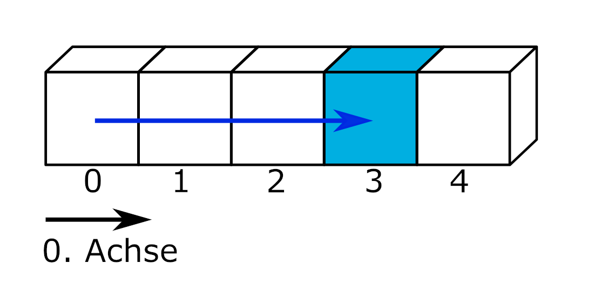
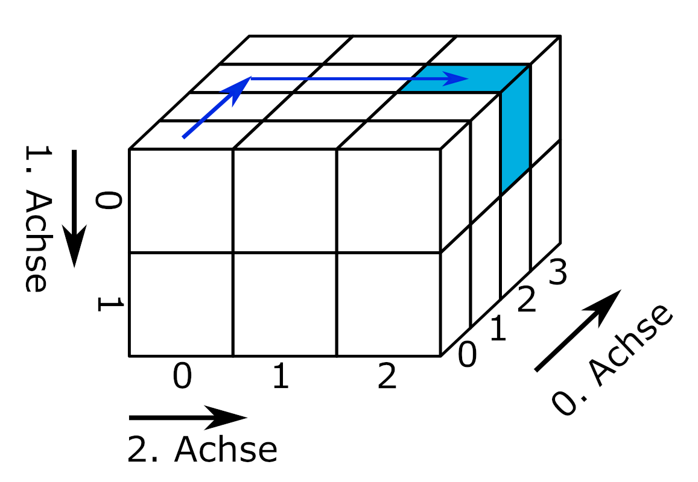
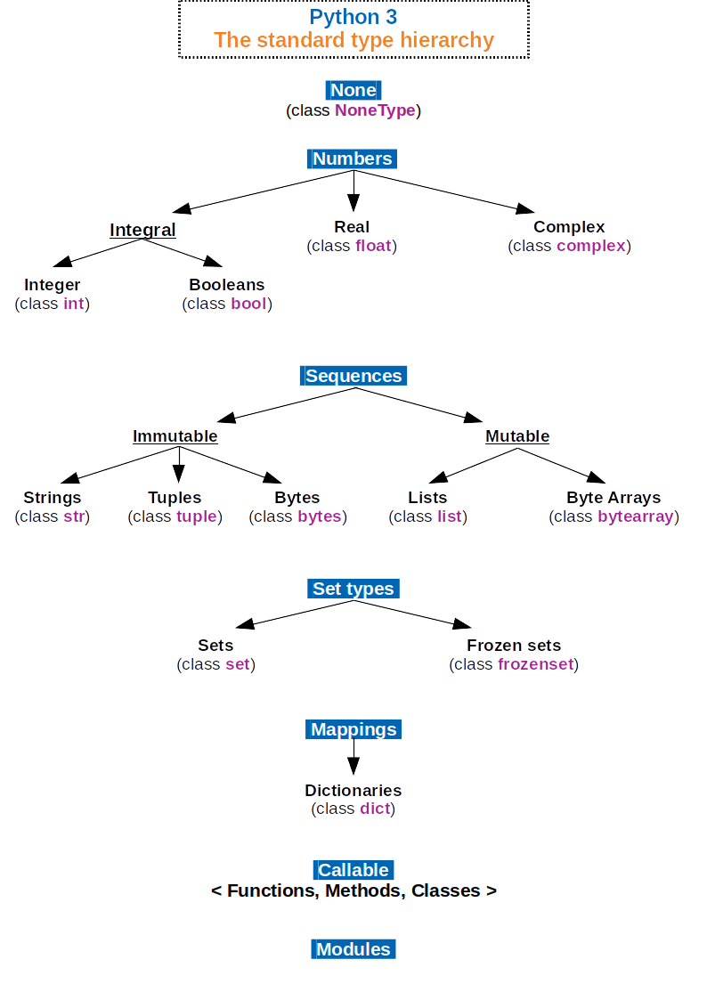

# Fundamentals: Characteristics of Datasets
Before diving into the practical challenges of reading structured datasets, we will first look at some key characteristics of datasets to build a basic understanding of terminology and learn how to handle Python’s built-in tools. At the end of this chapter, we introduce *tidy data*—a fundamental concept for organizing datasets.

::: {#imp-Datensatz .callout-important}
## Dataset

A dataset is a collection of related data. Datasets contain values associated with one or more variables. Every dataset has a technical format, a structure, at least one variable, and at least one value.

:::

## Technical Format
The technical format of a dataset determines how data can be read, processed, and stored. Some examples include:

  - Printed material, e.g., phone book: data like names and phone numbers must be read manually, edited irreversibly with a pen
  
  - Punch card, e.g., parking ticket: a reader recognizes the holes and grants one free hour; edited irreversibly with a punch tool
  
  - Text file, e.g., population by federal states: can be read, processed, and stored with various computer programs such as text editors, spreadsheets, or programming environments
  
  - Hierarchical Data Format (HDF5), e.g., spatial lightning density data: requires specialized software or packages

## Structure
Datasets store data in a defined n-dimensional structure.

::: {.border}
{fig-alt="Shown from left to right are one-, two-, and three-dimensional block structures representing datasets. These subfigures are reused and described in more detail in later sections."}

*slicing* by Marc Fehr is licensed under [CC-BY-4.0](https://github.com/bausteine-der-datenanalyse/w-python-numpy-grundlagen#CC-BY-4.0-1-ov-file) and available on [GitHub](https://github.com/bausteine-der-datenanalyse/w-python-numpy-grundlagen). 2024
:::

### One-Dimensional Datasets
The simplest form of dataset assigns values to a single variable. One-dimensional datasets containing values of the same type (e.g., numbers) are called **vectors**. One-dimensional datasets that can contain different data types are called **lists**. One-dimensional datasets have only one axis: the index, which can be used to access elements.

::: {.border}

{width="50%" fig-alt="A strip divided into five blocks represents a one-dimensional dataset. The blocks are labeled from 0 to 4 along axis 0 from left to right. A blue arrow goes from block zero to block three, which is highlighted in blue."}

*slicing* by Marc Fehr is licensed under [CC-BY-4.0](https://github.com/bausteine-der-datenanalyse/w-python-numpy-grundlagen#CC-BY-4.0-1-ov-file) and available on [GitHub](https://github.com/bausteine-der-datenanalyse/w-python-numpy-grundlagen). The graphic was cropped to show only the relevant part and the top label removed. 2024
:::

&nbsp;

Examples of one-dimensional datasets include a shopping list or the raw list of dice roll results. Using the index, you can, for example, output the dice result at index position 2.

``` {python}
print( *( eyes := [6, 2, 1, 2] ) )

print(f"The dice result at index position 2 is: {eyes[2]}")
```

### Reading One-Dimensional Data with Python
At this point, let’s briefly revisit content from the [Python Fundamentals module](https://bausteine-der-datenanalyse.github.io/w-python/output/book/):  
Python’s base accesses files via *file objects*. You have already learned about these functions and methods in the Python module. Accessing files through Python’s base functionality is a reliable fallback option and also useful for determining a file’s encoding.

::: {#tip-openundco .callout-tip collapse="false"}
## Quick Review: Core Python Functions and Methods

- The function `os.getcwd()` from the `os` module returns the current working directory. You can change it with `os.cwd(path)`.
- The function `open(filepath, mode = 'r')` opens a file in read mode and returns a file object.
- Information about the file object can be retrieved using various attributes: `file_object.name`, `os.path.basename(file_object.name)`, `file_object.closed`, `file_object.mode`, `file_object.encoding`
- The file object can be read using methods such as `file_object.read()`, `file_object.readline()`, `file_object.readlines()`, or the function `list(file_object)`.
- The method `file_object.close()` closes the file and releases it for use by other programs.

:::

**Read the file "python.txt" located in the path "skript/01-daten/".**

 - Determine the file’s encoding.

 - Remove the first line from the text and output the remaining text using Python.

 - How can the text be displayed correctly?

::: {#tip-pythonbasis .callout-tip collapse="true"}
## Example Solution for python.txt
```{python}
filepath = "01-daten/" + "python.txt"
file_object = open(filepath, mode = 'r')

# Determine the file encoding
print(f"The file encoding is: {file_object.encoding}")

# Output text
text_as_list = list(file_object)

for i in range(1, len(text_as_list)):
  print(text_as_list[i])

# Close the file
file_object.close()
```

Select UTF-8 encoding.
```{python}

# Choose UTF-8 encoding to support European special characters
file_object = open(filepath, mode = 'r', encoding = 'utf-8')

# Output text
text_as_list = list(file_object)

for i in range(1, len(text_as_list)):
  print(text_as_list[i])

# Close the file
file_object.close()
```

:::

### Two-Dimensional Datasets
Two-dimensional datasets organize values in a **matrix** or a **data frame** consisting of rows and columns. A matrix contains only one data type (e.g., numbers), while a data frame can contain different data types (e.g., numbers and boolean values). In Python, the Pandas module provides the DataFrame structure (see [Pandas Fundamentals module](https://bausteine-der-datenanalyse.github.io/w-pandas/output/book/)).

::: {.border}
{width="45%" fig-alt="A two-dimensional block represents a two-dimensional dataset. Arrows indicate the two axes. Axis 0 corresponds to the dataset’s length (top to bottom), and axis 1 corresponds to its width."}

*slicing* by Marc Fehr is licensed under [CC-BY-4.0](https://github.com/bausteine-der-datenanalyse/w-python-numpy-grundlagen#CC-BY-4.0-1-ov-file) and available on [GitHub](https://github.com/bausteine-der-datenanalyse/w-python-numpy-grundlagen). The graphic was cropped to show only the relevant part and the top label removed. 2024
:::

&nbsp;

Typically, in two-dimensional datasets, each column represents a **variable** and each row represents an **observation**. Variables store all values of a feature, for example, dice results. Observations store all measured values for one observation unit, e.g., a person. [@Wickham-2014, p. 3]

``` {python}
import pandas as pd

measurement1 = pd.DataFrame({
    'Name': ['Hans', 'Elke', 'Jean', 'Maya'],
    'Birthday': ['26.02.', '14.03.', '30.12.', '07.09.'],
    'Dice Color': ['pink', 'pink', 'blue', 'yellow'],
    'Sum of Eyes': [17, 12, 8, 23]
})

measurement1
```

&nbsp;

By specifying the indices along axis 0 (rows) and axis 1 (columns), you can output the sum of dice eyes for a person.

``` {python}

print(f"Jean rolled {measurement1.iloc[2, 3]} eyes")
```

It is also possible to first select a column and then access the value at a specific index, as with a one-dimensional dataset. This is called **chained indexing**.

``` {python}

print(f"Jean rolled {measurement1['Sum of Eyes'][2]} eyes")
```

::: {#wrn-chainedassignment .callout-warning appearance="simple"}
## Chained Indexing

Chained indexing in Pandas may either create a copy of the object or access the object’s memory directly, depending on the context. With Pandas 3.0, chained indexing will no longer be supported, and creating a copy will become the default. More information can be found at the linked reference.

:::: {.border layout="[5, 90, 5]"}

&nbsp;

"Whether a copy or a reference is returned for a setting operation may depend on the context. This is sometimes called `chained assignment` and should be avoided. See [Returning a View versus Copy](https://pandas.pydata.org/docs/user_guide/indexing.html#indexing-view-versus-copy)."

&nbsp;

::::

([Pandas Documentation](https://pandas.pydata.org/docs/user_guide/indexing.html))
:::

### Long and Wide Format
Two-dimensional datasets are usually represented as a matrix of rows and columns. Values for the variables organized in columns are assigned to the observations entered row-wise. This way of representing data is called the **wide format**: each additional measured variable makes the dataset wider.

Another way to organize and think about data is the **long format**. Some programs and packages require or at least benefit from data in long format, for example when creating plots. Let’s first look at the dataset `measurement1` again in wide format. What are the observation units? Which variables were recorded?

``` {python}
#| echo: false

measurement1
```

&nbsp;

You might assume that the observation units are Hans, Elke, Jean, and Maya, and that the variables are Birthday, Dice Color, and Sum of Eyes. However, it is also possible that the observation unit is Person, encoded as 0, 1, 2, and 3 (the row index of the dataset), and that the column Name is one of the recorded variables. Similarly, there could be only two variables, Dice Color and Sum of Eyes, while the columns Name and Birthday encode the observed individuals. Imagine there is a second person named Hans. In that case, the dice results for individuals named Hans can only be correctly assigned using the Birthday, e.g., 26.02. or 11.11.

``` {python}
measurement1 = pd.DataFrame({
    'Name': ['Hans', 'Elke', 'Jean', 'Maya', 'Hans'],
    'Birthday': ['26.02.', '14.03.', '30.12.', '07.09.', '11.11.'],
    'Dice Color': ['pink', 'pink', 'blue', 'yellow', 'pink'],
    'Sum of Eyes': [12, 17, 8, 23, 7]
})

measurement1
```

&nbsp;

The long format makes these considerations explicit by distinguishing between **identification variables** (id variables) and **measured variables** (measure variables or value vars). Transforming a dataset from wide format to long format is called **melting**. The Pandas module provides the function `pd.melt(frame, id_vars=None)`. It expects a DataFrame, and the optional argument `id_vars` specifies which columns are the identification variables.

``` {python}

measurement1_long = pd.melt(measurement1, id_vars = ['Name', 'Birthday'])

measurement1_long
```

&nbsp;

In long format, the measured variables are listed in the column `variable`, and their values are stored in the column `value`. Each additional measured variable makes the dataset longer.

If you think through the distinction between identification and measured variables, the variable name itself can be considered an identification variable for the value in the `value` column. A dataset can be understood as a structure that has exactly one measured variable, `value`, and a number of identification variables. This can be represented in long format as follows:

``` {python}
#| output: false

measurement1_all_id = pd.melt(measurement1, id_vars = ['Name', 'Birthday', 'Dice Color'])

measurement1_all_id
```

In this representation, for example, the first value `12` is identified by `Name = Hans`, `Birthday = 26.02.`, `Dice Color = pink`, and `variable = Sum of Eyes`.

::: {layout="[70, 30]"}
``` {python}
#| echo: false

measurement1_all_id = pd.melt(measurement1, id_vars = ['Name', 'Birthday', 'Dice Color'])

measurement1_all_id
```

{width="90%" fig-alt="Decorative image of a surprised dog"} 

<!-- wow will be removed again ;-) -->

::: 

::: {.border}
Much wow. Such architecture. by Dmitry Kudryavtsev is available at <https://yieldcode.blog/post/bloat-in-software-engineering/>. **The image will likely be removed again.**
:::

**What happens if the variable `Sum of Eyes` is also passed to the `id_vars` argument?**

::: {#tip-Antwort-all-id .callout-tip collapse="true"}
## Answer

The command `measurement1_all_id = pd.melt(measurement1, id_vars = ['Name', 'Birthday', 'Dice Color', 'Sum of Eyes'])` produces an empty DataFrame because no measured values remain.
:::

The reverse case is also possible: if no `id_vars` are specified during melting, all columns are treated as measured variables.

``` {python}

measurement1_no_id = pd.melt(measurement1)

measurement1_no_id
```

&nbsp;

The reverse operation of melting is called **casting** or **pivoting**. Here, a dataset in long format is converted back to wide format. The Pandas function `pd.pivot(data, columns, index)` takes a melted DataFrame and converts it using the unique values in `columns` (the column names of the wide-format DataFrame) and the unique values in `index` (the row index of the wide-format DataFrame). If no column is provided for `index`, the existing index of the melted DataFrame is used (which, with 20 rows, is of course too long). Since the object `measurement1_no_id` does not have a suitable index column, one must be created before casting. This can be done with the method `measurement1_no_id.groupby('variable').cumcount()`, which counts the occurrence of each value in the specified column starting at 0. (Directly replacing the index is not possible in this way, because the index passed to `pd.pivot(data, columns, index)` must not contain duplicates.)

``` {python}
# pd.pivot() requires an index or uses the existing index of the melted_df, which is too long
# Therefore, insert an additional column in measurement1_no_id
## simple: measurement1_no_id['new_index'] = list(range(0, 5)) * 4 
## general: measurement1_no_id['new_index'] = measurement1_no_id.groupby('variable').cumcount()

# Insert new_index column
measurement1_no_id['new_index'] = measurement1_no_id.groupby('variable').cumcount()
print(f"The long-format dataset with additional column new_index:\n{measurement1_no_id}")

# casting
measurement1_cast = pd.pivot(measurement1_no_id, index='new_index', columns='variable', values='value')
print(f"\nThe dataset in wide format:\n{measurement1_cast}")
```

The result still does not match the original wide-format dataset. To restore the original format, the columns must be reordered, and the index and its label must be reset.

```{python}

# Reorder columns and reset index
measurement1_cast = measurement1_cast[['Name', 'Birthday', 'Dice Color', 'Sum of Eyes']]
measurement1_cast.reset_index(drop=True, inplace=True)
measurement1_cast.rename_axis(None, axis=1, inplace=True)

print(f"\nThe dataset in wide format with reset index:\n\n{measurement1_cast}")
```

::: {#tip-idvars .callout-tip collapse="false"}
## Identification and Measured Variables

Even when working with wide-format datasets, distinguishing between identification and measured variables is useful for organizing data. [see @sec-tidydata]

:::

### Exercise: Two-Dimensional Datasets
Above, the object `measurement1_long` was created using the command `measurement1_long = pd.melt(measurement1, id_vars = ['Name', 'Birthday'])`.  
**Use the function** `pd.DataFrame.pivot()` **to transform the dataset `measurement1` back into wide format.**

``` {python}
#| echo: false

measurement1_long
```

::: {#tip-pivoting .callout-tip collapse="true"}
## Example Solution: Two-Dimensional Datasets

``` {python}

# Insert new_index column
measurement1_long['new_index'] = measurement1_long.groupby('variable').cumcount()

# casting
measurement1_long_cast = pd.pivot(measurement1_long, index='new_index', columns='variable', values='value')

# Reorder columns and reset index
measurement1_long_cast = measurement1_cast[['Name', 'Birthday', 'Dice Color', 'Sum of Eyes']]
measurement1_long_cast.reset_index(drop=True, inplace=True)
measurement1_long_cast.rename_axis(None, axis=1, inplace=True)

measurement1_long_cast
```

:::

### Three- and Higher-Dimensional Datasets
Three- or higher-dimensional datasets organize complex data structures in **arrays**. Arrays are n-dimensional data structures and therefore a general concept. For example, a list is a one-dimensional array, a matrix is a two-dimensional array, and an Excel file with multiple sheets for annually collected survey data is a three-dimensional array (sheets, rows, columns). Depending on the module used, arrays may contain one or multiple data types.

<!-- optionally add: xarray module <https://docs.xarray.dev/en/stable/user-guide/pandas.html> -->

::: {.border}
{width="50%" fig-alt="A three-dimensional block representing a three-dimensional dataset. Arrows indicate the three axes. Axis 0 corresponds to depth, axis 1 to length (top to bottom), and axis 2 to width of the dataset."}

*slicing* by Marc Fehr is licensed under [CC-BY-4.0](https://github.com/bausteine-der-datenanalyse/w-python-numpy-grundlagen#CC-BY-4.0-1-ov-file) and available on [GitHub](https://github.com/bausteine-der-datenanalyse/w-python-numpy-grundlagen). The graphic was cropped to show only the relevant part and the top label removed. 2024

:::

&nbsp;

For three- and higher-dimensional data structures, specialized data formats are often used, as discussed in section @sec-specialformats. This is partly because it makes it easier to process different data types and document them with metadata (see @sec-metadata).

**Optional: Excursus JSON <https://docs.python.org/3/tutorial/inputoutput.html>**

#### Reading Image Data

::: {.border}
Digital images are represented as three-dimensional datasets. Each pixel in the rows and columns has color values (Red, Green, Blue) and optionally an alpha channel (Red, Green, Blue, Alpha). The color values are either in the range 0–1 or 0–255 (8-bit).

```
# Color values for one pixel
[Red, Green, Blue]

# One image row with three pixels
[[Red, Green, Blue], [Red, Green, Blue], [Red, Green, Blue]]

# An image with three rows and three columns
[[[Red, Green, Blue], [Red, Green, Blue], [Red, Green, Blue]],
 [[Red, Green, Blue], [Red, Green, Blue], [Red, Green, Blue]],
 [[Red, Green, Blue], [Red, Green, Blue], [Red, Green, Blue]]]
```

Image files can be read using the function `plt.imread()` from the `matplotlib.pyplot` module.

:::: {.border}
``` {python}
import matplotlib.pyplot as plt

logo = plt.imread(fname='00-bilder/python-logo-and-wordmark-cc0-tm.png')

plt.imshow(logo)
```

The Python logo by the Python Software Foundation is licensed under the [GPLv3](https://www.gnu.org/licenses/gpl-3.0.html). The wordmark is trademarked: <https://www.python.org/psf/trademarks/>. The file is available on [Wikimedia](https://de.m.wikipedia.org/wiki/Datei:Python_logo_and_wordmark.svg). 2008

:::: 

&nbsp;

The structure of the dataset can be accessed using the `.shape` attribute.

``` {python}
print(type(logo), "\n")

print(logo.shape)
```

The data was read as a `NumPy.ndarray`. The logo has 144 rows, 486 columns, and is in the RGBA color space. A slice of the data looks like this:

``` {python}
print(logo[50:52, 50:52, :])
```

[@Arnold-2023-numpy-dateien]

:::

### Exercise: Three-Dimensional Datasets
Using the index of the third dimension, the Red, Green, and Blue color channels can be selected and displayed individually with the function `plt.imshow(cmap='Greys_r')`. The argument `cmap='Greys_r'` instructs the function to use the inverted grayscale, so high color values appear light and low values dark. **Display the Red, Green, and Blue channels of the Python logo individually using `plt.imshow(cmap='Greys_r')`.**

::: {#tip-logo .callout-tip collapse="true"}
## Example Solution: Three-Dimensional Datasets
``` {python}
#| fig-cap: Color channels of the Python logo
#| fig-alt: "The three color channels of the Python logo are shown."

channels = ["Red Channel", "Green Channel", "Blue Channel"]

plt.figure(figsize=(9, 6))

for i in range(3):
    plt.subplot(1, 4, i + 1)
    plt.imshow(logo[:, :, i], cmap='Greys_r')
    plt.title(label=channels[i])

plt.colorbar(shrink=0.15)

plt.tight_layout()
plt.show()
```

You might wonder why the image background appears black in each color channel. The explanation is in the next tip.

:::: {#tip-logo .callout-tip collapse="true"}
## Explanation: Image Background
The image background has a value of 0 in all channels, including the alpha channel. This part of the image is therefore fully transparent and is filled in by the webpage background. As a result, the logo's background appears white.

``` {python}
#| fig-cap: Alpha channel of the Python logo
#| fig-alt: "The alpha channel of the Python logo is shown. The image background has a value of 0."

# Alpha channel
plt.imshow(logo[:, :, 3], cmap='Greys_r')
plt.title(label='Alpha Channel')
plt.colorbar(shrink=0.4)

plt.show()

# The first two rows and columns of the logo
print(logo[0:2, 0:2, :])
```

::::
:::

## Data Type {#sec-datentyp}
The data type specifies how the values contained in a dataset are interpreted by Python. For example, the value "1" could represent a character, an integer, a Boolean value, the month January, or the level of a categorical variable. Python, as a versatile programming language, supports many data types that fall into the categories: numerics, sequences, mappings, classes, instances, and exceptions. More information can be found in the [documentation](https://docs.python.org/3/library/stdtypes.html).

::: {.border}
{width="60%" fig-alt="A categorization of standard types in Python. The categorization does not exactly match the categories listed in the documentation. The type None for null values has no further subdivision. The Numbers category is divided into integers (including Booleans), real numbers (floats), and complex numbers. The Sequences category is divided into immutable (Strings, Tuples, Bytes) and mutable (Lists, Byte Arrays). The Set Types category is divided into Sets and Frozen Sets. The Mappings category contains Dictionaries. The Callable category includes functions, methods, and classes. There is also the Module category."}

Python 3. The standard type hierarchy. by Максим Пе is licensed under [CC BY SA 4.0](https://creativecommons.org/licenses/by-sa/4.0/deed.de) and available on [Wikimedia](https://commons.wikimedia.org/wiki/File:Python_3._The_standard_type_hierarchy.png). 2018
:::

&nbsp;

Modules add further data types. Commonly used data types in data analysis include:

  - Numbers: integers, floating-point numbers
  - Booleans
  - Strings
  - Date and time values
  - Category (from the [Pandas](https://pandas.pydata.org/docs/user_guide/categorical.html) module)

The data type determines, on the one hand, the allowable range of values for a variable. For example, 0 and 13 are valid integers but not valid encodings for a month. On the other hand, the data type defines which operations are allowed on the values and how Python executes them. This applies to operators and functions. Python includes functions to determine and, if necessary, convert the data type of a value (see w-Python).

::: {#nte-operation-nach-datentyp .callout-note}
