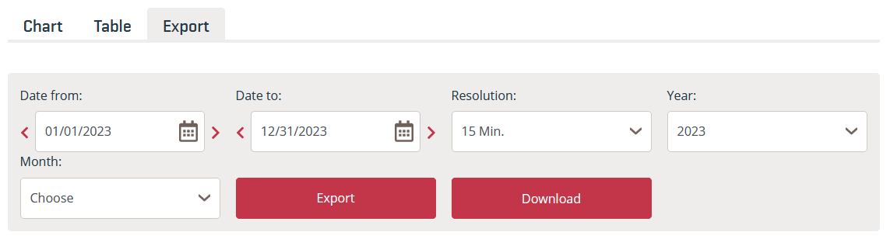
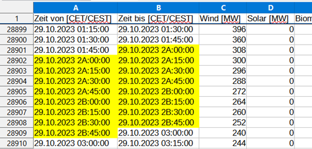

# Download Austrian Market Transparency Data

``` {python}
# Preparation: reload modules from the previous chapter
import numpy as np
import pandas as pd
```

After selecting the desired period, click Export, then the Download button will appear. 

{fig-alt="View of the input fields to download Austrian electricity market data."}

{fig-alt="View of the input fields to download Austrian electricity market data in English."}

The date format of the files depends on the language setting of the website (German/English).

:::

&nbsp;

The following file is attached to this script. 

::: {style="font-size: 90%;"}
| Data | Filename |
|---|---|
| Realized Electricity Generation 2023 | AGPT_2022-12-31T23_00_00Z_2023-12-31T23_00_00Z_15M_de_2024-06-10T09_32_38Z.csv |
:::

In this dataset, the switch from daylight saving time to standard time on the last Sunday in October results in the 2 AM hour being recorded twice (while one hour is missing during the switch from standard to daylight saving time on the last Sunday in March). The duplicate hour is marked in the dataset as 2A and 2B. (Information from Austrian Power Grid AG, 13.08.2024)

{fig-alt="Excerpt from the Austrian generation dataset. The columns 'Zeit von [CET/CEST]' and 'Zeit bis [CET/CEST]' highlight the period from 29.10.2023 02:00:00 to 29.10.2023 03:00:00 in yellow to illustrate the anomaly described above."}

**Read the file so that columns with date and time information are recognized as datetime. Resolve the daylight saving time transition so that each day has 24 hours.**

::: {#tip-Austria title="Solution for Austrian Electricity Market Data" .callout-tip collapse="true"}

:::: {.callout-tip collapse="true"}
## Simple Approach
The simplest solution is to generate time series and replace the columns 'Zeit von [CET/CEST]' and 'Zeit bis [CET/CEST]' with them.
```
start_times = pd.date_range(start = "2023-01-01T00:00", end = "2023-12-31T23:45", freq = '15min')
end_times = pd.date_range(start = "2023-01-01T00:15", end = "2024-01-01T00:00", freq = '15min')

print(start_times[8070:8078], "\n")
print(end_times[8070:8078], "\n")
```

::::

**Read File and String Manipulation**

First, the file is read in. Cells that cannot be converted to datetime can be displayed using Python.

``` {python}
# Read file
generation_austria = pd.read_csv(filepath_or_buffer = "01-daten/AGPT_2022-12-31T23_00_00Z_2023-12-31T23_00_00Z_15M_de_2024-06-10T09_32_38Z.csv",
                                 sep = ";", decimal = ",", thousands = ".")

# Identify cells with invalid datetime strings
print("Column 'Zeit von [CET/CEST]'")
i = 0
invalid_positions = []
for element in generation_austria['Zeit von [CET/CEST]']:
    try:
        pd.to_datetime(element, format = "%d.%m.%Y %H:%M:%S")
    except:
        print(element)
        invalid_positions.append(i)
    i += 1
print("\nThe cells have the row indices: ", invalid_positions, "\n")

print("Column 'Zeit von [CET/CEST]'")
i = 0
invalid_positions = []
for element in generation_austria['Zeit von [CET/CEST]']:
    try:
        pd.to_datetime(element, format = "%d.%m.%Y %H:%M:%S")
    except:
        print(element)
        invalid_positions.append(i)
    i += 1
print("\nThe cells have the row indices: ", invalid_positions, "\n")
```

To correctly read the date columns, the strings "2A" and "2B" are replaced with "02" using the `str.replace()` method. This creates a duplicate in the dataset.

``` {python}
# String replace & convert to datetime
## Column 'Zeit von [CET/CEST]'
generation_austria['Zeit von [CET/CEST]'] = generation_austria['Zeit von [CET/CEST]'].str.replace(pat = '2A', repl = '02')
generation_austria['Zeit von [CET/CEST]'] = generation_austria['Zeit von [CET/CEST]'].str.replace(pat = '2B', repl = '02')

generation_austria['Zeit von [CET/CEST]'] = pd.to_datetime(generation_austria['Zeit von [CET/CEST]'], format = "%d.%m.%Y %H:%M:%S")

## Column 'Zeit bis [CET/CEST]'
generation_austria['Zeit bis [CET/CEST]'] = generation_austria['Zeit bis [CET/CEST]'].str.replace(pat = '2A', repl = '02')
generation_austria['Zeit bis [CET/CEST]'] = generation_austria['Zeit bis [CET/CEST]'].str.replace(pat = '2B', repl = '02')

generation_austria['Zeit bis [CET/CEST]'] = pd.to_datetime(generation_austria['Zeit bis [CET/CEST]'], format = "%d.%m.%Y %H:%M:%S")

print(generation_austria.info())
```

**Determine index positions of the duplicated and missing hour**

In the next step, we determine the index positions of the duplicated and the missing hour.  
For this purpose, a new object is created that accesses the memory area of the date columns (which is not strictly necessary).  
The position of the duplicated hour is determined using the method `pd.Series.duplicated()`, which returns a logical vector.  
This vector is then used for slicing and output of the index position.  
By subtracting 4, the index of the first hour is displayed (the dataset is based on quarter-hour intervals).

*duplicated hour*

``` {python}
# create new object
austria_dates = generation_austria[['Zeit von [CET/CEST]', 'Zeit bis [CET/CEST]']].copy()

# determine index position of the duplicated hour
## Time from
position_duplicated_hour_from = austria_dates['Zeit von [CET/CEST]'][austria_dates['Zeit von [CET/CEST]'].duplicated()].index - 4

print(f"The duplicated hour (Time from):\n{austria_dates.loc[position_duplicated_hour_from, 'Zeit von [CET/CEST]']}\n"
      f"is located at index position\n {position_duplicated_hour_from}\n"
      f"\nThe next hour is:\n{austria_dates.loc[position_duplicated_hour_from + 4, 'Zeit von [CET/CEST]']}"
      f"\n\nBoth hours are identical.")

### End of the shift in column Time from
end_shift_from = position_duplicated_hour_from[-1]
print(f"\nThe time shift in column 'Time from' ends at index position: {end_shift_from}")

## Time to
position_duplicated_hour_to = austria_dates['Zeit bis [CET/CEST]'][austria_dates['Zeit bis [CET/CEST]'].duplicated()].index - 4

print(f"\n\nThe duplicated hour (Time to):\n{austria_dates.loc[position_duplicated_hour_to, 'Zeit bis [CET/CEST]']}\n"
      f"is located at index position\n {position_duplicated_hour_to}\n"
      f"\nThe next hour is:\n{austria_dates.loc[position_duplicated_hour_to + 4, 'Zeit bis [CET/CEST]']}"
      f"\n\nBoth hours are identical.")

### End of the shift in column Time to
end_shift_to = position_duplicated_hour_to[-1]
print(f"\nThe time shift in column 'Time to' ends at index position: {end_shift_to}")
```

*missing hour*  

Daylight saving time begins on the last Sunday in March.  
The missing hour does not lie within `range(0, 24)`.  
This condition can be checked in four steps:

  - March: `march = pd.Series[pd.Series.dt.month == 3]`

  - Sundays in March: `sundays = march[march.dt.dayofweek == 6]`

  - last Sunday in March: The last 23*4 entries represent the last Sunday of the month (23 because one hour is missing).  
    `last_sunday = sundays[-23*4:]`
  
  - missing hour: `np.argwhere(np.invert(pd.Series(range(0,24)).isin(last_sunday.dt.hour)))`

``` {python}
# determine index position of the missing hour
## Time from
### Month of March
mask_march_from = austria_dates['Zeit von [CET/CEST]'].dt.month == 3
austria_dates_march_from = austria_dates.loc[mask_march_from, 'Zeit von [CET/CEST]']
print(f"The month of March (Time from):\n{austria_dates_march_from.head}\n");

### last Sunday
mask_sunday_from = (austria_dates_march_from.dt.dayofweek == 6)
last_sunday_from = (austria_dates_march_from[mask_sunday_from])[-23*4:]
print(f"The last Sunday in March:\n{last_sunday_from}\n")

### missing hour
print(last_sunday_from.dt.hour)
missing_hour_from = np.argwhere(np.invert(pd.Series(range(0,24)).isin(last_sunday_from.dt.hour))).item() 
print(f"\nThe missing hour is:\n{missing_hour_from}\n")
print(last_sunday_from[last_sunday_from.dt.hour == (missing_hour_from - 1)], 
      last_sunday_from[last_sunday_from.dt.hour == (missing_hour_from + 1)], sep = "\n")

### start of the shift in column Time from
start_shift_from = last_sunday_from[last_sunday_from.dt.hour == (missing_hour_from + 1)].index[0]

print(f"\nThe time shift in the column 'Time from' starts at index position: {start_shift_from}\n\n")

## Time to
### Month of March
mask_march_to = austria_dates['Zeit bis [CET/CEST]'].dt.month == 3
austria_dates_march_to = austria_dates.loc[mask_march_to, 'Zeit bis [CET/CEST]']
print(f"The month of March (Time to):\n{austria_dates_march_to.head}\n");

### last Sunday
mask_sunday_to = (austria_dates_march_to.dt.dayofweek == 6)
last_sunday_to = (austria_dates_march_to[mask_sunday_to])[-23*4:]
print(f"The last Sunday in March:\n{last_sunday_to}\n")

### missing hour
print(last_sunday_to.dt.hour)
missing_hour_to = np.argwhere(np.invert(pd.Series(range(0,24)).isin(last_sunday_to.dt.hour))).item() 
print(f"\nThe missing hour is:\n{missing_hour_to}\n")
print(last_sunday_to[last_sunday_to.dt.hour == (missing_hour_to - 1)], 
      last_sunday_to[last_sunday_to.dt.hour == (missing_hour_to + 1)], sep = "\n")

### start of the shift in column Time to
start_shift_to = last_sunday_to[last_sunday_to.dt.hour == (missing_hour_to + 1)].index[0]

print(f"\nThe time shift in the column 'Time to' starts at index position: {start_shift_to}")
```

With the stored index positions, the corresponding timestamps can now be shifted:

  - Column *Time from*: 8072 (object `start_shift_from`) to 28903 (object `end_shift_from`)

  - Column *Time to*: 8071 (object `start_shift_to`) to 28902 (object `end_shift_to`)

For slicing, the method `pd.Series.iloc[]` is used, which indexes exclusively — that is, the end positions must be increased by 1.  
By subtracting `pd.Timedelta(1, unit='h')`, the time shift is removed from the dataset.
  
``` {python}
# correct time shift
## Time from
austria_dates['Zeit von [CET/CEST]'].iloc[start_shift_from : end_shift_from + 1] = (
    austria_dates['Zeit von [CET/CEST]']
    .iloc[start_shift_from : end_shift_from + 1]
    .subtract(pd.Timedelta(1, unit='h'))
)

generation_austria['Zeit von [CET/CEST]'] = austria_dates['Zeit von [CET/CEST]']

## Time to
austria_dates['Zeit bis [CET/CEST]'].iloc[start_shift_to : end_shift_to + 1] = (
    austria_dates['Zeit bis [CET/CEST]']
    .iloc[start_shift_to : end_shift_to + 1]
    .subtract(pd.Timedelta(1, unit='h'))
)

generation_austria['Zeit bis [CET/CEST]'] = austria_dates['Zeit bis [CET/CEST]']

# verification
print("Verification in the dataset +/- one quarter hour\n")
print("The column 'Time from'")
print(generation_austria['Zeit von [CET/CEST]'].iloc[start_shift_from - 1 : end_shift_from + 2], "\n")

print("The column 'Time to'")
print(generation_austria['Zeit bis [CET/CEST]'].iloc[start_shift_to - 1 : end_shift_to + 2], "\n")
```

:::

#### Advanced: CAPE Ratio — a dataset full of pitfalls
The 2013 Nobel laureate in Economic Sciences, **Robert Shiller**, maintains a dataset containing monthly price data of the **U.S. stock index S&P 500** and other economic indicators for calculating the **inflation-adjusted price-to-earnings ratio (CAPE Ratio)**.  
The dataset is available on [Robert Shiller’s website](https://shillerdata.com/) ([direct link to the XLS file](https://img1.wsimg.com/blobby/go/e5e77e0b-59d1-44d9-ab25-4763ac982e53/downloads/ie_data.xls?ver=1712069253887)).  
**Read in the dataset.**

::: {style="font-size: 90%;"}
| Data | Filename |
|---|------|
| Monthly price data S&P500 | shiller_data.xls |
:::

::: {#tip-shiller-data1 .callout-tip collapse="true"}
## Notes and sample solution — Shiller data

First, open the dataset in a spreadsheet program. Some remarkable irregularities include:

  - Metadata in rows 2 and 3, where some column labels are also placed, and additional metadata at the end of the file.

  - Multi-line column headers.
  
  - Empty columns **P** and **N**.

  - Missing values represented by `'NA'` and empty cells `''`.

  - Different formatting for the month of October in the `Date` column (`YYYY-M` format).

:::: {#tip-shiller-data2 .callout-tip collapse="true"}
## Hints for solving

Due to these numerous irregularities, it’s helpful to read the **data** and **headers** separately.  
You can determine the correct row index either from your initial spreadsheet inspection or by reading the first 10–20 lines of the dataset in Python.  
This makes it easier to inspect the data and manipulate it using string-processing methods.  

In practice, it’s often simpler to manually specify the column names using the argument  
`names = Sequence of column labels to apply`  
or to define them directly in a spreadsheet editor.

It’s also advisable to proceed step by step, developing a separate solution for each issue, possibly using smaller dataset excerpts or generated test data.

::::: {#tip-shiller-data3 .callout-tip collapse="true"}
## Complete sample solution

The dataset is read using the `pd.read_excel()` function.  
The argument `sheet_name` is used to select the worksheet **Data**.  
With the method `pd.DataFrame.head(n = 10)`, you can identify the row index where the header ends and the data begins.
In this case, the header ends at row 8, which corresponds to index **7** in Python.

**Read header**

``` {python}
file_path = '01-daten/shiller_data.xls'
shiller = pd.read_excel(io=file_path, sheet_name='Data')

# manually identify the end of the header and start of data (commented out)
# print(shiller.head(n=10), "\n")

# read header
shiller_head = pd.read_excel(io=file_path, sheet_name='Data', skiprows=1, nrows=7, header=None)
print(shiller_head, "\n")
print(shiller_head.info())  # empty columns are recognized as numeric
```

**Isolating column labels**  
Next, the header can be further processed to isolate the column labels.  
There are several possible approaches for this task — the following method is one example, and other alternatives are shown in the next example.  

Column-wise concatenation of strings is performed using the method `pd.Series.str.cat()`, which is only available for `pd.Series` objects.  
Therefore, each column is processed individually in a loop.  
Additionally, this method only works with the data type `'string'`, which is ensured using the method `astype('string')`.

Afterward, text elements that do not belong to the column labels are removed using `str.replace()`.  
Here, the argument `regex=True` proves useful.

``` {python}
# create column labels using a loop
shiller_column_labels = pd.Series()

for column in shiller_head:
    shiller_column_labels = pd.concat([
        shiller_column_labels,
        pd.Series(shiller_head[column].astype('string').str.cat())
    ])

# clean up strings
## remove first cell content: "Stock Market Data Used in 'Irrational Exuberan...'"
shiller_column_labels = shiller_column_labels.astype('str').replace(shiller_head.loc[0, 0], '', regex=True)

## remove 'Robert J. Shiller'
shiller_column_labels = shiller_column_labels.astype('str').replace(shiller_head.loc[1, 0], '', regex=True)

## remove spaces
## regex=True to remove spaces within strings
shiller_column_labels = shiller_column_labels.astype('str').replace(' ', '', regex=True)

## replace overly long strings
shiller_column_labels = shiller_column_labels.astype('str').replace('CyclicallyAdjustedPriceEarningsRatioP/E10or', '', regex=True)
shiller_column_labels = shiller_column_labels.astype('str').replace('CyclicallyAdjustedTotalReturnPriceEarningsRatioTRP/E10or', '', regex=True)

## reset index
shiller_column_labels.reset_index(inplace=True, drop=True)

print(shiller_column_labels)
```

:::::: {.callout-note collapse="true"}
## Alternative approaches for string manipulation of the file header

#### Using the NumPy data type `'str'`

Specifying `dtype='str'` results in the use of the NumPy string data type (`dtype='str'`), which is **mutable**.  
Only with this data type does string concatenation using the method `pd.DataFrame.sum()` work properly.

``` {python}
# The NumPy string data type is mutable
my_array = np.array([['1', '2'], ['3', '4']])
my_array[0] = ['a', 'b']
my_array
```

With the Pandas data types `'string'` and `'object'`, the approach shown above does **not** work.  
Pandas uses the Python string type, which is **immutable**.  
This means that no method can modify an existing string in place.  
Instead, methods like `str.replace()` return **new strings**.

``` {.raw}
## using NumPy string data type
shiller_head = pd.read_excel(io=file_path, sheet_name='Data', skiprows=1, nrows=7, header=None)

# concatenate header with NumPy string type using pd.DataFrame.sum()
# print(shiller_head.astype('str').sum(skipna=True, axis=0))

## cleaning the dataset
### remove nan
shiller_head = shiller_head.astype('str').replace('nan', '')

### remove first cell content: "Stock Market Data Used in 'Irrational Exuberan...'"
shiller_head = shiller_head.astype('str').replace(shiller_head.loc[0, 0], '')

### remove 'Robert J. Shiller'
shiller_head = shiller_head.astype('str').replace(shiller_head.loc[1, 0], '')

### remove spaces
### regex=True to remove spaces within strings
shiller_head = shiller_head.astype('str').replace(' ', '', regex=True)

### replace overly long strings
shiller_head = shiller_head.astype('str').replace('CyclicallyAdjustedPriceEarningsRatioP/E10or', '', regex=True)
shiller_head = shiller_head.astype('str').replace('CyclicallyAdjustedTotalReturnPriceEarningsRatioTRP/E10or', '', regex=True)

### concatenate rows column-wise
shiller_head = shiller_head.astype('str').sum(skipna=True, axis=0)

print("\nConcatenated column names\n", shiller_head)
```

#### Using `DF.agg()` or `DF.apply()`

The Pandas method `DF.agg()` aggregates a DataFrame row-wise or column-wise using a specified function.  
The Pandas method `DF.apply()` applies a function row-wise or column-wise to a DataFrame.  
Essentially, both methods achieve the same result.  

For details on using [lambda expressions](https://docs.python.org/3/reference/expressions.html#lambda) and the `join` method from [Python basics](https://www.w3schools.com/python/ref_string_join.asp), refer to the provided links.

``` {.raw}
shiller_head = pd.read_excel(io=file_path, sheet_name='Data', skiprows=1, nrows=7, header=None)

# DF.agg()
print(shiller_head.agg(lambda x: ''.join(x.astype(str))))

# DF.apply()
print(shiller_head.apply(lambda x: ''.join(x.astype(str))))
```

::::::

**Read in data**

When reading the data, the header is checked, and the end of the dataset is examined using the `.tail()` method to identify rows containing additional metadata.  
These metadata rows are then skipped using the argument `skipfooter=1`.

``` {python}
file_path = '01-daten/shiller_data.xls'

# read data
shiller_data = pd.read_excel(io=file_path, sheet_name='Data', skiprows=8, header=None)
print(shiller_data.head(n=2), "\n")
shiller_data.tail(n=5)
```

&nbsp;

After removing the metadata, the detected data types are checked using the `.info()` method.

``` {python}
shiller_data = pd.read_excel(io=file_path, sheet_name='Data', skiprows=8, header=None, skipfooter=1)
print(shiller_data.head(n=2), "\n")
print(shiller_data.tail(n=2))

# determine data types
shiller_data.info()
```

**Combine header and data**

Columns with index 13 (column N) and 15 (column P) are empty; these are removed from both the header and the data.  
All remaining columns are recognized as floating-point numbers.  
This means that the percentage signs in columns with indices 16 and 19–21 (Q, T:V) were handled by division by 100.  
With the exception of the `Date` column, all data types are now correctly recognized.

``` {python}
# remove empty columns
shiller_column_labels = shiller_column_labels.drop(labels=[13, 15])
shiller_data = shiller_data.drop(labels=[13, 15], axis='columns')

# assign column names
shiller_data.columns = shiller_column_labels
shiller_data.info()
```

**Correct date format**

The next step is to correct the date format.  
The `Date` column contains strings in the format `'YYYY,MM'`.  
An exception is the month of October, which is encoded as `'YYYY.M'`.  
This difference is not visible in the `print()` output because the display precision is set to 2 decimal places using `pd.set_option("display.precision", 2)`.  
The varying string lengths can be visualized with  
`shiller_data.loc[0:12, 'Date'].astype('str').str.len()`.

``` {python}

print(shiller_data.loc[0:12, 'Date'], "\n")

try:
    pd.to_datetime(shiller_data.loc[0:12, 'Date'], format="%Y.%m")
except ValueError as error:
    print(error, "\n")
else:
    pd.to_datetime(shiller_data.loc[0:12, 'Date'], format="%Y.%m")

print(shiller_data.loc[0:12, 'Date'].astype('str').str.len(), "\n")
```

The data type of the `Date` column is set as a string.  
Using a mask, strings with length 6 are identified.  
A `'0'` is appended to these 6-character strings to standardize the date format.  
Finally, the column is converted to datetime using `pd.to_datetime(format="%Y.%m")`.

``` {python}
# set data type of 'Date' column to string
# leads to an errormessage:
shiller_data['Date'] = shiller_data['Date'].astype('str')

mask = shiller_data['Date'].str.len() == 6
shiller_data.loc[mask, 'Date'] = shiller_data.loc[mask, 'Date'] + '0'

# display string lengths
print(shiller_data.loc[0:12, 'Date'].str.len())
print(shiller_data.loc[0:12, 'Date'])

# convert 'Date' column to datetime
shiller_data['Date'] = pd.to_datetime(shiller_data['Date'], format="%Y.%m")
shiller_data.info()
```

:::::
::::
:::

